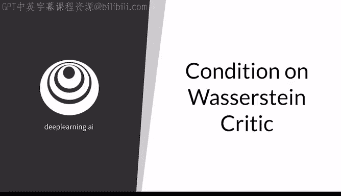
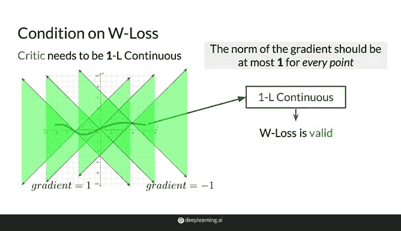
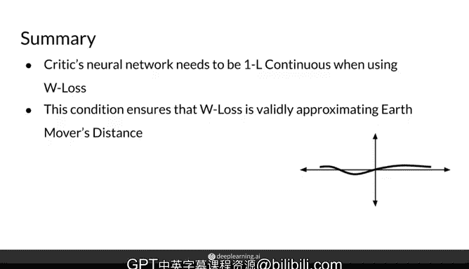

# 25：Wasserstein GAN中的判别器条件 🧠

在本节课中，我们将学习Wasserstein损失函数如何解决传统GAN训练中的一些问题，并重点探讨其成功应用的一个关键前提：判别器网络必须满足“1-Lipschitz连续性”条件。我们将解释这个条件的含义、重要性以及如何实现它。

---

## 概述

Wasserstein损失（W Loss）通过计算真实样本与生成样本在判别器输出上的期望值之差，为GAN训练提供了更稳定的梯度。然而，要有效地使用W Loss进行训练，判别器（Critic）网络必须满足一个特殊的数学条件，即“1-Lipschitz连续性”。本节将深入解析这一条件。

## Wasserstein损失函数回顾

上一节我们介绍了Wasserstein损失的基本形式。它本质上是一个简单的表达式，用于计算判别器对真实样本 **X** 的输出期望值与其对生成样本 **G(Z)** 的输出期望值之间的差值。

生成器的目标是**最小化**这个表达式，试图让生成的样本尽可能接近真实样本。

而判别器的目标是**最大化**这个表达式，因为它希望尽可能地区分真实样本和生成样本，希望两者之间的距离尽可能大。

然而，为了使用W Loss成功训练GAN，判别器需要满足一个特殊条件。

## 判别器的关键条件：1-Lipschitz连续性

这个条件听起来复杂，但其核心思想很简单：对于像判别器这样的神经网络函数，要成为“1-Lipschitz连续”的，其**梯度的范数（Norm）必须处处小于或等于1**。

这意味着，函数在任何一点的**斜率（梯度）的绝对值都不能大于1**。

以下是判断一个函数是否满足1-Lipschitz连续性的方法：

你可以沿着函数的每一个点进行检查，确保该点的斜率小于或等于1（或梯度小于等于1）。一种可视化的方法是，在你要评估的每个点处，画两条斜率分别为+1和-1的直线。你需要确保函数的增长永远不会超出这两条线所夹的绿色区域范围，因为停留在这个区域内意味着函数的增长是线性的。

**示例分析：**
*   图中展示的函数**不满足**1-Lipschitz连续性，因为它在多个区段超出了绿色边界，表明其增长超过了线性速度。
*   一个平滑的曲线函数，如果你检查每一个点，发现其增长始终没有超过线性速度，那么这个函数就是1-Lipschitz连续的。

## 为什么这个条件至关重要？

这个施加在判别器网络上的条件对于W Loss至关重要，因为它确保了Wasserstein损失函数不仅是连续且可微的，而且其变化不会过大，从而在训练过程中保持一定的稳定性。

这正是W Loss所基于的**推土机距离（Earth Mover‘s Distance）** 能够有效计算的前提。

这个条件对于同时训练判别器和生成器神经网络是必需的。它还能增加训练的稳定性，因为随着生成器的学习，损失函数的变化将被限制在一定范围内。

## 总结与过渡

总结来说，在使用W Loss进行训练的GAN中，判别器需要是1-Lipschitz连续的，这样才能确保其对真实数据和生成数据之间进行的推土机距离比较是有效的。

为了在训练中满足或近似满足这一条件，研究者们提出了多种不同的方法。

在本节课中，我们一起学习了Wasserstein GAN中判别器必须满足的1-Lipschitz连续性条件，了解了它的定义、直观理解及其对训练稳定性的重要性。下一节，我们将探讨几种在实践中强制执行这一条件的常用技术。