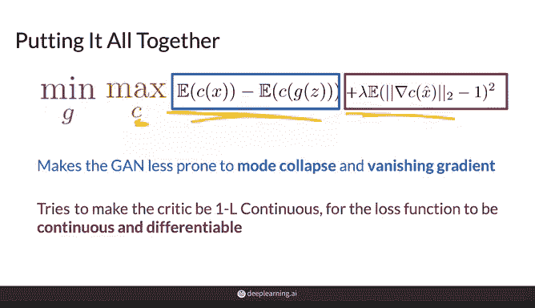
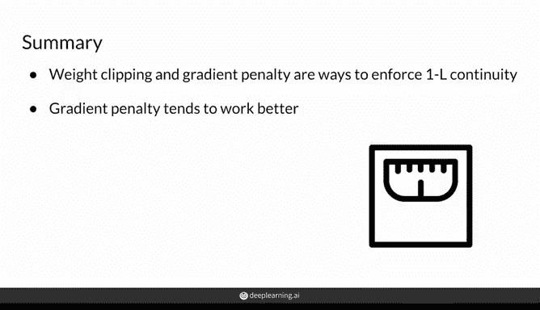

# 26：强制 Lipschitz 连续性 🎯

在本节课中，我们将学习如何在训练判别器时，强制其满足 **1-Lipschitz 连续性** 条件，以确保 Wasserstein 损失函数的有效性。我们将介绍两种主要方法：权重裁剪和梯度惩罚，并比较它们的优劣。


---

## 1. 什么是 1-Lipschitz 连续性？

上一节我们介绍了 Wasserstein 损失函数。本节中我们来看看确保其有效性的一个关键条件：判别器网络的 **1-Lipschitz 连续性**。

这意味着，对于判别器函数 **f**（例如，以图像 **x** 为输入），其梯度的范数在函数的每一个点上都必须小于或等于 1。用公式表示如下：

**||∇f(x)|| ≤ 1**

这里通常使用 L2 范数（即欧几里得距离）。直观上，在二维空间中，这表示函数在任何一点的“斜率”都不超过 1。

---

## 2. 强制连续性的两种方法

为了确保判别器满足上述条件，有两种常见的方法。以下是它们的简要介绍：

### 方法一：权重裁剪

在权重裁剪方法中，判别器神经网络的所有权重值都被强制限制在一个固定的区间内。

具体操作是，在梯度下降更新权重后，将所有超出设定区间的权重“裁剪”到区间的边界值。例如，如果设定区间为 `[-c, c]`，那么任何小于 `-c` 的权重会被设为 `-c`，任何大于 `c` 的权重会被设为 `c`。

**代码示例：**
```python
# 假设权重矩阵为 w，裁剪阈值为 clip_value
w = np.clip(w, -clip_value, clip_value)
```

### 方法二：梯度惩罚

梯度惩罚是一种更“柔和”的强制连续性方法。它通过在损失函数中添加一个正则化项来实现。

这个正则化项的作用是：当判别器在某个点上的梯度范数大于 1 时，对其进行惩罚。损失函数变为：

**L = Wasserstein损失 + λ * 正则化项**

其中，λ 是一个超参数，用于控制正则化项的权重。

---

## 3. 梯度惩罚的实现细节

上一节我们提到了梯度惩罚的基本思想。本节中我们来看看如何具体实现它。

由于检查判别器在特征空间每一个点上的梯度是不现实的，我们采用一种采样近似的方法。以下是具体步骤：

1.  从真实图像集和生成图像集中各取一个样本。
2.  在这两个样本之间进行随机线性插值，生成一个中间样本 **x̂**。
3.  计算判别器对这个中间样本 **x̂** 的预测的梯度范数。
4.  我们希望这个梯度范数尽可能接近 1。因此，正则化项被设计为梯度范数与 1 的平方差。

**公式表示：**
正则化项 = **(||∇f(x̂)||₂ - 1)²**

其中，**x̂ = ε * x_real + (1 - ε) * x_fake**，ε 是一个在 [0, 1] 区间内均匀分布的随机数。

这种方法并不严格保证每一点的梯度范数都 ≤1，而是鼓励判别器在整个数据流形上具有近似为 1 的梯度范数。实践证明，它比权重裁剪更有效。

---

## 4. 两种方法的比较

现在，我们来总结和比较一下权重裁剪与梯度惩罚这两种方法。



*   **权重裁剪**：实现简单，但存在明显缺点。过于严格的裁剪会严重限制判别器的学习能力，影响最终生成器的性能；而裁剪不足则可能无法有效强制连续性。这需要大量的超参数调优。
*   **梯度惩罚**：作为一种软约束，它不严格保证但有效鼓励判别器满足 Lipschitz 连续性。尽管它增加了计算开销（需要计算二阶梯度），但在实践中通常能获得更稳定、更优的训练效果，对超参数的选择也相对更鲁棒。

---

## 总结



本节课中，我们一起学习了强制判别器满足 **1-Lipschitz 连续性** 的两种方法：**权重裁剪** 和 **梯度惩罚**。我们了解了它们的基本原理、实现方式以及各自的优缺点。梯度惩罚因其更好的实践效果，已成为训练 Wasserstein GAN (WGAN-GP) 时更受青睐的选择。理解这些技术有助于我们构建更稳定、更强大的生成对抗网络。