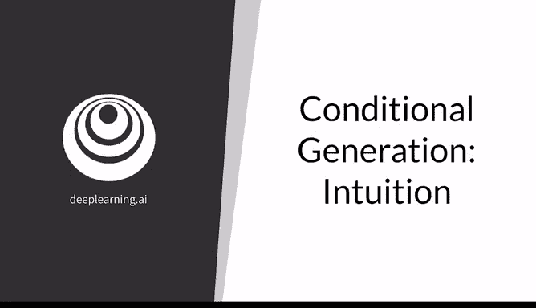
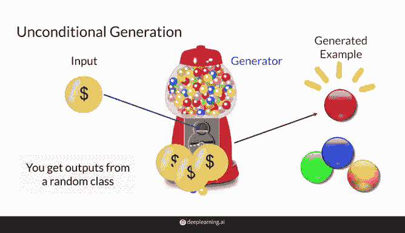
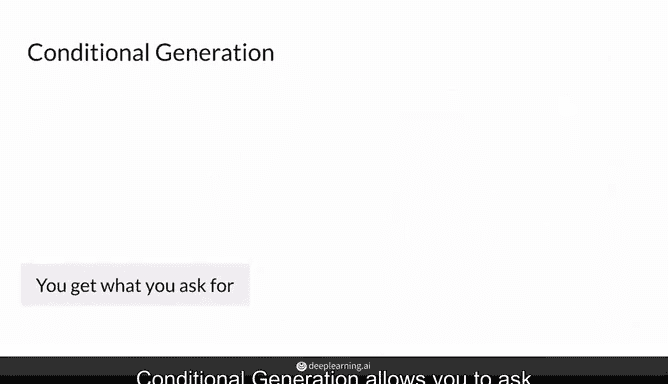
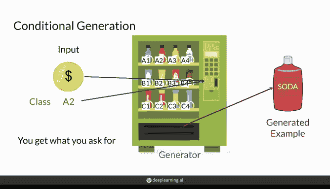
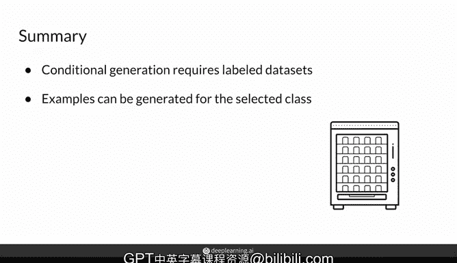

# 28：条件生成对抗网络（Conditional GAN）的直观理解 🧠

在本节课中，我们将要学习生成对抗网络（GAN）中一个重要的进阶概念：条件生成（Conditional Generation）。我们将通过对比无条件生成，来理解条件生成如何让你控制生成样本的类别或特征。

## 概述

在之前的几周里，你已经了解了GAN的工作原理，以及如何构建它们来生成模仿训练数据集的样本。本周，我将向你展示如何控制生成器的输出，使其生成特定类别的样本，或者让生成的样本具备某些特定特征。这非常有趣。

## 无条件生成回顾

首先，我们来回顾一下什么是无条件生成。实际上，到目前为止你一直在使用的就是无条件生成。在这种模式下，生成器会从随机类别中产生输出。

你可以将其想象成一个扭蛋机：你投入一枚硬币，就会得到一个随机颜色的扭蛋。如果你想要一个特定颜色（比如红色）的扭蛋，你必须不断投币，直到得到它为止。

在这个比喻中：
*   **硬币** 类似于生成器用于生成的**随机噪声向量 `z`**。
*   **扭蛋机** 类似于**生成器 `G`**。
*   **扭蛋** 就是随机的输出，即你得到的那些**图像**。

因此，就像你知道扭蛋机里有哪些颜色的扭蛋（基于你的训练数据），但你无法控制具体会得到哪个颜色的扭蛋一样，无条件生成无法控制输出样本的具体类别。

## 条件生成介绍

与无条件生成相反，条件生成允许你“请求”一个特定类别的样本，并且你会得到你所请求的。这更像一个自动售货机。

你投入一枚硬币（类似于扭蛋机），但同时你还需要输入你想要商品的代码。例如，输入代码“A2”来获得一瓶红色汽水。

但需要注意的是，你仍然无法控制汽水瓶的某些具体特征，比如你无法得到保质期最新、瓶身最完好或者液体最满的那一瓶。你只是随机得到一瓶红色汽水，但它确实是一瓶红色汽水，而不是一根蓝色糖果棒。

在这个比喻中：
*   **硬币和代码** 共同作为**条件GAN的输入**。
*   **自动售货机** 是**生成器 `G`**。
*   **汽水** 是**生成的输出**。

因此，使用条件GAN，你可以从你指定的类别（例如这里的“A2”红色汽水）中获得一个随机样本。

## 核心对比

现在你已经对条件生成和无条件生成的关系有了概念，让我们对它们进行一些比较。

以下是两者的主要区别：

*   **输出控制**：条件生成可以让你决定生成样本的类别；而无条件生成只能得到随机类别的样本。
*   **数据需求**：因此，条件生成需要使用**带标签的数据集**进行训练，这些标签对应着你希望生成的不同类别；而无条件生成则不需要任何标签，正如你在前几周课程中看到的，你只需要一堆真实的样本即可。
*   **模型修改**：在后续的讲座中，你将看到如何修改你的模型来实现这种条件生成。

## 总结

本节课中，我们一起学习了条件生成对抗网络的核心直觉。你需要掌握的重点是：**条件生成需要带标签的数据集进行训练，以便学习如何从期望的类别中生成样本**。

接下来，我将向你展示如何将数据集的标签信息输入到生成器和判别器中，从而训练你的条件GAN，并生成来自期望类别的样本，就像从自动售货机中选择红色汽水一样。