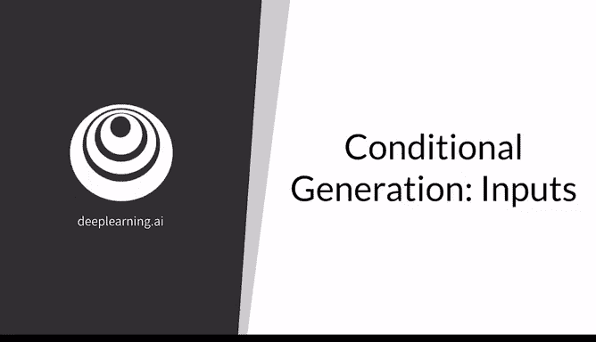
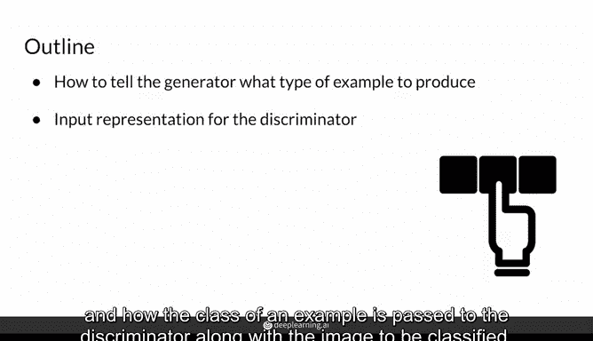
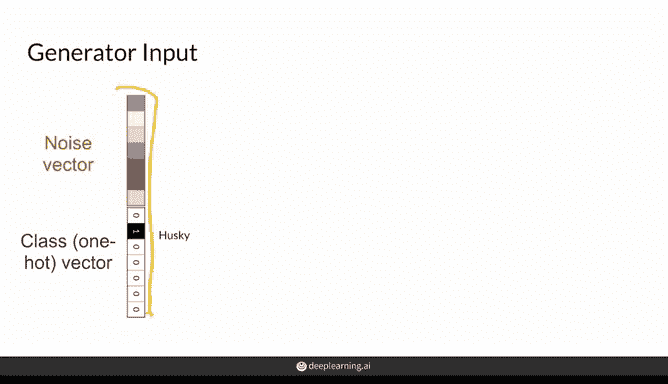
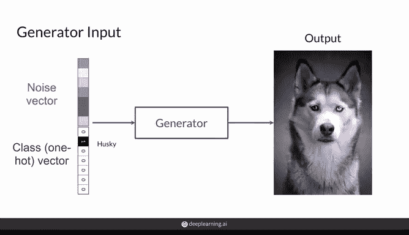
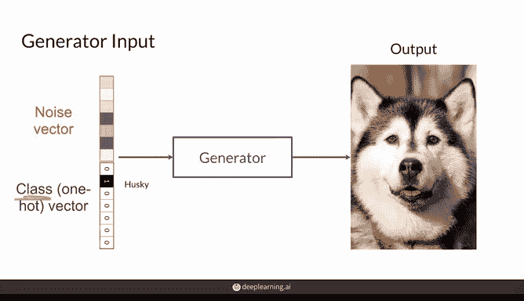
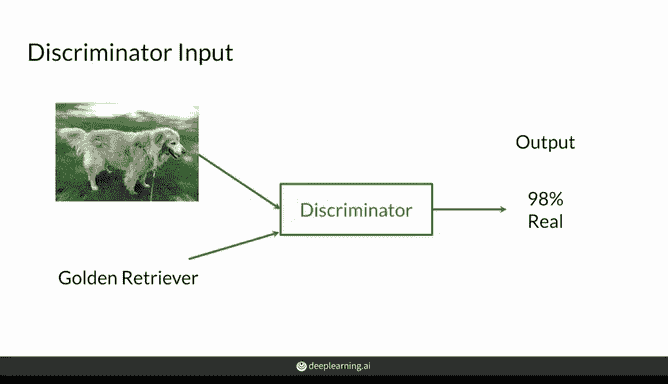
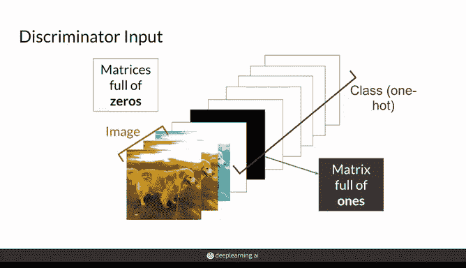
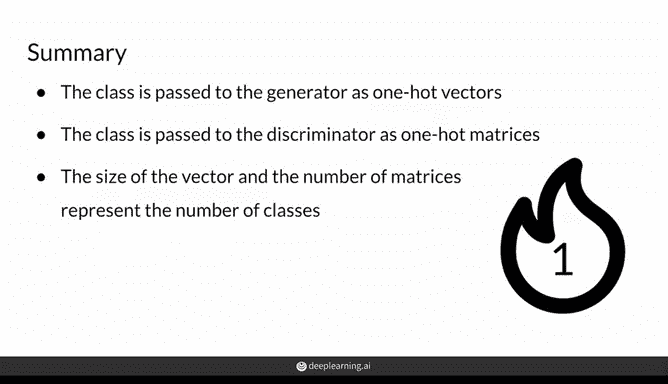

# 29：条件生成对抗网络的输入 🎨

在本节课中，我们将学习条件生成对抗网络（Conditional GAN）中，如何将类别信息传递给生成器和判别器，从而实现按指定类别生成样本。

---





## 概述

条件生成允许你从指定类别中生成样本。为实现这一点，你需要带有标签的数据，并在训练过程中将类别信息同时传递给生成器和判别器。本节将介绍如何告知生成器要生成哪个类别，以及如何将样本的类别信息与待分类图像一同传递给判别器。

---

## 生成器的输入

上一节我们介绍了无条件生成，生成器需要一个噪声向量来生成随机样本。在条件生成中，你还需要一个向量来告诉生成器，生成的样本应属于哪个类别。

这通常是一个**独热编码向量**，意味着除了对应你所需类别的位置为1外，其他所有位置都是0。噪声向量则仍然是随机值，但它不必是0或1。

以下是类别信息与噪声向量的结合方式：

*   **独热编码向量**：用于指定目标类别。例如，向量 `[0, 1, 0, 0, 0]` 可能表示“哈士奇”。
*   **噪声向量**：用于在指定类别内引入多样性，生成不同的样本。

条件GAN中生成器的输入，实际上是噪声向量和独热编码类别信息的**拼接**，形成一个更大的向量。

**代码示例：生成器输入向量的拼接**
```python
# 假设 noise_vector 维度为 100， one_hot_class 维度为 10（代表10个类别）
generator_input = concatenate([noise_vector, one_hot_class])
# 现在 generator_input 的维度是 110
```





例如，当类别向量代表“哈士奇”时，生成器理想情况下会从一个噪声向量生成一只哈士奇的图像。如果你改变噪声向量，它应该生成另一只不同的哈士奇，而类别信息保持不变。

---

## 判别器的输入与训练目标

那么，如何确保生成器真的生成哈士奇，而不是任意品种的狗呢？这看起来像魔法。原因在于判别器也会接收同样的类别信息。



判别器以类似的方式接收样本，但现在样本会与类别信息配对，作为输入，以判断该样本是该特定类别的真实还是虚假表示。这是关键所在。

例如，如果输入判别器的类别是“金毛寻回犬”，但图像是一只比格犬（即使它看起来非常真实），判别器也应该判定其为“假”，因为它不是一只看起来真实的金毛寻回犬。

因此，为了让判别器预测一个样本是“真实”的，该样本需要看起来像训练数据集中该类的样本。生成器为了用“金毛寻回犬”欺骗判别器，就必须生成一只逼真的金毛寻回犬。

继续以“金毛寻回犬”类别为例，判别器将学会仅在样本看起来像金毛寻回犬时，才预测该图像更“真实”。这是因为真实图像会带有正确的类别标签，这也促使生成的图像呈现出正确的类别。

---

## 类别信息的表示方法



深入探讨一下，判别器的输入是图像。那么如何添加类别信息呢？

图像通常以三个通道（RGB：红、绿、蓝）输入，如果是灰度图像则只有一个通道。这就是图像的组成部分。

而独热编码的类别信息也可以作为额外的通道输入。在这些通道中，所有位置的值通常都是0（图中显示为白色块，与图像等高宽），而对应类别的通道（图中显示为黑色块）则取值为1。

与一维的独热向量相比，这些是更大的矩阵，每个通道在非对应类别的位置都充满0。

当然，也存在许多其他更节省空间的方法来实现这一点，例如以其他格式压缩此信息。如果你有非常多的类别，甚至可以创建一个独立的神经网络“头”来处理，这将是更谨慎的做法。但对于这里大约七个类别的情况，上述方法完全可行，模型能够学习到这些信息。

**公式/概念说明：判别器的多通道输入**
判别器的输入可以看作是一个多通道张量：
`判别器输入 = 图像通道 (如 RGB) + 类别信息通道 (独热编码矩阵)`

---



## 总结

本节课中，我们一起学习了条件生成对抗网络中输入的处理方式：

1.  在条件生成中，你需要将类别信息传递给两个模型。
2.  对于生成器，类别信息通常是一个**独热编码向量**，与你的噪声向量**拼接**后作为输入。
3.  对于判别器，当GAN的期望输出是图像时，类别信息是代表通道的**独热编码矩阵**。
4.  类别向量的大小以及用于类别信息的额外通道数，与你将要生成的类别数量相同。



通过这种方式，生成器学会了根据指定的类别生成样本，而判别器则学会了结合类别信息来更精确地判断真伪。