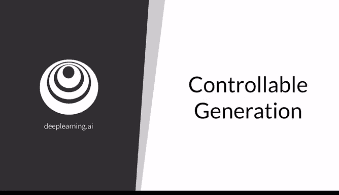
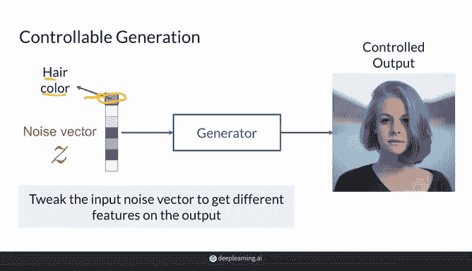
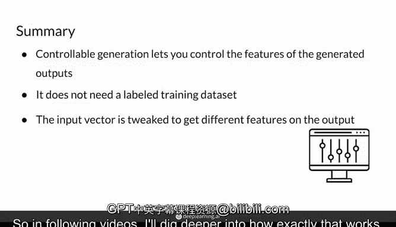

# 30：可控生成 🎛️

在本节课中，我们将学习生成对抗网络的另一种控制输出方式——可控生成。我们将探讨其核心概念、工作原理，并将其与上一节介绍的条件生成进行对比。

---



## 概述

上一节我们介绍了条件生成，它利用标签在训练过程中引导模型。本节中，我们来看看**可控生成**。这种方法允许你在模型训练完成后，依然能够控制输出样本中想要的特定特征，例如调整生成人脸的年龄、是否戴眼镜或头发的颜色。

---

## 什么是可控生成？🤔

可控生成让你能够控制输出样本中的某些特征。例如，在一个进行人脸生成的GAN中，你可以控制图像中人物的**外观年龄**、**是否佩戴太阳镜**、**视线方向**或**感知性别**。

实现这一目标的方法是：在模型训练完成后，通过调整输入生成器的**噪声向量Z**。

例如，对于某个输入噪声向量 `Z`，生成器可能生成一张红发女性的图片。如果你调整 `Z` 中的某个特定维度（特征），可能会得到同一位女性但头发变为蓝色的图片。这暗示了该维度可能**控制着发色的变化**。

```python
# 概念性示例：调整噪声向量Z的某个维度以改变特征
z_original = sample_noise_vector()
image_original = generator(z_original) # 生成红发人像

z_modified = modify_feature_in_z(z_original, feature_index=0, delta=0.5)
image_modified = generator(z_modified) # 生成蓝发人像
```



在后续课程中，你将学习如何精确地调整 `Z` 向量。但首先，为了更好地理解可控生成，我们将其与条件生成进行快速比较。

---

## 可控生成 vs. 条件生成 ⚖️

以下是两种方法的核心区别。请注意，在研究论文中，这些术语的界限有时并不绝对（可控生成有时也涵盖条件生成），但通常按如下方式区分：

*   **可控生成**：目标是控制输出中**特征的强弱或有无**。这些特征通常是连续的，如年龄、发色深浅、笑容程度。你可以在**训练后**通过寻找特征方向并调整 `Z` 来实现，无需为每个特征值（如每种具体发长）提供标签。
*   **条件生成**：目标是指定输出**所属的类别**，例如“人类”或“鸟类”。当然，也可以是“戴太阳镜的人”。这通常需要在**训练期间**使用带标签的数据集，并将类别信息附加到噪声向量 `Z` 上。

简而言之，可控生成更关注**连续特征的程度微调**，而条件生成更关注**离散类别的指定**。

---

## 工作原理与对比 🔧

可控生成与条件生成在实现机制上有所不同：

*   **可控生成**：通过**调整输入噪声向量 `Z`** 本身来工作。你寻找 `Z` 空间中代表特定特征（如“年龄增长”）的方向，并沿该方向移动 `Z`。
*   **条件生成**：需要向生成器**传递额外的信息**（即类别标签），通常与噪声向量 `Z` **拼接（append）** 后一起输入。

```python
# 概念性代码对比
# 可控生成：修改Z
z_controlled = z + alpha * direction_age  # 沿“年龄”方向调整

# 条件生成：将标签信息与Z结合
label = one_hot_encode("person_with_sunglasses")
z_conditional = concatenate(z, label)
```

当然，可控生成有时也会在训练期间进行干预，以引导模型学到更易于控制的特征方向。

---

## 总结

本节课中，我们一起学习了**可控生成**。它使你能够在GAN训练完成后，通过调整输入噪声向量 `Z` 来控制输出样本的特定特征（如年龄、发色）。与条件生成不同，它通常不需要带标签的训练数据集，而是侧重于在特征空间中发现可解释的方向并进行操作。



在接下来的视频中，我们将深入探讨如何具体实现这种对 `Z` 向量的调整。