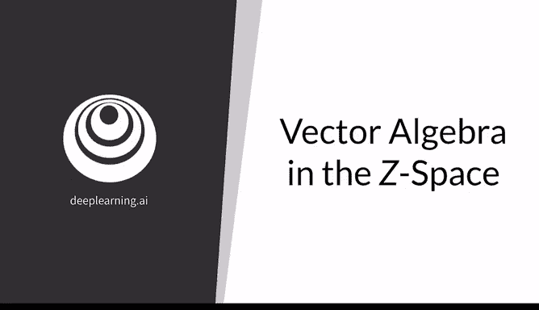
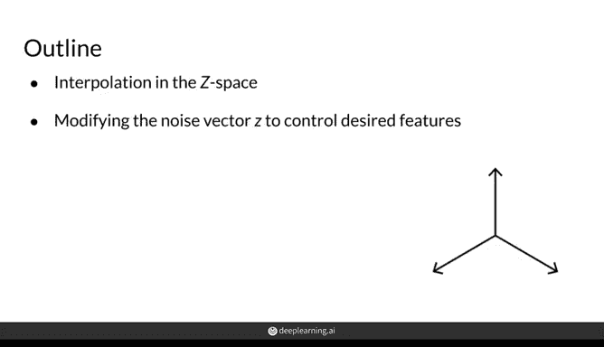
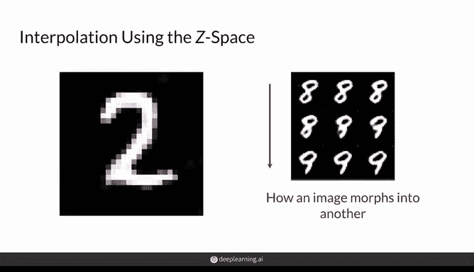
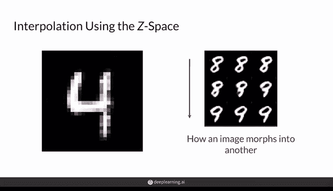
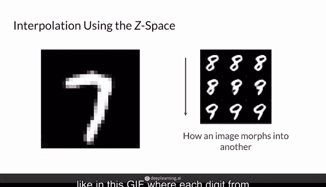
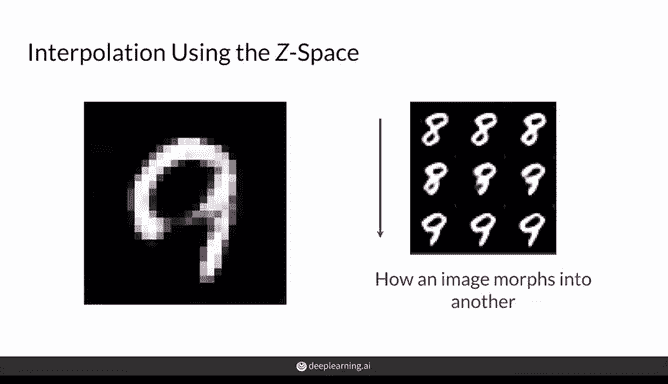
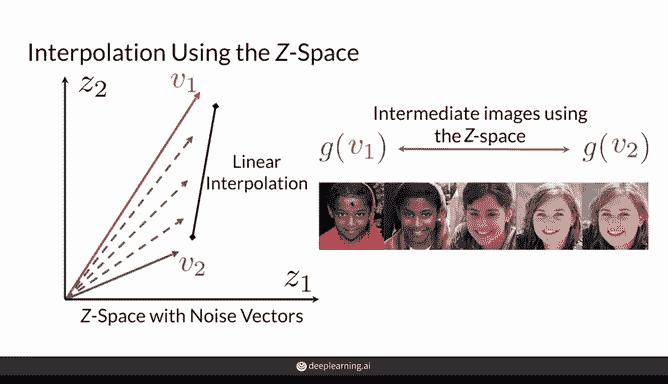
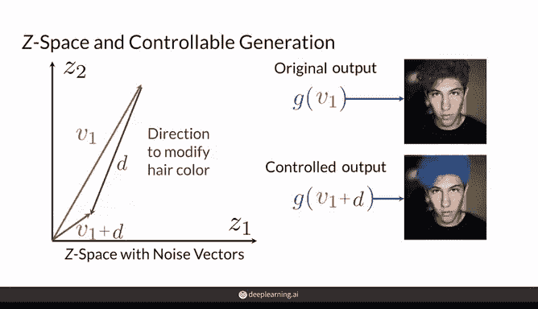
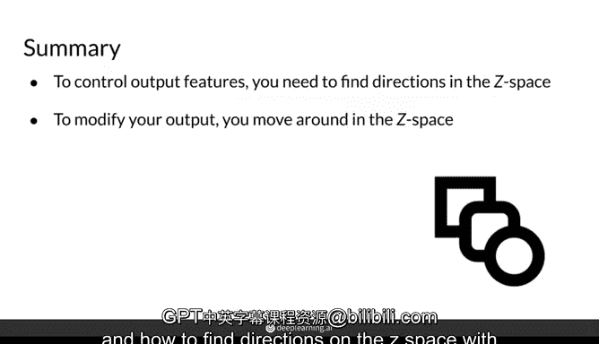

# 31：Z空间中的向量代数 🧮

在本节课中，我们将学习生成对抗网络中“可控生成”背后的核心直觉。我们将探讨如何通过操作输入生成器的噪声向量 `Z`，来控制生成图像的特征，例如改变人物的发色。理解Z空间中的向量操作是实现精细控制生成内容的关键。

---

上一节我们介绍了通过操作噪声向量 `Z` 可以实现可控生成。本节中，我们来看看这背后的直观原理，并首先回顾如何在两个生成器输出之间进行插值。

## 回顾：生成器输出之间的插值 🔄

可控生成与插值有相似之处。通过插值，你可以在两个生成的样本之间获得一系列中间样本。

以下是插值在实践中的应用方式：

*   你可以观察一张图像如何逐渐变形为另一张图像。
*   例如，在这个动图中，每个从0到9的数字都逐渐变形为下一个数字，效果非常有趣。

其原理是，通过操作来自Z空间（即噪声向量的向量空间）的输入，你可以在目标图像之间获得中间样本。稍后你会看到，这正是可控生成背后的相同思想。

为了更清晰，我们定义：
*   `Z1` 和 `Z2` 是当前所观察的Z空间中的两个维度。
*   向量 `V1` 和 `V2` 是Z空间中的具体向量值。

例如：
*   向量 `V1` 的值为 `[z1=5, z2=10]`，即向量 `[5, 10]`。
*   向量 `V2` 的值为 `[z1=4, z2=2]`，即向量 `[4, 2]`。

当将 `V1` 输入生成器时，会产生图像A；将 `V2` 输入生成器时，会产生图像B。

如果你想在这两张图像之间获得中间图像，可以在Z空间中对它们的两个输入向量 `V1` 和 `V2` 进行插值。这种插值通常是线性的，当然也存在其他插值方式。

然后，你可以将所有中间向量输入生成器，观察它们产生的图像。生成器接收这些向量并输出对应的图像，从而得到这两张原始图像之间的平滑渐变过渡。

## 可控生成的原理 🎯

可控生成同样利用了Z空间中的变化，其关键在于理解对噪声向量的修改如何反映在生成器的输出上。

例如：
*   使用一个噪声向量，你可以得到一张红发女性的图片。
*   使用另一个噪声向量，你可以得到同一女性但头发是蓝色的图片。

这两个噪声向量之间的差异，正好指明了在Z空间中需要移动的“方向”，以修改生成图像的发色。

在可控生成中，你的目标就是为所关心的不同特征（例如修改发色）找到这些方向。不过，暂时不必担心如何精确找到这个方向，我们将在后续课程中讲解。

假设我们已知这个方向，称其为Z空间中的方向向量 `D`。现在，你就可以控制生成器 `G` 输出上的特征了，这非常令人兴奋。

这意味着，如果你用同一个生成器 `G` 和输入噪声向量 `V1` 生成了一张红发男性的图像，你可以通过将之前找到的方向向量 `D` 加到噪声向量上，创建一个新的噪声向量 `V1 + D`。

将 `V1 + D` 输入你的生成器，就能得到一张结果图像，其中男性的头发变成了蓝色。

---

## 总结 📝

本节课中，我们一起学习了Z空间向量代数的核心思想。

总结来说，在可控生成中，你需要找到Z空间中与生成器输出上所需特征变化相关的方向。

一旦已知这些方向，可控生成就通过在该Z空间中沿不同方向移动噪声向量来实现。

接下来，你将学习与可控生成相关的一些挑战，以及如何找到对生成输出具有已知效果的Z空间方向。