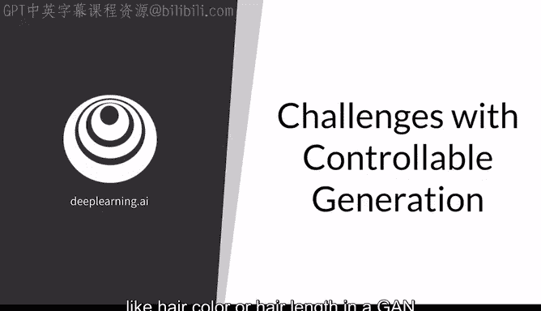
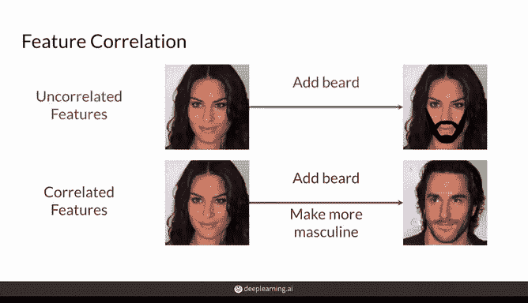
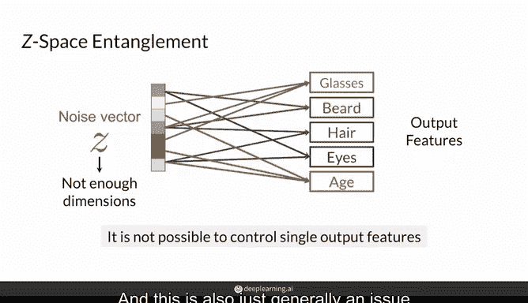
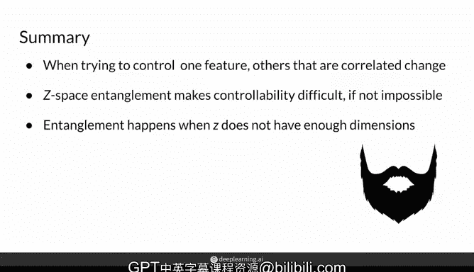

# 32：可控生成的挑战 🎯

在本节课中，我们将学习生成对抗网络（GAN）中“可控生成”所面临的两个主要挑战：输出空间中的特征相关性，以及潜在空间（Z空间）的纠缠问题。理解这些挑战是掌握如何精确控制生成内容的关键。

## 概述

可控生成的目标是能够决定生成器输出内容的特定特征，例如在生成人物图片时控制其发色或发型。然而，实现精确控制并非易事，主要会遇到两个核心挑战。

## 特征相关性

上一节我们介绍了可控生成的基本概念，本节中我们来看看第一个挑战：特征相关性。

当训练数据集中不同的特征高度相关时，训练出的生成器将难以在不影响相关特征的情况下，独立控制某个特定特征。

例如，理想情况下，你希望仅控制生成器输出的人物面部胡须量。如果数据集中的特征没有高度相关性，你或许可以通过在潜在空间（Z空间）中沿某个方向移动，为一张女性图片添加胡须。

然而，在实际训练数据集中，像“是否有胡须”和“面部男性化程度”这类特征很可能存在强相关性。因此，当你试图为女性图片添加胡须时，最终会改变输出的许多其他特征。这通常不是我们期望的结果，因为我们希望找到能仅改变单一特征的方向，从而实现可靠的图像编辑。

以下是特征相关性挑战的要点：
*   **问题本质**：数据集中特征A与特征B高度绑定。
*   **导致结果**：尝试修改特征A时，会不可避免地连带改变特征B。
*   **核心影响**：破坏了控制的独立性和精确性。

## Z空间纠缠

了解了特征相关性后，我们来看第二个挑战：Z空间纠缠。

当Z空间发生纠缠时，即使训练数据中的特征本身不相关，在Z空间中沿不同方向移动也会同时影响输出中的多个特征。这是因为噪声空间在学习过程中变得非常纠缠。

在这个纠缠的Z空间中，例如当你试图控制输出人物是否戴眼镜时，可能也会同时改变她是否有胡须或头发的样式。同样，当你尝试修改她的表观年龄时，可能也会连带改变她的眼睛和发色。这对于控制无关的特征来说是不可取的。

这意味着噪声向量中某些分量的变化会同时改变输出的多个特征，这使得控制输出变得非常困难，甚至不可能。

当Z空间的维度相对于你想要控制的输出特征数量不足时，这是一个非常常见的问题，因为此时模型无法建立一一映射的关系。这通常也是训练生成模型时的一个普遍问题。

以下是Z空间纠缠挑战的要点：
*   **问题本质**：Z空间（噪声输入空间）的维度结构混乱。
*   **数学/代码描述**：设噪声向量为 `z ∈ R^d`，生成器为 `G(z)`。纠缠意味着存在一个方向向量 `Δz`，使得 `G(z + αΔz)` 的输出在多个不相关的特征上（如眼镜、胡须）同时发生变化，其中 `α` 是步长。
*   **导致结果**：单一控制方向会同时影响多个输出特征。
*   **核心影响**：无法实现特征间的解耦控制。

## 总结

本节课中我们一起学习了可控生成面临的两大挑战。

首先，如果数据集中的特征彼此高度相关，并且没有以某种方式加以处理，那么当你尝试控制生成器的输出时，最终会一次性改变多个特征。

其次，即使你想要控制的特征在训练数据中相关性不高，但如果你的Z空间是纠缠的，可控生成同样困难。当Z空间的维度不够大时，这种情况经常发生，当然也存在其他导致纠缠的原因。

理解这些挑战是后续探索解决方案（如使用解耦表示学习、条件GAN等）的重要基础。