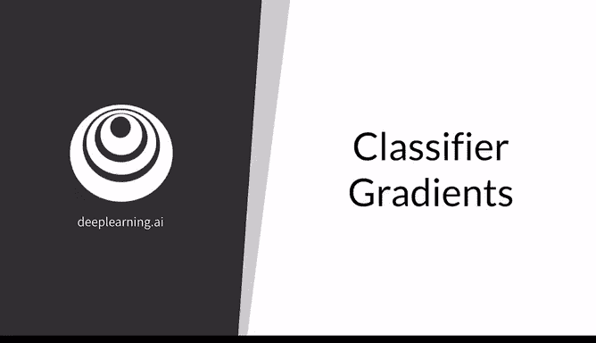
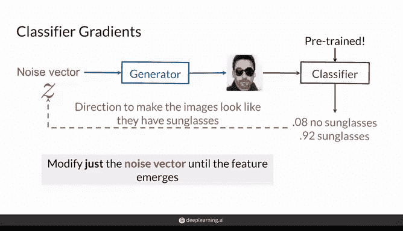
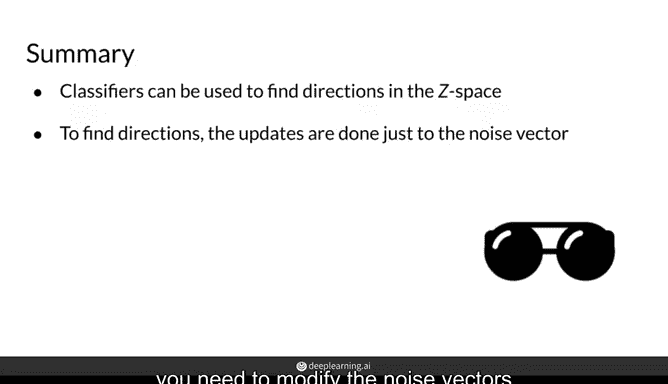

# 33：利用分类器梯度控制GAN生成特征 🎭

在本节课中，我们将学习一种利用已训练分类器的梯度，在生成对抗网络的潜在空间（Z空间）中寻找特定特征方向的方法。这种方法允许我们在不修改生成器权重的情况下，通过调整输入噪声向量来控制生成图像的特征，例如添加太阳镜或改变发型。

---

## 概述

上一节我们介绍了通过在Z空间中沿特定方向移动来修改生成图像特征（如改变头发长度）的基本概念。本节中，我们将深入探讨一种利用预训练分类器梯度来寻找这些方向的具体方法。

## 方法原理

该方法的核心思想是：使用一个能够识别目标特征（例如“是否佩戴太阳镜”）的预训练分类器，通过其输出的梯度信息来指导噪声向量Z的调整，从而使生成器输出的图像逐渐具备该特征。

以下是实现步骤：

1.  **准备噪声向量与生成图像**：选取一批噪声向量`Z`，输入到已训练好的生成器中，得到一批生成图像。
2.  **使用分类器进行评估**：将生成的图像输入到一个预训练的分类器（例如“太阳镜分类器”）中。该分类器会判断每张图像中的人物是否佩戴太阳镜。
3.  **计算梯度并更新Z**：根据分类器的输出（例如，对“未佩戴太阳镜”的图像施加惩罚），计算损失函数相对于输入噪声向量`Z`的梯度。然后，沿着减小损失的方向更新`Z`向量。**生成器的权重在此过程中始终保持冻结，不被更新。**
4.  **迭代优化**：重复步骤1至3，直到生成的图像被分类器判定为“佩戴太阳镜”为止。

## 方法要求与优缺点

以下是使用此方法前需要考虑的几个要点：

*   **需要预训练的分类器**：你必须有一个能够准确检测你想要控制的目标特征的预训练分类器。
*   **分类器的来源**：你可以使用现成的模型，也可以针对特定特征（例如检测胡须）自己训练一个分类器。建议优先寻找可用的预训练模型，这通常是最简单快捷的方式。
*   **方法的优势**：这种方法简单、高效，充分利用了现有的预训练模型，无需重新训练或修改生成器。
*   **方法的局限**：其效果完全依赖于所用分类器的准确性。如果分类器性能不佳，寻找的特征方向也可能不准确。

## 总结

本节课中，我们一起学习了如何利用预训练分类器的梯度来控制GAN的生成特征。关键要点是：预训练分类器可用于发现Z空间中与生成图像特征相关联的方向；通过计算分类器对噪声向量`Z`的梯度并迭代更新`Z`（同时保持生成器不变），我们可以实现这种控制。请记住，所有这些操作都是在生成器训练完成之后进行的。