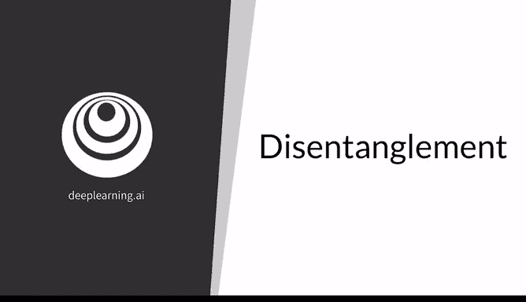
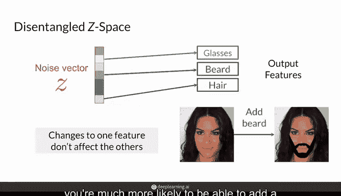
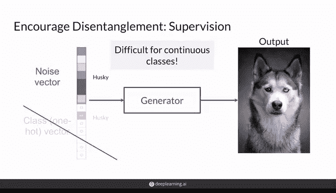
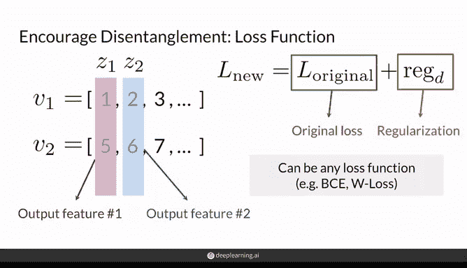
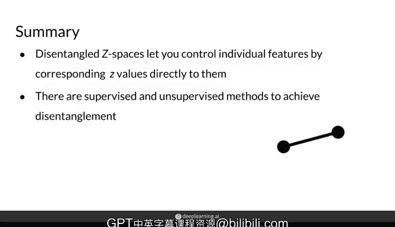

# 34：生成对抗网络 (GAN) - P34：解耦 🧩



在本节课中，我们将学习生成对抗网络中“解耦”的概念。我们将探讨解耦空间与耦合空间的区别，并介绍几种引导模型实现解耦的方法。

---

上一节我们介绍了Z空间中的“耦合”现象及其带来的问题。本节中，我们来看看什么是“解耦”，以及如何引导模型实现它。

首先，我们回顾一下耦合与解耦的Z空间分别意味着什么。

## 耦合空间 vs. 解耦空间

假设有以下两个噪声向量 **V1** 和 **V2**，它们来自一个解耦的Z空间。

```python
# 示例：解耦Z空间中的噪声向量
V1 = [z1_hair_color, z2_hair_length, z3, z4, ...]
V2 = [z1'_hair_color, z2'_hair_length, z3', z4', ...]
```

右侧可视化了该Z空间的两个维度，但显然，从这些噪声向量可以看出，其维度远不止两个。在一个解耦的Z空间中，每个维度位置都对应输出图像中的一个**单一特征**。例如：
*   第一个维度（如 `z1`）可能对应**发色**。
*   第二个维度（如 `z2`）可能对应**发长**。

因此，如果你想改变图片中的发色，你只需要改变噪声向量中第一个元素的值，或者在Z空间中沿Z1方向移动。同理，要改变发长，只需调整第二个维度的值。

通常，我们希望噪声向量的尺寸大于你想要控制的特征数量。这使得模型在训练时更容易学习，因为多余的维度值可以灵活变化以辅助训练。例如，如果你只想控制发色和发长两个特征，那么将噪声向量设置为大于二维（比如三维或更多）是更明智的。多出的维度不控制特定特征，但能帮助模型在训练过程中进行适应。

由于解耦Z空间中的噪声向量分量允许你改变输出中期望的特征，它们通常被称为**变化的潜在因子**。“潜在”一词源于噪声向量中的信息并非直接体现在输出中，但它们确实决定了输出的样貌。有时，噪声向量也被更泛泛地称为“潜变量”。“变化的因子”则意味着这些是不同的、你希望独立改变的因素（如发色、发长），并且改变一个因子时，只影响对应的那个特征。

本质上，一个解耦的Z空间意味着在噪声向量中存在特定的索引（维度），这些维度直接对应并改变你GAN输出中的特定特征。例如，生成图像中的人物是否戴眼镜、是否有胡子或头发的某些特征。每个这样的维度都对应一个你希望改变的特征，你只需改变该维度的值就能调整眼镜、胡子或头发。

解耦Z空间与耦合Z空间的一个关键区别在于：在解耦空间中，当你控制输出中的一个特征（例如眼镜）时，其他特征保持不变。如果改变某人是否有胡子，眼镜和头发也会保持不变。

这意味着，拥有一个解耦的Z空间，你更有可能为一个看起来非常女性化的人物添加胡子，而无需改变她的头发或面部特征。

---

了解了什么是解耦空间后，我们来看看如何引导模型实现它。以下是几种主要方法。

## 引导模型实现解耦的方法



### 1. 使用带标签数据的监督方法

一种方法是给你的数据打上标签，并遵循类似于条件生成的过程。但不同之处在于，类别的信息被嵌入到噪声向量本身中，因此你不需要额外的独热编码类别信息或类别向量。

然而，这种方法对于连续型类别可能会有问题。想象一下，需要为成千上万张人脸标注他们的头发长度。当然，即使只划分几个不同的类别（几个桶），也可能将你的生成器推向正确的方向。



### 2. 无监督的正则化方法

另一种无需为任何样本打标签的方法是，在你选择的损失函数（如BCE或W损失）中添加一个**正则化项**。这个正则化项的目的是鼓励模型将噪声向量中的每个索引与输出中的不同特征关联起来。这种正则化可以来自分类器的梯度，也有更先进的技术以完全无监督（即无需任何标签）的方式实现这一点。

---



在本节课中，我们一起学习了生成对抗网络中的“解耦”概念。



**总结如下：**
*   **解耦的Z空间**允许你通过将噪声向量中特定的Z值直接对应到你想控制的特征，从而独立地控制单个输出特征。
*   为了引导你的模型使用解耦的噪声向量，你可以使用**监督学习**和**无监督学习**两种方法。