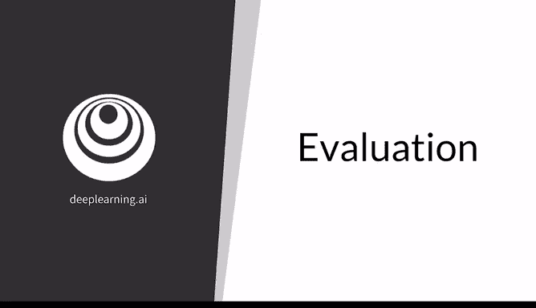
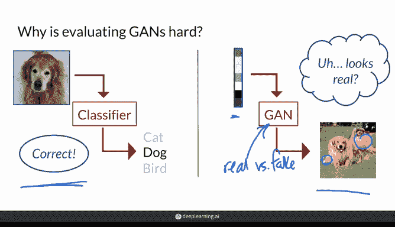
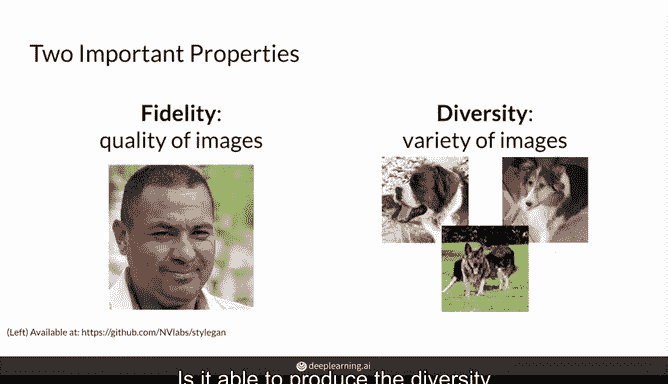
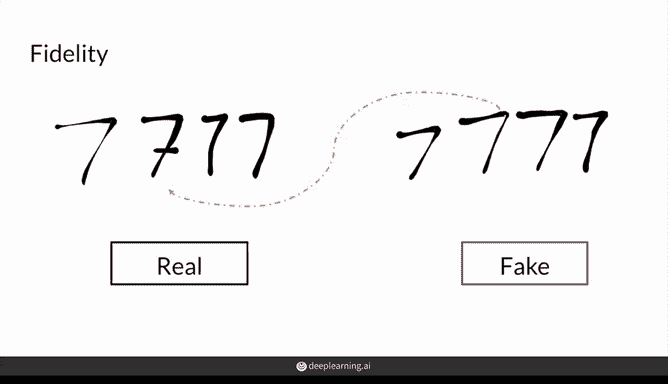
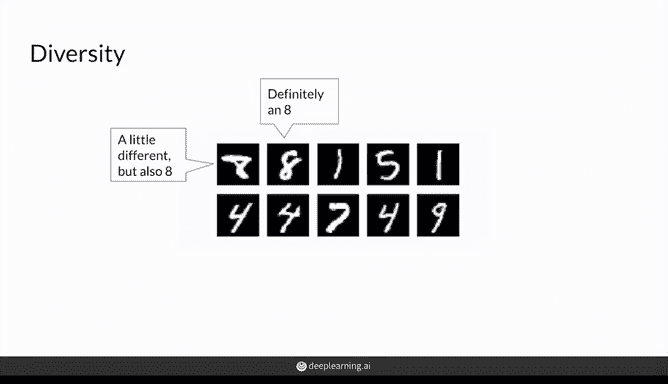
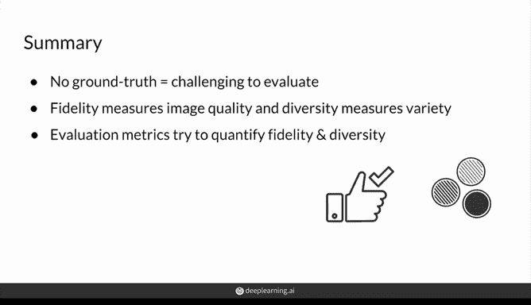

# 37：生成对抗网络（GAN）评估指南 🧐

在本节课中，我们将学习如何评估生成对抗网络。评估GAN是一个具有挑战性的任务，因为它不像分类任务那样有明确的“正确”或“错误”标签。我们将从理解评估GAN的难点开始，然后深入探讨两个核心评估属性：**保真度**和**多样性**。

## 为什么评估GAN具有挑战性？🤔

评估GAN的挑战性源于其生成式任务的本质。在监督学习中，例如图像分类，我们有一个带有标签的测试集，可以明确判断模型预测的对错。模型输出有明确的“正确”目标。

然而，对于GAN，我们输入一个随机噪声向量 `z`，模型会生成一张“假”图像。我们无法预先知道给定 `z` 时应该生成的确切像素值。因此，没有一个清晰的“正确”目标来衡量生成图像的好坏。这就像评判一位学习创作大师级画作的艺术家，而不是评判一位临摹已知画作的学徒。

此外，GAN中的判别器虽然能区分真实与生成图像，但它永远不会达到完美，并且通常会过拟合于其对应的特定生成器。这意味着，即使一个生成器生成了看起来很逼真的图像，其对应的判别器也可能因为捕捉到了生成器的某些特定模式而将其判定为“假”。因此，不存在一个完美的、通用的判别器可以公平地比较两个不同GAN模型的优劣。

## 评估GAN的核心属性

既然没有直接的“正确”答案，我们转而关注生成器应具备的理想属性。以下是两个最重要的评估维度。

### 属性一：保真度

保真度指的是生成图像的质量和真实感。一张高保真度的图像看起来应该像一张真实的照片，细节清晰，没有明显的伪影或模糊。我们可以这样思考：对于每一张生成的“假”样本，它与最接近的“真”样本有多大的差异？更一般地，我们可以比较一组生成图像与一组真实图像在特征空间中的整体距离。

**核心思想**：评估生成图像与真实图像的接近程度。

### 属性二：多样性

多样性指的是生成器能够产生的图像的变化范围。一个好的生成器不应该只反复生成同一张或少数几张非常逼真的图像（这种现象称为**模式崩溃**）。它应该能够捕捉并再现训练数据集中存在的全部多样性。

例如，一个用于生成手写数字的GAN，应该能生成各种不同风格、不同笔画的数字“8”，而不仅仅是同一种“8”。

**核心思想**：评估生成图像覆盖真实数据分布范围的能力。

上一节我们介绍了评估GAN的两个核心属性。需要理解的是，保真度和多样性有时会相互制约。追求极高的保真度可能导致生成图像过于相似，缺乏多样性；而过度追求多样性又可能牺牲图像质量。一个优秀的GAN需要在两者之间取得良好的平衡。

## 深入理解保真度与多样性

以下是关于这两个属性的进一步说明。

### 关于保真度

评估保真度时，我们关注生成图像的逼真程度。一种思路是衡量单个生成样本与其在真实数据集中最近邻样本的差异。为了获得更稳健的评估，我们通常比较两组样本（例如各100张）在特征空间中的分布距离。我们期望一个好的生成器能够**持续稳定**地输出高质量图像，而不是偶尔生成一张杰作。

在后续课程中，你将学习一些具体的度量方法来进行这种比较。

### 关于多样性

评估多样性时，我们希望生成图像的分布能够覆盖真实数据分布的整个范围。如果GAN只生成同一张高度逼真的图像，那它不是一个好模型。我们可以通过比较生成图像集和真实图像集在特征空间中的分布“散度”来量化多样性。例如，生成的一组“狗”的图片，应该像真实的“狗”图片集一样，包含不同品种、姿态和场景。

## 课程总结

本节课我们一起学习了评估生成对抗网络的核心概念。

我们了解到，评估GAN之所以困难，是因为缺乏一个能够提供绝对真实标签的全局判别器来进行公平的模型间比较。

为了评估GAN，我们需要综合考虑**保真度**（生成图像的质量与真实感）和**多样性**（生成图像的变化范围）这两个关键属性。

通过衡量生成图像与真实图像在保真度和多样性上的表现，我们可以对生成器的性能有一个全面的认识。

在接下来的视频中，你将带着对这些属性和标准的理解，学习具体评估GAN的几种方法。