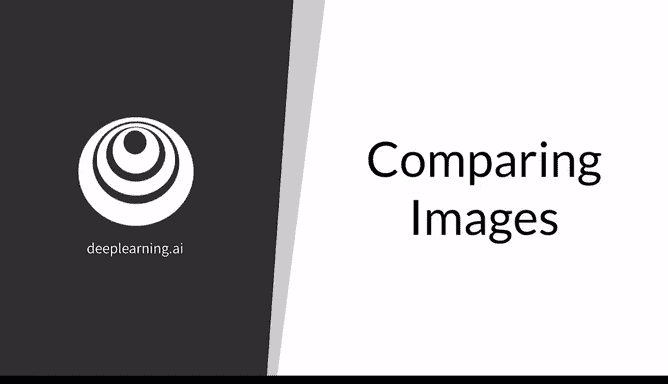
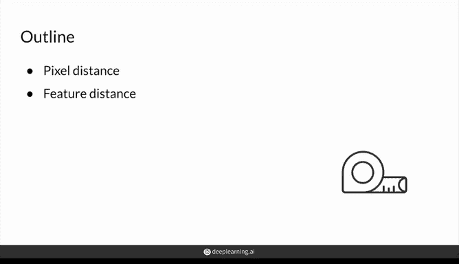
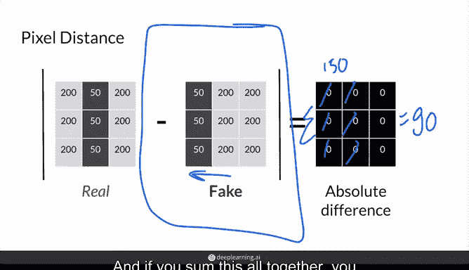
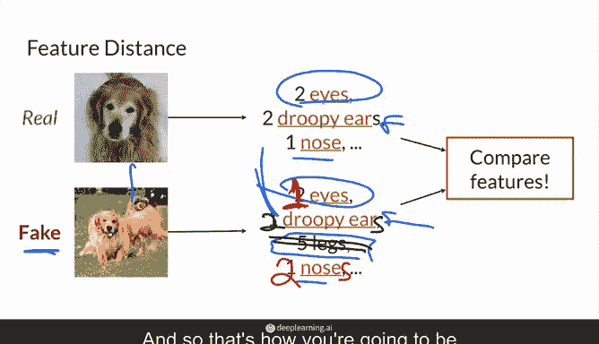
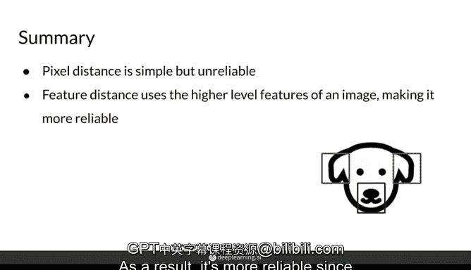

# 38：图像比较方法 🖼️🔍



在本节课中，我们将学习如何比较不同的图像，例如在生成对抗网络中评估真实图像与生成图像的质量。比较图像在保真度和多样性方面具有挑战性，因为具体应该比较什么？首先，我们将探讨一种简单但不够充分的方法——像素距离。然后，我们将介绍使用特征距离来比较图像，这种方法能提供更可靠的比较结果。



## 像素距离法 📏

像素距离是图像比较中最简单的方法，它通过计算两幅图像对应像素值之间的差异来实现。

具体操作是：对于一幅真实图像和一幅生成图像，将一幅图像的像素值（范围从0到255）减去另一幅图像的对应像素值，然后取绝对值。这样可以得到每个像素的差异值。

接着，可以将所有像素的差异值求和。如果两幅图像完全相同，总差异值为0，表示它们之间没有距离，看起来完全一致。

然而，像素距离法并不十分可靠。例如，假设生成图像相对于真实图像向左平移了一个像素。尽管这两幅图像在人眼看来可能几乎无法区分，尤其是在高分辨率图像中，但根据像素距离计算，它们的绝对差异会非常大。

**公式示例：**
```
像素距离 = Σ |真实图像像素值 - 生成图像像素值|
```

如果图像非常大，仅平移一个像素可能导致巨大的像素距离总和，例如达到900，尽管视觉差异微乎其微。

## 特征距离法 🧠



由于像素距离法对微小变化过于敏感，一种替代方法是关注图像的高级特征，而非直接比较像素。

高级特征指的是图像中的语义信息，例如：狗是否有两只眼睛？鼻子是否在眼睛下方？是否有毛发？这种高级语义信息对图像的小幅平移或变化不那么敏感。

因此，我们可以通过提取图像的特征（如两只眼睛、下垂的耳朵、鼻子等）来“浓缩”或描述图像，然后基于这些提取的特征来比较图像。这种方法称为特征距离法。

**核心思想：**
通过比较图像的高级语义特征，评估结果对图像中的微小差异不再那么敏感。例如，即使两幅图像的背景不同，只要它们都能被识别为“有两只眼睛和鼻子的狗”，它们在特征层面上就是相似的。

在接下来的视频中，我们将详细讲解如何提取这些特征以及如何计算特征距离。

**有趣的是**，你可以看到两幅图像在某些方面相似（例如都有两只眼睛），但在其他方面可能存在差异（例如耳朵的数量、腿的数量等）。生成图像可能只有一只下垂的耳朵或者五条腿，这与真实图像存在差距。通过特征比较，我们可以量化这种差距。

## 总结 📝

本节课我们一起学习了两种图像比较方法。

首先，我们介绍了像素距离法。这种方法虽然简单，但对图像中的微小变化过于敏感，导致比较结果不可靠。

接着，我们探讨了特征距离法。这种方法通过提取和比较图像的高级语义特征，而非直接比较像素，使得图像比较更加稳健和可靠。特征距离法关注的是更高层次的信息，因此在评估生成对抗网络中的图像时更为有效。





总之，在评估和比较图像时，特征距离法提供了一个比像素距离法更优的替代方案。