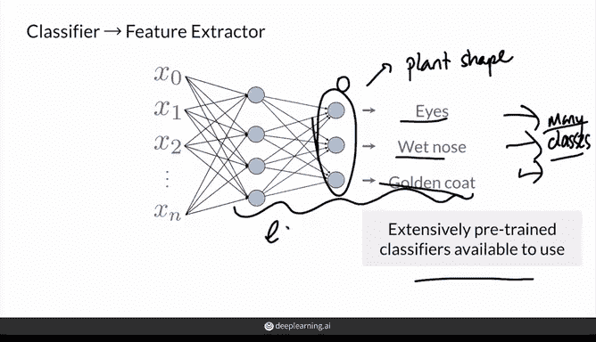
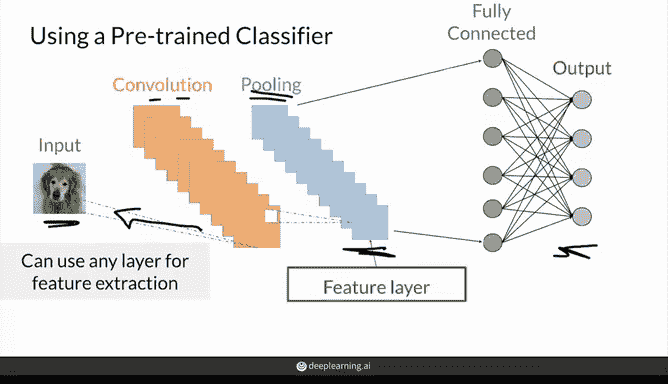
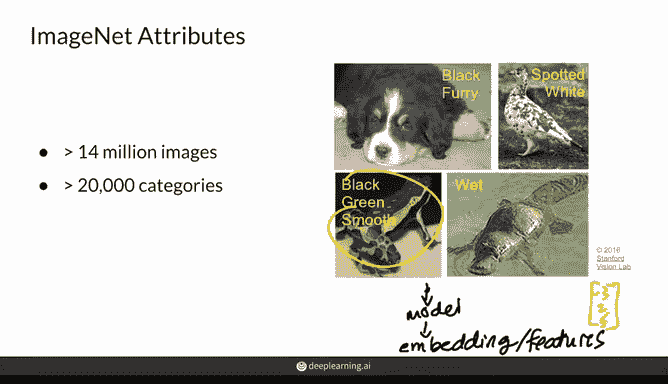
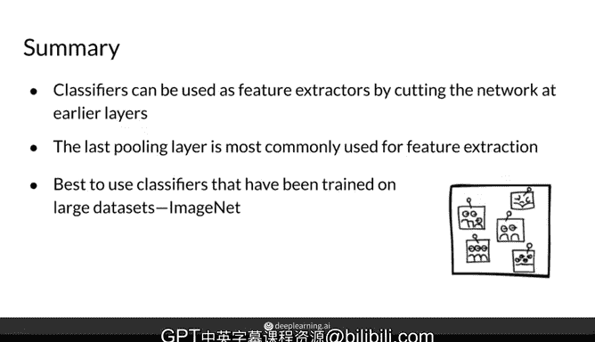

# 39：特征提取 🧠

在本节课中，我们将学习如何从图像中提取特征。这些特征将用于计算图像之间的特征距离。

为了计算真实图像与生成图像之间的特征距离，首先需要一种从这些图像中提取特征的方法。我们可以通过使用预训练分类器的权重来获得一个特征提取器。

## 获取特征提取器

以下是获取特征提取器的关键步骤：

*   **预训练分类器**：理想的提取器是一个在大量图像上预训练过的分类器，这些图像最好与你想要提取特征的数据和类别相关。
*   **编码的特征**：这些预训练模型的权重本质上编码了许多特征。例如，一个能区分狗和植物的分类器，必然已经学会了识别“湿鼻子”、“金色毛发”或“植物形状”等特征。
*   **无需重复训练**：幸运的是，我们无需为评估每个GAN都去训练一个新分类器。已有在数百万图像和成百上千个类别上预训练好的神经网络可供直接使用。

这些分类器能区分非常多的类别，因此它们的网络中编码了大量相关特征。

## 如何使用预训练分类器

上一节我们介绍了如何获取预训练模型，本节中我们来看看如何具体使用它来提取特征。

我们并不关心分类器最终的分类输出，但网络其余部分的权重很有价值，它们学习了有助于最终分类任务的重要特征。

因此，我们可以“砍掉”最后的分类层，只获取更早一层的输出，该层包含了输入图像的有用信息。

以下是处理一个通用卷积神经网络（CNN）的典型流程：

1.  一个卷积神经网络通常包含卷积层、池化层和全连接层。
2.  最常见的做法是移除最后一个用于分类的全连接层。
3.  将移除前最后一个池化层的输出作为特征。因为在这一层，模型必须编码足够多的精细特征信息，才能让后续仅一个全连接层就能完成图像分类。

截断网络后，从这个“最后的池化层”输出的值（例如100个数值）就代表了该模型为这张特定输入图像提取的特征。我们可以将此层视为**特征层**。

这个特征层输出的值远少于输入像素的数量，因此它将输入中的像素值压缩成了这些特征。

## 选择特征层

选择哪一层作为特征层是可以进行实验的。通常建议从最后一个池化层开始，因为它在一个庞大且任务广泛的数据集上训练过。

但使用更早的层也是可行的。以下是不同层次的特征差异：

*   **更早的层**：如果回溯到网络中更早的卷积层或池化层，可以提取更基础的特征。例如，最早的层可能只进行垂直边缘检测。
*   **最后的池化层**：这一层的特征则更适用于具体的图像类别，例如判断图像中是否有猫。

## ImageNet 数据集

上一节提到，一个好的起点是使用在ImageNet上预训练的分类器。本节我们来详细了解一下这个数据集。

ImageNet是一个包含超过1400万张图像和2万个类别的著名大型数据集。其类别包括各种狗品种、猫品种、几乎所有你能想到的动物类型以及多种物体。

在这个数据集上训练的分类器，其编码的信息非常丰富。从这个分类器提取的特征有时被称为 **ImageNet嵌入**，因为它们利用在该数据集上训练的网络权重，将图像信息嵌入并压缩到一个更小的向量中。

这些特征（或嵌入）是存在于更广泛意义上的**特征空间**或**嵌入空间**中的向量。你可以想象一张图像输入后，输出的特征就是一个由各种数值组成的向量（例如 `[-3, 2, 0.5, ...]`），这个向量在某个空间中代表了你的特征。

## 总结

本节课中，我们一起学习了如何通过截断网络并使用输出层之前的层权重，从一个预训练分类器中获得特征提取器。

最常用的做法是使用最后一个池化层，但如果使用更早的层，则可以提取更基础的特征，如垂直边缘或自然纹理模式。

使用在大型数据集（如拥有数百万张图像的ImageNet）上训练的分类器，可以将图像中有意义的信息编码为特征。在接下来的课程中，你将学习一个使用ImageNet数据的流行分类器，以及如何用它来评估你的生成对抗网络（GAN）。