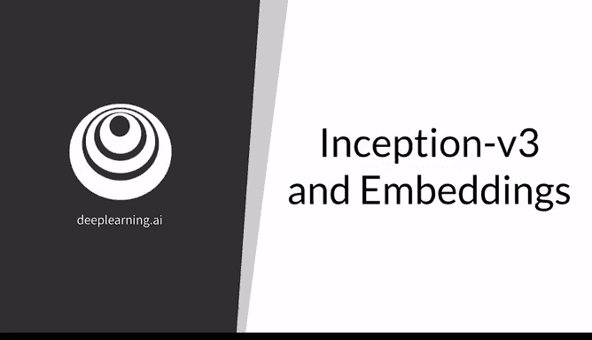
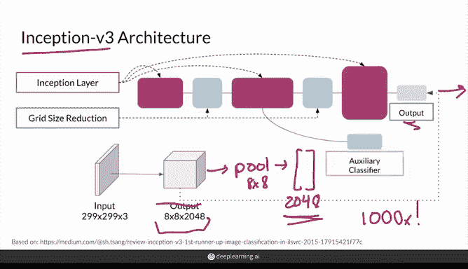
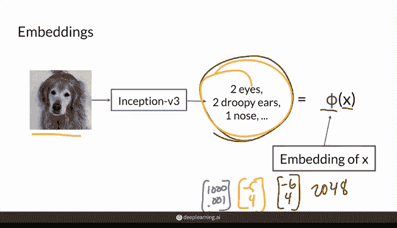
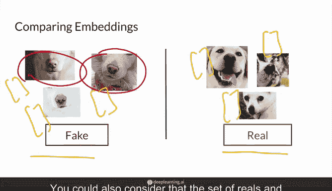
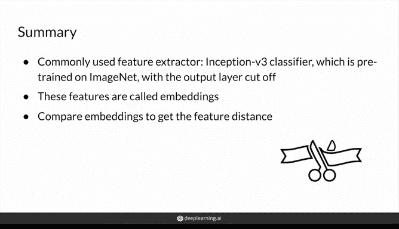

# 40：06_01_08_Inception-v3 与嵌入 🧠

在本节课中，我们将学习 Inception V3 网络。这是一个复杂的卷积神经网络分类器，可以在 ImageNet 数据集上进行训练。本节内容将围绕 Inception V3 网络展开，讲解如何从中提取特征嵌入，并比较这些嵌入。这种比较方法可用于评估生成对抗网络。

## 从分类器到特征提取器

上一节我们介绍了如何使用一个分类器作为特征提取器，特别是那些在庞大的 ImageNet 数据集上训练过的分类器。

具体使用的网络可以不同，但最常用的是 Inception V3，或简称为 Inception。Inception 网络有 42 层深，但设计巧妙且计算高效，在分类任务上表现出色，同时作为特征提取器也特别有用。由于我们将用它来比较真实图像与生成图像的特征，因此我们将重点放在其作为特征提取器的功能上。

## Inception V3 网络结构

下图展示了 Inception V3 网络的表示。首先，你需要截断这个分类器网络的最后一个用于分类的全连接层，然后使用最后一个池化层。

分类过程发生在网络末端（图中未显示），这部分已被截断。如图所示，输出是一个 8x8x2048 的张量。这实际上并非最终输出，而是最后一个卷积层的输出。然后，你将其输入到一个使用 8x8 滤波器的最后一个池化层，最终得到一个大小为 2048 的向量嵌入。

令人惊叹的是，你只得到这 2048 个值作为输出。这意味着给定一张图像，它可以将图像的像素压缩到仅用 2048 个值来表示图像中的显著特征。

之所以强调 2048，是因为与许多图像相比，这个值确实不多。网络上常见的图像可能是 1024x1024 像素，带有三个 RGB 颜色通道，总计超过 300 万个像素值。因此，2048 的嵌入尺寸缩小了 1000 多倍，描述图像所需的值减少了 1000 倍。

目前看来，特征距离似乎明显优于像素距离。特征提取器压缩图像信息也很有用，因为这允许你在每个图像上操作更少的维度，并将大大减少比较大量图像所需的时间，这在后续工作中是必然要做的。

## 特征提取与嵌入

使用在 ImageNet 上训练用于图像分类的 Inception V3 网络，你现在可以从图像中提取特征来评估你的 GAN。

再次说明，这可能是从这只可爱的狗身上提取诸如两只眼睛、两只下垂的耳朵和一个鼻子等特征。当然，实际的特征比这些描述更抽象一些。值得注意的是，这个特征提取模型应用了一个称为 Phi 的函数或映射函数到图像 X 上以提取其特征。这里的 X 可以是真实或生成的图像，而 Phi 实际上就是那个截断了全连接层的 Inception 网络，用于获取这些特征并构建嵌入，也就是那个 2048 维的向量。

这些提取的特征通常被称为图像的嵌入，因为它们被压缩到这个低维空间中，并且它们在这个低维空间中的位置彼此之间具有相对意义。

实际上，具有相似特征的嵌入在空间中的位置会更接近，即具有相似的值。例如，如果输入另一只与这只狗非常相似的狗，也许是另一只金毛或拉布拉多，但处于不同的姿势，你仍然提取出这些相似的特征，那么它的特征向量可能非常接近原始的那个。假设原始向量是 [-5, 4]，想象另一只是 [-6, 4]，那么这两个向量就相当相似。

现在，如果输入一张看起来非常不同的椅子图像，没有任何这些特征，那么你会得到第三个特征向量，它可能与前两个相距甚远，例如 [1000, 0.001]。这里我只展示了这些嵌入的两个维度，但请记住它们有 2048 维。

## 比较嵌入以进行评估

接下来，为了进行评估，需要比较这些嵌入，即真实图像和生成图像之间提取的特征。这通常涉及多个真实图像和多个生成图像，以获得足够的图像代表性。

假设你有几个生成的狗图像示例，当你将它们的特征提取为嵌入时，你发现这些嵌入（这些是向量值的图示）代表了浅色毛发、粉色鼻子的狗。

与此同时，你的真实图像的特征嵌入也包含浅色毛发的狗，但更多的是黑色鼻子。因此，将这些图像作为特征进行比较，比将它们作为像素进行比较更有意义。请记住，在简单的像素距离下，像素的轻微偏移就可能导致两张其他方面完全相同的图像显得完全不同。

因此，基于特征距离，这两张相当相似的图像实际上会非常接近，因为它们都是浅色毛发的狗，都有粉色鼻子。但在像素距离上，它们会相距甚远，因为某个像素与另一个像素非常不同，所以在像素距离上它们会是天壤之别。

## 计算特征距离的方法

要获得特征距离，你可以直接通过相减来比较特征。例如，你为所有这些图像都得到了向量，你可以取所有生成图像向量的平均值，所有真实图像向量的平均值，然后相减——这是一种方法，类似于你计算像素距离的方式。或者，你可以计算不同向量之间的欧几里得距离或余弦距离。你还可以考虑将真实图像集和生成图像集视为某种分布，并查看这些分布之间的距离。

在下一节中，你将学习如何计算真实图像与生成图像之间的特征距离，这是一种常见的评估方法，敬请期待。

## 本节总结

现在你对 Inception 网络有了相当的了解：它是一个在 ImageNet 上预训练的分类器，也可以通过截断最后的全连接层用作特征提取器。

同时，你也了解了如何利用最后一个池化层的中间输出，为输入图像构建特征嵌入。这些嵌入随后可用于在不同图像（特别是真实图像和生成图像）之间进行比较，从而了解它们在特征空间中的差异程度。

