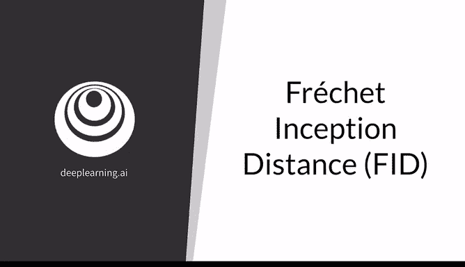
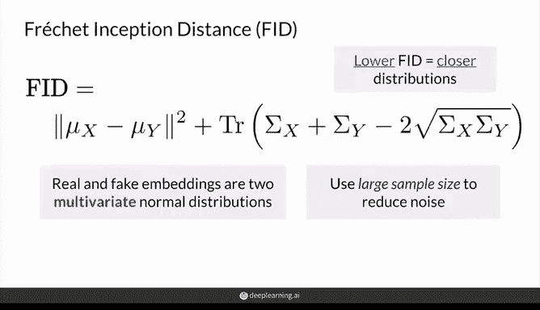
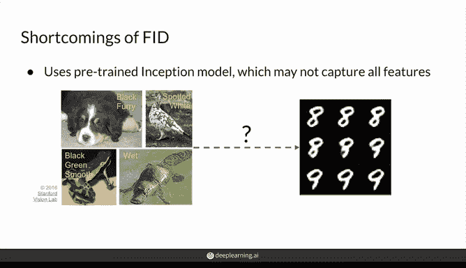
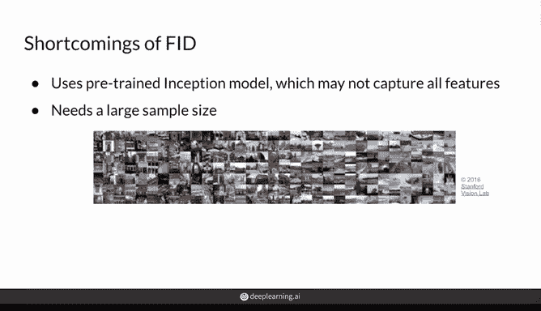
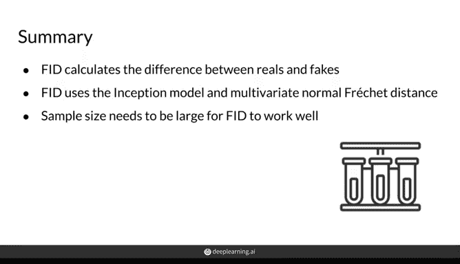

# 41：07_01_09_弗雷歇起始距离 (FID) 📊

在本节课中，我们将学习生成对抗网络（GAN）中最流行的评估指标之一——弗雷歇起始距离（Fréchet Inception Distance，简称 FID）。我们将了解其数学原理、如何应用于评估生成图像的质量，以及它存在的一些局限性。

---

## 弗雷歇距离简介

上一节我们介绍了评估生成模型的重要性。本节中，我们来看看一个具体的评估指标：弗雷歇距离。

弗雷歇距离以数学家莫里斯·弗雷歇命名，最初用于度量两条曲线之间的距离，后来被推广用于比较两个概率分布。

一个经典的例子是“遛狗问题”：狗在一条曲线（蓝色）上行走，主人在另一条曲线（橙色）上行走。两者都可以按各自速度前进，但不能后退。

计算这两条曲线之间的弗雷歇距离，本质上是找出从起点到终点遛完整条曲线所需的最小**狗绳长度**。这个长度就是弗雷歇距离的直观理解。

---

## 从曲线到分布

弗雷歇距离也可以用于计算两个概率分布之间的距离。对于某些分布，存在解析解。

例如，对于两个**一维正态分布**，弗雷歇距离有一个简单的计算公式：

**公式：** `d^2 = (μ_x - μ_y)^2 + (σ_x - σ_y)^2`

其中：
*   `μ_x` 和 `μ_y` 分别是两个分布的均值，代表分布的中心位置。
*   `σ_x` 和 `σ_y` 分别是两个分布的标准差，代表分布的离散程度。

这个公式计算了均值之差与标准差之差的平方和，可以理解为一种衡量两个分布“中心”和“形状”差异的L2距离。

---

## 多元正态分布

然而，真实数据（如图像特征）的分布通常不是简单的一维正态分布，它们可能具有多个峰值和复杂的模式。

为了建模这种复杂关系，我们需要引入**多元正态分布**。它将正态分布的概念推广到更高维度，允许我们使用一个均值向量和一个协方差矩阵来描述分布。

*   **均值向量**：表示分布在每个维度上的中心。
*   **协方差矩阵**：描述各个维度自身的方差以及维度之间的协方差（即它们如何相互影响）。

以下是协方差矩阵不同取值时，二元正态分布形态的变化：
*   **对角线为1，非对角线为0**：两个维度独立，分布呈对称的圆形山峰。
*   **非对角线为正数**：两个维度正相关，分布沿 `y=x` 方向被拉长。
*   **非对角线为负数**：两个维度负相关，分布沿 `y=-x` 方向被拉长。

---

## 多元弗雷歇距离公式

理解了多元正态分布后，我们可以将一维的弗雷歇距离公式推广到多元情况，用于比较两个多元正态分布：

**公式：** `d^2 = ||μ_x - μ_y||^2 + Tr(Σ_x + Σ_y - 2(Σ_x Σ_y)^{1/2})`

其中：
*   `μ_x`, `μ_y` 分别是真实和生成数据特征向量的均值向量。
*   `Σ_x`, `Σ_y` 分别是它们的协方差矩阵。
*   `Tr()` 表示矩阵的迹（对角线元素之和）。
*   `||...||` 表示向量的范数（长度）。
*   `(Σ_x Σ_y)^{1/2}` 表示矩阵的平方根。

这个公式的核心思想与一维情况一致：同时比较两个分布的“中心”（均值向量）和“形状”（协方差矩阵）。距离越小，说明两个分布越接近。

---

## 弗雷歇起始距离 (FID) 的应用

现在，我们来看如何将这个理论应用于GAN评估，即计算**弗雷歇起始距离**。

其步骤如下：
1.  **提取特征**：使用一个预训练的图像分类网络（通常是 **Inception V3**）分别处理大量真实图像和生成图像，提取它们的特征向量（通常是2048维）。这就是“Inception”的由来。
2.  **拟合分布**：假设这些特征向量服从多元正态分布。分别用真实图像的特征和生成图像的特征，拟合出两个多元正态分布（即计算各自的均值向量和协方差矩阵）。
3.  **计算距离**：使用上述多元弗雷歇距离公式，计算这两个拟合分布之间的距离。这个距离值就是FID分数。

**核心要点**：FID分数**越低越好**。分数越低，说明生成图像的特征分布与真实图像的特征分布越接近，即生成图像的质量越高、多样性越好。

---

## FID的局限性

尽管FID被广泛使用，但它也存在一些明显的缺点，需要我们注意：

以下是FID的主要局限性：

1.  **对特征提取器依赖性强**：FID依赖于Inception V3网络提取的特征。如果任务与ImageNet数据集（Inception V3的训练数据）差异很大（例如生成手写数字），提取的特征可能不具代表性，导致评估不准。
2.  **需要大量样本**：为了减少噪声和选择偏差，FID通常需要至少数万个样本进行计算。这导致计算速度较慢。
3.  **分数存在偏差**：FID分数会随所用样本数量的变化而波动。通常样本越多，分数会倾向于更低（显得模型更好），但这并非模型本身改进所致。
4.  **假设过于简化**：FID假设特征服从多元正态分布，且只考虑了一阶矩（均值）和二阶矩（协方差）。真实的特征分布可能更复杂，包含更高阶的统计特性（如偏度、峰度），这些信息被忽略了。
5.  **分数范围不直观**：FID分数没有一个固定的范围（如0到1），其具体数值难以直接解释，通常只能用于相对比较。

---

## 总结与建议

本节课中，我们一起学习了弗雷歇起始距离（FID）的原理与应用。

我们了解到，FID通过比较真实图像与生成图像在特征空间中的分布距离来评估GAN的性能。它计算高效、易于实现，因此成为当前最主流的GAN评估指标。

然而，由于其存在的多种局限性（如假设简化、样本偏差等），**FID分数不应作为评估模型的唯一标准**。在训练GAN时，我们仍然需要：
*   **定性检查**：人工观察生成的样本，判断其视觉质量。
*   **综合评估**：结合FID、其他定量指标以及定性分析，来选择最佳模型。

生成模型的评估仍然是一个开放的研究领域，理解现有工具的优缺点对于有效使用它们至关重要。