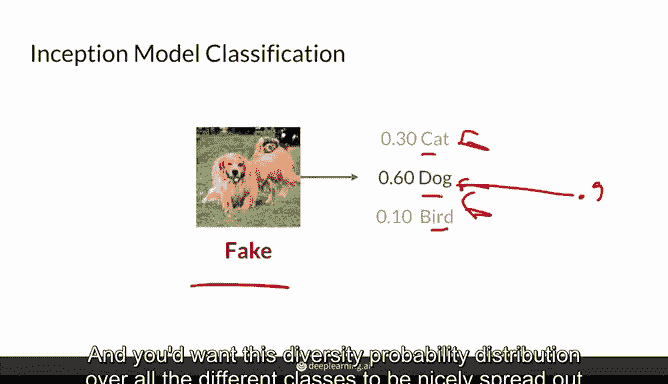
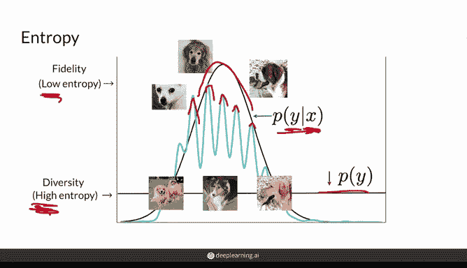
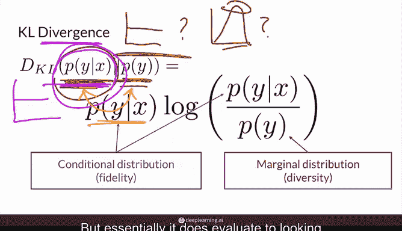
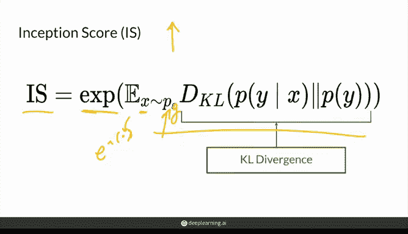
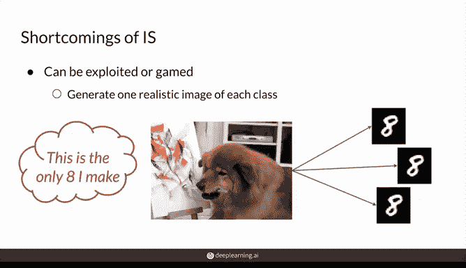
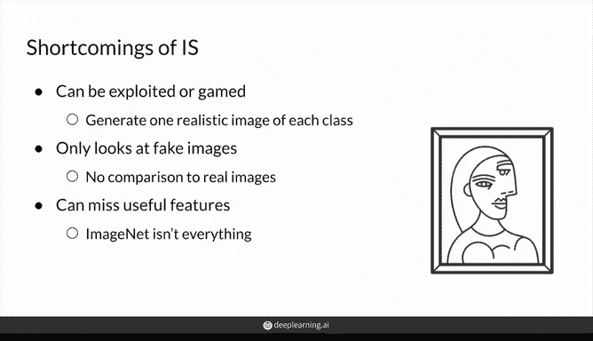
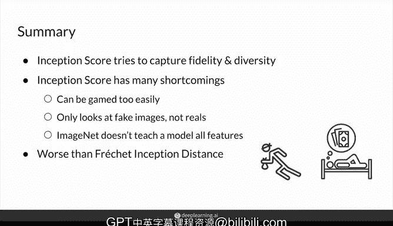

# 42：生成对抗网络评估指标 - Inception Score 🧠


在本节课中，我们将学习一种使用 Inception V3 模型来计算生成图像与真实图像之间“距离”的早期方法——Inception Score。虽然它现在很大程度上已被 Fréchet Inception Distance (FID) 所取代，但在许多论文中仍有报告，理解其原理和与FID的区别仍然很重要。

## 概述：什么是 Inception Score？ 📊

Inception Score 是一种评估生成对抗网络性能的指标。它利用在 ImageNet 上预训练的 Inception V3 分类器，从**保真度**和**多样性**两个维度来评估生成图像的质量。与FID使用模型中间层特征不同，Inception Score 直接使用分类器的最终输出。

## Inception Score 的核心原理



上一节我们介绍了 Inception Score 的基本概念，本节中我们来看看它的具体计算逻辑。其核心思想基于两个概率分布：

1.  **条件标签分布 `P(y|x)`**：给定一张生成图像 `x`，分类器预测其属于各个类别的概率分布。这衡量了**保真度**。
2.  **边缘标签分布 `P(y)`**：在所有生成图像的样本上，统计各个类别出现的总体概率分布。这衡量了**多样性**。

### 保真度：清晰的对象识别

保真度要求单张生成图像看起来像某个明确的类别。这意味着 `P(y|x)` 应该是一个**低熵**分布，即概率集中在少数或单个类别上。



**例如**，一张高质量的“狗”的生成图像，其 `P(y|x)` 可能类似于：
```python
P(‘dog’|x) = 0.9, P(‘cat’|x) = 0.05, P(‘bird’|x) = 0.05
```
这个分布具有明显的峰值（低熵），表明图像内容清晰可辨。

### 多样性：丰富的类别覆盖

多样性要求生成器能产生多种不同类别的图像。这意味着 `P(y)` 应该是一个**高熵**分布，即概率均匀地分散在许多类别上，而不是集中在某几个类别。

**例如**，一个好的生成器，其 `P(y)` 可能对所有1000个ImageNet类别都有相近的非零概率，而不是只生成“狗”。

## Inception Score 的计算公式

理解了保真度和多样性的含义后，我们将它们结合成一个单一的分数。Inception Score 使用 **KL散度** 来度量 `P(y|x)` 和 `P(y)` 这两个分布之间的差异。

**Inception Score 公式**：
```
IS(G) = exp( E_{x~p_G} [ KL( P(y|x) || P(y) ) ] )
```
其中：
*   `G` 代表生成器。
*   `x ~ p_G` 表示从生成器中采样的图像。
*   `KL(P||Q)` 是分布P和Q之间的KL散度。
*   `exp()` 是指数函数，用于将分数放大到更易读的范围（如接近类别总数1000）。



**直观理解**：当保真度高（`P(y|x)` 峰值尖锐、低熵）且多样性好（`P(y)` 分布平坦、高熵）时，这两个分布差异很大，KL散度值高，从而Inception Score也高。

## Inception Score 的数值范围与解读

根据公式和实现方式，Inception Score 的理论最低值为1（当 `exp(0)` 时），最高值理论上可达类别数量（对于ImageNet是1000）。

以下是得分的解读：
*   **高分（例如 > 50）**：通常意味着模型在保真度和多样性上都表现良好。
*   **低分**：可能由两种情况导致：
    1.  两种分布都是低熵（`P(y|x)` 和 `P(y)` 都有尖峰）：模型可能发生了模式崩溃，只生成少数几种清晰的图像。
    2.  两种分布都是高熵（`P(y|x)` 和 `P(y)` 都很平坦）：生成的图像内容模糊，分类器无法识别出任何明确物体。



## Inception Score 的局限性



尽管曾被广泛使用，Inception Score 存在一些明显的缺陷：

以下是其主要问题：

1.  **容易被“欺骗”**：生成器只需为每个类别生成**一张**高质量的图像，就能获得近乎完美的分数，即使它无法为同一类别生成多张不同的图像（这本身也是一种模式崩溃）。
2.  **不与真实数据比较**：该指标只评估生成图像，完全不参考真实数据集的统计信息。因此，一个生成分布可能与真实分布相去甚远，却仍能获得高分。
3.  **依赖于分类器的能力**：其效果受限于Inception V3分类器在ImageNet任务上的训练。对于包含多个物体的复杂场景、分类器未训练过的特征（如特定的人脸角度）或空间关系错乱但局部特征清晰的图像，评估可能不准确。
4.  **对数据集敏感**：只有当生成任务的数据集与ImageNet相似时，该指标才有意义。

## 总结



本节课中我们一起学习了 Inception Score 这一重要的GAN评估指标。我们了解到它通过 Inception V3 分类器，将生成图像的质量分解为**保真度**（`P(y|x)`，低熵为好）和**多样性**（`P(y)`，高熵为好）两个方面，并使用KL散度将它们合并为一个分数。



尽管 Inception Score 因其不与真实数据比较、易被欺骗等局限性，已逐渐被 **Fréchet Inception Distance** 所取代，但它仍然是阅读早期GAN文献和理解评估思路的重要基础，尤其在条件生成任务中仍有其参考价值。