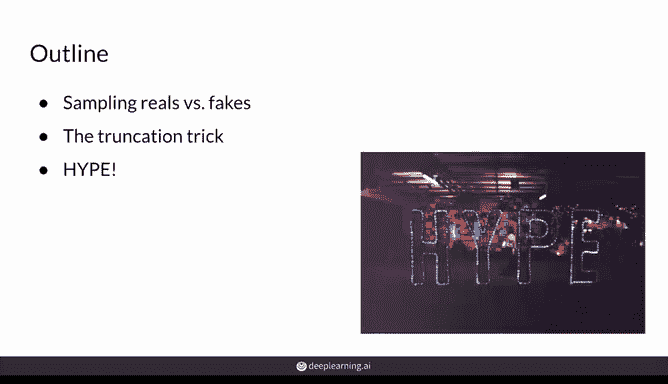
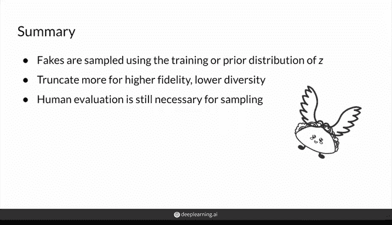

# 43：采样与截断技巧 🎲

在本节课中，我们将要学习生成对抗网络（GAN）评估过程中的两个重要概念：采样方法与截断技巧。我们将了解如何通过调整采样策略来平衡生成图像的质量（保真度）与多样性，并介绍一种在模型训练后使用的实用技巧。

---

## 概述

上一节我们介绍了GAN的主要评估方法。本节中，我们来看看在具体评估时，如何对真实数据集和生成数据集进行采样，以及一个可以显著影响评估结果的技巧——截断技巧。

## 采样策略的重要性

在评估GAN时，真实数据集与生成数据集的统计特性至关重要。采样方式的不同会直接影响评估指标（如FID分数）的结果。

对于真实图像，通常采用均匀随机采样。然而，对于生成图像，其采样依赖于噪声向量 **z** 的先验分布 **P(z)**。

以下是典型的做法：
*   在训练GAN时，噪声向量 **z** 通常从一个标准正态分布中采样，即 **z ~ N(0, 1)**。
*   这意味着，靠近均值0的 **z** 值在训练中出现得更频繁。
*   因此，在评估时从分布中心区域采样，生成的图像质量较高、更逼真，但多样性可能不足。

## 截断技巧

基于上述保真度与多样性的权衡观察，一个非常巧妙的采样技巧应运而生，即**截断技巧**。该技巧在模型训练完成后使用，用于主动调整生成结果的特性。

截断技巧的核心操作是“裁剪”用于采样的正态分布尾部。具体而言：
*   它通过设定一个超参数 **ψ**（截断阈值），将原始分布（如图中蓝色曲线）的尾部切除，形成新的采样分布（如图中红色曲线）。
*   采样时，只从 **[-ψ, ψ]** 区间内抽取 **z** 值。

这个技巧允许你在评估或应用模型时进行微调：
*   **若追求更高保真度**：应设置较大的 **ψ** 值，更多地裁剪分布尾部，使采样更集中于均值附近。公式表示为：采样 **z**， 其中 **|z| ≤ ψ**，且 **ψ** 值较小。
*   **若追求更高多样性**：应设置较小的 **ψ** 值，保留更多的分布尾部，从而采样到更多训练中不常见的 **z** 值。但这样生成的图像可能质量较低、更怪异。

## 关于先验分布的补充

虽然也可以使用均匀分布等其他先验分布来训练GAN，但正态分布因其支持截断技巧而广受欢迎。实验表明，不同先验分布对最终模型性能的影响并不显著。

需要注意的是，使用截断技巧可能会影响FID等自动化评估分数，因为它改变了生成样本的统计特性。然而，它可能更符合特定下游任务的需求，例如当你需要高度逼真、避免怪异结果的图像时。

## 人类评估与HYPE标准

尽管自动化评估指标很有用，但它们仍无法完全捕捉人类对图像质量的感知。因此，人工评估仍然是GAN开发过程中的重要环节，并被视为黄金标准。

近年来，发展出了一种系统化、基于众包的人类感知评估标准——**HYPE**。HYPE通过向评估者（如亚马逊众包工人）逐张展示图像，并要求其判断“真实”或“虚假”，来量化生成模型的质量。评估者需要做出判断的时间越短，通常意味着图像越容易被识别为假货，即模型性能越差。

然而，最终选择何种评估方式，仍取决于你的下游任务。例如，如果GAN用于生成医学X光片，那么最好的评估者可能是专业医生，而非自动化指标或普通众包人员。

---

## 总结

本节课中我们一起学习了：
1.  **采样策略**：评估GAN时，对生成图像的采样需依据训练时噪声向量 **z** 的先验分布 **P(z)**，通常为标准正态分布 **N(0, 1)**。
2.  **截断技巧**：这是一个训练后技巧，通过设定阈值 **ψ** 来裁剪采样分布的尾部，从而在**保真度**（图像质量）和**多样性**（图像变化范围）之间进行权衡。
3.  **评估考量**：自动化指标（如FID）与人类感知评估（如HYPE）各有优劣，选择合适的评估方法需结合具体的应用目标。

你现在已经掌握了如何在测试或推理阶段，通过截断技巧这把“新武器”来灵活调整GAN的输出特性。虽然自动化评估指标尚不能完美衡量生成效果，但它们提供了良好的近似，而人类评估则继续为图像质量设定着终极基准。