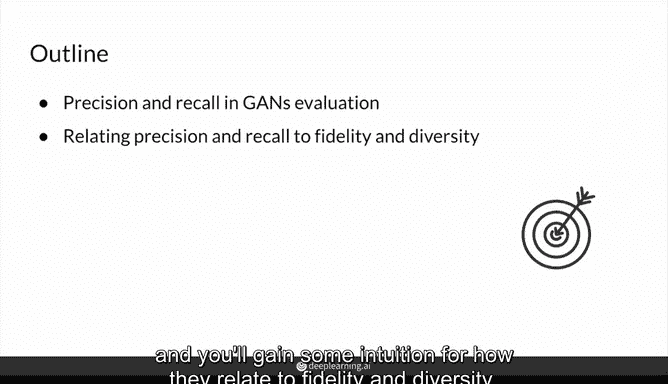
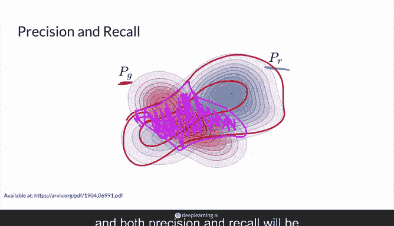
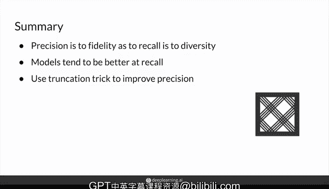

# 44：生成对抗网络（GAN）评估：精确率与召回率 📊

在本节课中，我们将学习用于评估生成对抗网络（GAN）性能的两个重要概念：**精确率**和**召回率**。这两个指标可以帮助我们更细致地理解生成图像的质量（逼真度）和多样性。

## 概述

在生成模型的评估中，我们不仅关心生成的单个图像是否逼真，还关心模型是否能生成覆盖整个真实数据分布的多样化图像。精确率和召回率为我们提供了一种将“逼真度”和“多样性”分解为更具体、可量化指标的方法。

## 核心概念：精确率与召回率

为了理解这两个指标，我们首先需要想象一个包含所有可能真实图像的“空间”。在这个空间中，有两个关键分布：
*   **真实分布（PR）**：代表所有真实图像的概率分布。
*   **生成分布（PG）**：代表生成器能够生成的所有“假”图像的概率分布。

理想情况下，我们希望 `PG` 与 `PR` 完全重叠，这意味着生成器既能生成所有类型的真实图像，又不会生成任何不真实的“垃圾”图像。

然而现实中，这两个分布通常只是部分重叠。精确率和召回率正是通过分析这个重叠区域来评估模型性能的。

### 精确率（Precision）

精确率关注的是**生成器输出的质量**。

在上图中，虚线圆圈内代表所有生成样本。其中，填充的样本是与真实分布重叠的部分（即看起来真实的生成图像），未填充的样本是未重叠的部分（即看起来虚假的“垃圾”图像）。

精确率的计算公式是：
**精确率 = （与真实分布重叠的生成样本数） / （所有生成样本的总数）**

直观上，精确率衡量的是“在所有生成的图像中，有多少比例是高质量的（看起来真实的）”。**高精确率意味着生成器产生的图像普遍逼真，但它可能只覆盖了真实数据分布的一部分**（即 `PG` 可能是 `PR` 的一个子集）。

**精确率与逼真度（Fidelity）相关**，因为它惩罚了那些被模型生成出来但质量低劣的“额外垃圾”。

### 召回率（Recall）

召回率关注的是**生成器覆盖真实数据分布的能力**。

它是精确率的镜像，计算公式是：
**召回率 = （与真实分布重叠的生成样本数） / （所有真实样本的总数）**

直观上，召回率衡量的是“在所有可能的真实图像中，生成器能够成功模拟（生成）的比例”。它关注的是生成器**遗漏了哪些真实样本**（即图中蓝色区域中未被红色覆盖的部分）。**高召回率意味着生成器能够生成非常多样化的图像，覆盖了真实数据中的大部分变化。**

**召回率与多样性（Diversity）相关**，因为它评估了模型捕捉真实数据全部变化的能力。

## 模型表现与“截断技巧”

理解了这两个指标后，我们来看看实践中模型的典型表现。

以下是当前生成模型（尤其是大型模型）的一个常见趋势：

*   **模型通常在召回率方面表现较好**。由于模型参数量巨大，理论上存在某个噪声向量 `z`，使得模型能够生成数据集中（甚至超出）的每一个真实图像，从而较好地覆盖真实分布。
*   **模型在精确率方面往往表现不佳**。同样因为参数量庞大，模型某些部分在训练中未得到判别器的充分反馈，导致其会生成大量不属于真实分布的“垃圾”图像。这使得生成分布 `PG` 看起来像是真实分布 `PR` 的一个**超集**（即 `PG` 包含了 `PR`，但还有额外部分）。

为了应对精确率低的问题，在实践中可以采用 **“截断技巧”** 。这个技巧通过限制输入生成器的噪声向量 `z` 的取值范围（例如，只采样其值接近均值的部分），来“修剪”掉生成分布中那些质量低劣的边缘部分。这能有效提高生成图像的整体质量（即精确率），但代价是可能会降低多样性（即召回率），因为生成分布 `PG` 的范围被缩小了。

## 总结

本节课我们一起学习了评估生成对抗网络的两个重要指标：

1.  **精确率**：衡量生成图像的质量。**高精确率 = 高逼真度**。它计算“看起来真实的生成图像”占“所有生成图像”的比例。
2.  **召回率**：衡量生成图像的多样性。**高召回率 = 高多样性**。它计算“被成功生成的图像”占“所有真实图像”的比例。

当前的大型生成模型往往更擅长实现高召回率（覆盖多样数据），但在精确率（避免生成垃圾）方面存在挑战。我们可以利用“截断技巧”等方法来在具体应用中权衡这两者，以提升生成结果的整体质量。

至此，您已经完成了本周的理论学习，可以准备进入编程实践部分了。希望您能运用这些知识，构建出性能卓越的下一代生成模型！