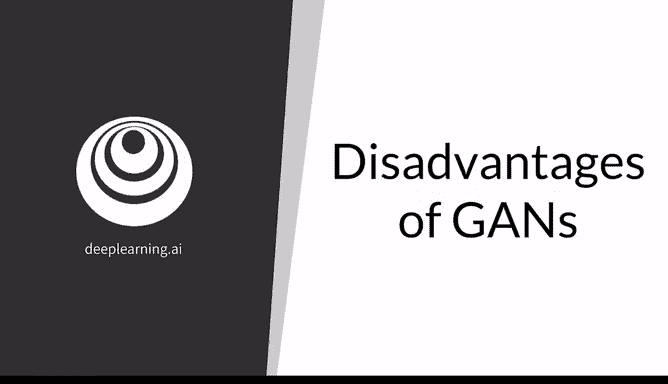
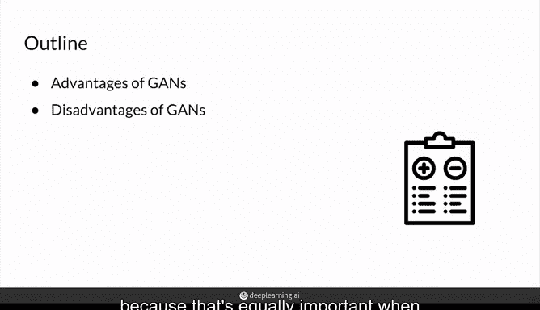
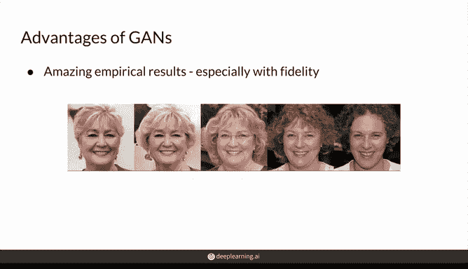
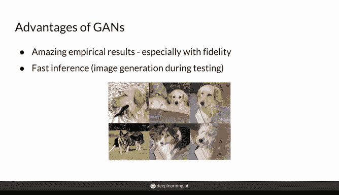
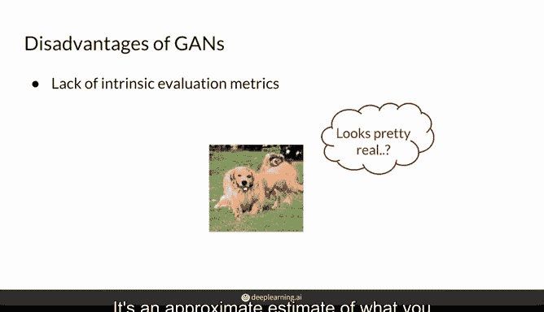
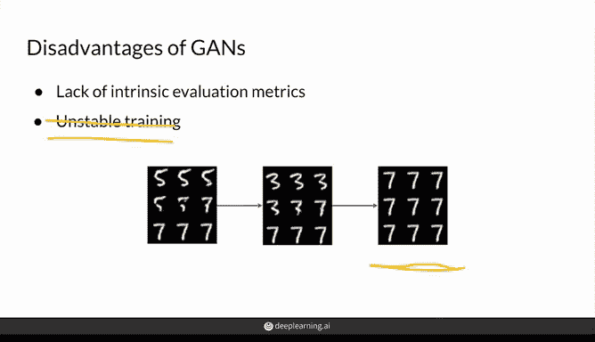
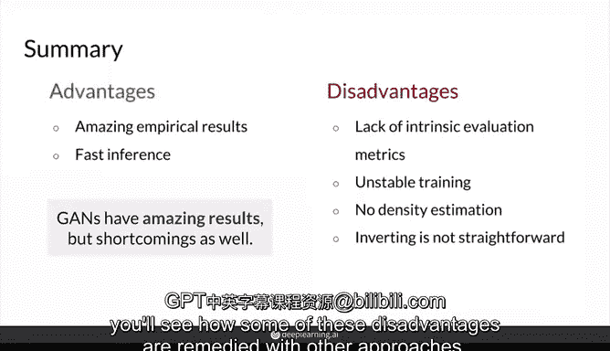

# 46：生成对抗网络的缺点 🧐

在本节课中，我们将探讨生成对抗网络（GAN）的局限性。了解这些缺点对于全面掌握GAN技术至关重要，它能帮助我们在实际应用中做出更明智的选择。

上一节我们介绍了GAN的工作原理及其优势。本节中，我们来看看GAN在实际应用中面临的一些挑战和不足之处。

## GAN的优势回顾

首先，简要回顾一下GAN的主要优势。

*   **生成质量高**：GAN能够生成在视觉上高度逼真的结果，足以“以假乱真”。
*   **生成速度快**：一旦模型训练完成，仅需输入噪声向量即可快速生成样本。

## GAN的缺点分析

尽管优势显著，GAN也存在一些固有的缺点。

以下是GAN的几个主要缺点：

1.  **缺乏内在的评估指标**
    GAN没有像分类准确率那样明确、理论扎实的评估标准。我们无法直接通过检查模型权重或输出就轻易判断哪个模型更好。通常需要人工检查大量生成样本的特征，并与真实图像进行对比，但这只是一种近似估计，可靠性有限。

2.  **训练过程不稳定且耗时**
    训练GAN可能不稳定，需要大量时间。梯度下降法并不总能得到理想的生成器，有时更像一门“艺术”而非“科学”。例如，可能遇到**模式崩溃（Mode Collapse）**问题，即生成器陷入单一模式，只生成相似样本（如全是数字“7”）。你不能简单地持续训练并期望模型收敛，需要频繁监控，通过视觉检查生成样本来决定何时停止训练。不过，这个问题已通过**Wasserstein损失（W loss）**和**Lipschitz连续性**等技术得到了一定程度的缓解。

3.  **无法进行显式的概率密度估计**
    如果你需要明确获取建模特征的概率密度（即某个特定特征组合出现的可能性），GAN可能不是最合适的模型。这种**密度估计（Density Estimation）**能力在异常检测等任务中很有用，例如，判断一张“狗”的图片是否异常。虽然通过对大量样本进行统计可以获得某种近似，但这并非GAN模型固有的能力。

4.  **生成器通常不可逆**
    标准的GAN生成器设计为单向映射：`z（噪声） -> x（图像）`。它通常不具备可逆性，即你无法轻松地将一张现有图像（无论是生成的还是真实的）反向映射回其对应的噪声向量`z`。这限制了其在图像编辑等领域的应用，因为如果能找到图像对应的`z`，就可以通过修改`z`来控制生成图像的属性（如年龄、发色）。目前已有一些新方法试图解决可逆性问题，例如训练一个逆向模型，或使用能同时学习双向映射的GAN变体。

## 总结与展望

本节课中我们一起学习了生成对抗网络（GAN）的优缺点。

**总结如下：**
*   **优势**：能生成高质量结果，且从已训练模型中生成样本的速度快。
*   **缺点**：缺乏内在评估指标；训练可能不稳定（已部分改善）；无法进行固有的概率密度估计；将图像反演到潜在空间表示具有挑战性。

尽管存在这些缺点，但必须强调GAN在生成高保真结果方面的开创性意义。它首次如此稳定地实现了逼真的输出，这一核心优势使其被广泛用于增强各种输出的真实感。

在接下来的视频中，你将看到其他方法如何尝试弥补GAN的这些不足。