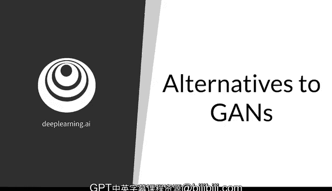
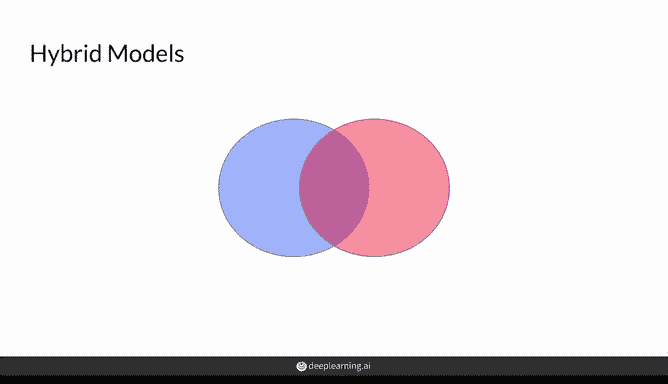
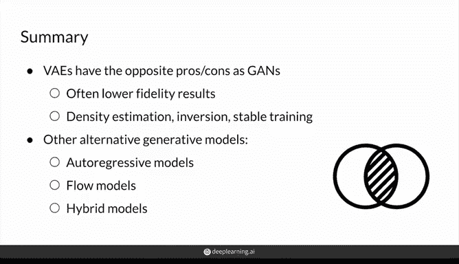

# 47：GAN的替代方案 🧠

在本节课中，我们将学习生成对抗网络（GAN）之外的其他生成模型。我们将探讨变分自编码器（VAE）、自回归模型、流模型以及混合架构，了解它们如何以不同的方式解决生成问题，并分析各自的优缺点。

上一节我们介绍了GAN的一些缺点。本节中，我们来看看其他生成模型如何应对这些挑战，但同时也带来了不同的权衡取舍。具体而言，我们将讨论另一种流行的模型——变分自编码器（VAE），以及一些虽不那么流行但非常有趣的替代方案。

一个生成器模型可以是任何试图建模给定类别y下数据x的概率分布P(x|y)的机器学习模型。如果只针对单一类别建模，则通常是该类别数据x的概率分布P(x)。模型通常会引入某种噪声以实现随机性，从而避免每次生成相同的内容。这意味着其输出具有多样性，并能根据输入的类别生成代表该类别的特征或对象X。

生成模型的范围远不止GAN。让我们开始深入了解。

## 变分自编码器（VAE） 🔄

变分自编码器（VAE）是另一大类生成模型。作为本专项课程第一周的回顾，VAE包含两个不同的模型：一个编码器和一个解码器。

以下是VAE的工作原理：

*   模型通过将真实图像输入编码器进行学习。
*   编码器在潜在空间中找到一种好的方式来表示该图像。
*   然后，解码器接收该潜在表示（或接近它的表示），并重建编码器之前看到的真实图像。

以上描述的主要是VAE的“自编码器”部分。“变分”部分则更为复杂，它使模型能够以最大化生成真实数据（或类似输入编码器的真实图像）的可能性为目标进行训练。

从高层次看，VAE试图最小化生成分布与真实分布之间的差异。这通常被认为是一种相对更容易的优化问题，能带来更稳定的训练过程，但也常被认为会导致结果更模糊或保真度更低。训练完VAE后，实际上可以丢弃编码器（就像不需要判别器一样），而使用解码器（类似于生成器），从潜在空间中采样点，从而生成输出图像。

如果你还记得GAN的优缺点，VAE的情况大致相反。VAE通常被认为产生的结果质量低于GAN，至少在生成逼真结果方面不是首创，并且一度落后于GAN，需要更多的工程和修改。

以下是VAE的主要特点：

*   **密度估计**：VAE可以进行密度估计。
*   **易于反转**：因为它们有编码器来寻找潜在空间表示。虽然可能不是完美的一对一反转，但能提供一个不错的噪声因子。
*   **训练更稳定可靠**：尽管可以说训练速度相对较慢。

但GAN的支持者可能会说，如果不能生成好的样本，这些优点就没什么用。因此，大量工作致力于提升VAE的结果质量。例如，左边是近期一个名为VQ-VAE-2的VAE模型生成的图像，右边是BigGAN生成的图像。可以看到BigGAN的质量略高，但VAE的结果也开始变得更好，特别是在多样性方面，正如这条生成的鱼所展示的。

## 自回归模型 📈

这个VQ-VAE-2模型借鉴了许多VAE的概念，但它实际上不被认为是纯粹的VAE解决方案。事实上，它还依赖于一个自回归网络组件。

自回归模型是一种根据先前像素来确定下一个像素的模型。例如，它可能看到这里的几个像素，然后就能确定图像其余部分的像素。这是另一种生成模型，它基于前一个像素逐个像素地生成。你可以将其理解为，它根据之前的像素来“条件化”地决定下一个像素是什么。它无法看到未来的像素，只能查看过去的像素。如果你熟悉RNN或语言/语音模型，这个概念非常相似，即无法看到未来的信息。

可以想见，这种模型并非完全无监督，因为它依赖于之前的像素。它是一种有监督技术，意味着需要锚定像素来开始生成，无法直接从噪声生成。

## 流模型 🌊

另一种生成模型是流模型。这类模型训练困难且耗时，但它是一个非常酷的新想法，基于似然估计来寻找噪声与生成图像之间的可逆映射。

显然，它是可逆的。从高层次看，它的工作方式是从一个初始的简单分布开始，通过一系列可逆变换来创建更复杂的分布。假设它从非常简单的东西开始，通过图中箭头代表的可逆映射，得到更复杂的分布，最终能够建模人脸。这是一个名为Glow的流模型示例。

## 混合架构 🤝

最后，你也可以结合这些模型或思想中的任意几种，形成混合架构，以尝试兼收两个或多个领域的优势。就像之前看到的结合了VAE和自回归的VQ-VAE-2模型一样。此外，也有许多结合了GAN和VAE概念的模型。在课程三中，你也会看到一些高级模型的提及。

## 总结 📝

本节课中，我们一起学习了GAN之外的其他生成模型。

总而言之，VAE的优缺点列表与GAN大致相反。值得注意的是，其结果通常更模糊（尽管这一点有争议），但它可以进行密度估计、易于反转且训练稳定。然而，GAN已经在许多方面改进了这些缺点，例如训练稳定性大大提高，而近似反转（这是编辑图像所需的）已简化为通过另一个模型寻找Z向量的工程问题。VAE在获得更好结果方面也取得了长足进步。

因此，总体而言，在应用方面，当逼真生成是主要目标时，GAN仍然更有用。

正如本视频所示，其他替代生成模型包括自回归模型、流模型以及所有这些模型的混合模型。

现在你已经了解了其他生成模型，接下来将探讨所有机器学习模型（包括GAN和这些其他模型）都无法避免的一些普遍问题。