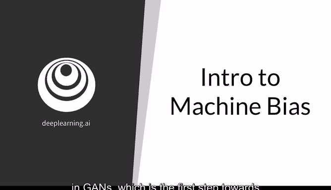
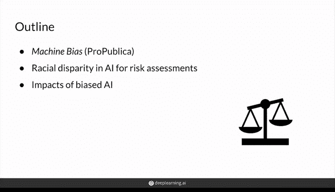
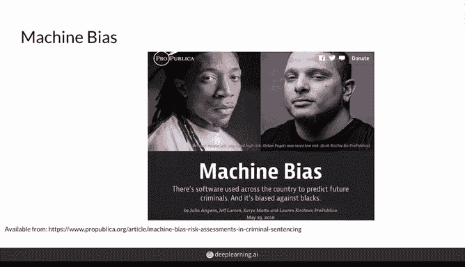
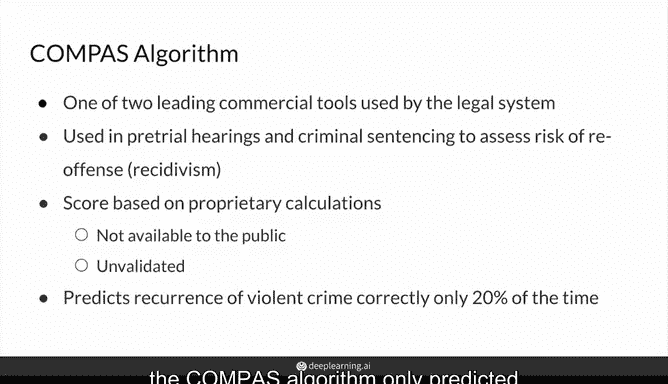
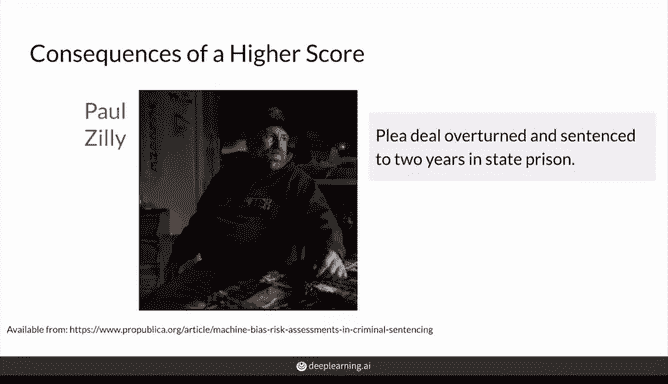
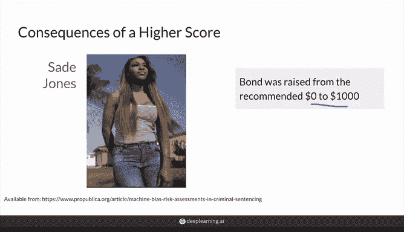
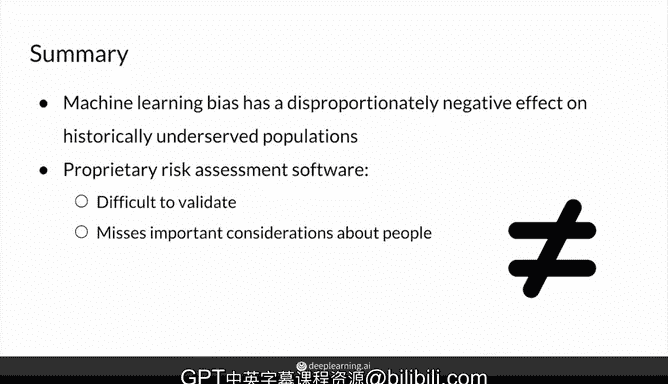

# 48：机器学习偏差简介 🧠

在本节课中，我们将暂时离开生成对抗网络（GAN）的主题，探讨一个普遍存在且影响深远的问题——偏差。这个问题渗透到生活的许多方面，机器学习和GAN也不例外。本视频的目的是提高大家对机器学习，特别是GAN中偏差问题的认识，这是消除模型中偏差的第一步。

## 偏差在现实中的体现

上一节我们提到了偏差问题的普遍性。本节中，我们来看看一个来自现实世界的具体案例，它揭示了机器学习模型如何可能复制并加剧社会中的现有偏见。

这个案例基于ProPublica新闻机构一篇名为《机器偏差》的文章，该文章讨论了在全国范围内用于刑事判决的专有软件中发现的种族差异及其影响。

以下是该文章的主要要点：

*   **背景**：在美国刑事司法系统中，法庭越来越多地依赖风险评估来预测个人未来犯罪的可能性。许多风险评分计算现已计算机化，并且越来越依赖机器学习。
*   **研究对象**：ProPublica通过公开记录请求，评估了当时两个主流商业模型之一，该算法名为**Compass**。其设计初衷是减少审前判决的偏见。
*   **核心矛盾**：然而，ProPublica的调查结果表明，该算法本身存在显著的偏见。值得注意的是，Compass的评分计算被视为专有技术，其公司不公开具体细节。
*   **数据输入**：评分计算大致基于被告填写的问卷及其犯罪记录。问卷中不直接询问种族，但包含诸如“你的父母是否曾入狱？”或“饥饿的人偷窃是错误的吗？”等问题。
*   **法官决策**：法官可以根据他们对风险评分的评估，增加或减少刑期长度。
*   **预测表现**：不幸的是，Compass算法仅能正确预测约20%的暴力犯罪再犯情况。ProPublica发现，该模型预测黑人被告未来暴力犯罪的风险高出77%，未来任何类型犯罪的风险高出45%。
*   **评分分布**：数据显示，白人被告的高风险评分比例随年龄增长而下降，而黑人被告的高风险评分可能性则保持不变。这表明白人被告的分数倾向于较低风险类别，而黑人被告则不然。

## 具体案例与影响

了解了算法的整体偏差情况后，我们通过具体个体的故事来看看这些风险评估分数可能带来的真实后果。

*   **案例对比**：例如，白人男性Gregory Lugo和黑人女性Mallory Williams均因持有毒品被捕，但犯罪前科不同。Lugo此前已有三次严重犯罪前科，而Williams则是首次严重犯罪，且之前只有两项轻罪。然而，Williams的风险评估分数（6分）却远高于Lugo（1分）。
*   **影响实例一**：Paul Zilly是一名复吸成瘾者，因复发并偷窃一台割草机被捕。在法官看到他的高风险评分后，原本控辩双方同意的认罪协议被推翻，刑期从县监狱一年增至州立监狱两年。尽管上诉后刑期减至18个月，但上诉法官指出，若没有Compass评分，Zilly本应只被判一年或六个月。
*   **影响实例二**：18岁的Sage Jones在逮捕时无犯罪记录，因偷窃一辆未上锁的自行车而被给予中等风险评分，其保释金从建议的0美元提高至1000美元。如今，她仍因记录上的轻罪而难以找到工作。

这些案例展示了较高风险评分可能带来的后果，即使当事人事后未必再次犯罪。判决在很大程度上仅基于模型的预测，如果模型的预测存在偏差，就可能非常不公平。

## 模型表现与公平性问题

前面我们看到了偏差对个人的直接影响。现在，我们来深入分析该模型在统计上的表现，这能更系统地揭示其公平性问题。

研究人员发现，该模型在所有领域（再犯风险、暴力犯罪风险、未出庭风险）正确预测再犯者的总体准确率仅为61%。仅就暴力犯罪而言，准确率只有20%。

问题的关键在于，模型对白人和黑人群体产生的错误类型不同：
*   **假阳性**（被标记为高风险但未再犯）：约45%被标记为高风险的非洲裔美国人实际上并未再犯，而白人群体的这一比例为23.5%。
*   **假阴性**（被标记为低风险但实际再犯）：在那些被标记为低风险但实际再犯的人中，非洲裔美国人占28%，白人占48%。

这些细节表明，该模型及其评估方法在公平性上存在严重问题。

## 总结与反思

本节课中，我们一起学习了机器学习中偏差问题的具体体现。我们通过Compass算法的案例看到，旨在减少刑事司法系统偏见的模型，实际上可能只是反映了我们自身的偏见，并加剧了历史上服务不足和受歧视群体重新融入社会的困难。

由营利性公司创建的专有风险评估软件，由于其计算不公开，且对其准确性的调查往往由软件构建者自身进行，使得理解和改进这些系统变得更加困难。

此外，还需要考虑的是，这些模型无法全面地看待一个人，例如个人真诚的自我改造努力，或较长刑期对其照顾家庭能力的影响。因此，一个至关重要的问题是：**这些模型今天究竟在为谁服务？**

认识到偏差的存在是解决它的第一步。在后续的机器学习实践中，我们必须积极审视数据、算法和结果，努力构建更加公平、负责任的系统。