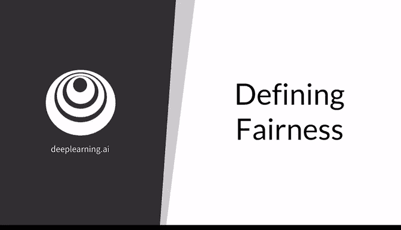
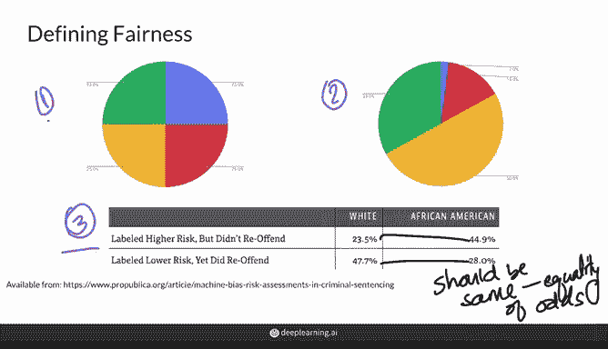
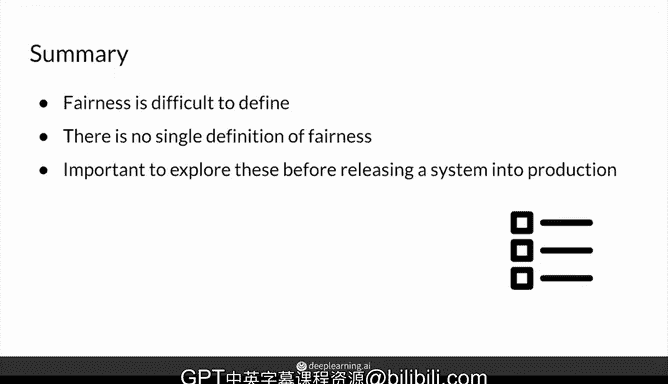

# 49：15_02_09_定义公平性 📊

在本节课中，我们将探讨机器学习模型公平性的定义。理解如何衡量公平性是构建负责任AI系统的关键一步。

---

## 概述

上一节我们讨论了模型偏见的问题。本节中，我们来看看如何具体地定义和衡量一个模型是否“公平”。虽然“公平”这个概念看似直观，但在实际操作中却存在多种不同的定义方式。

## 公平性的多种定义

公平性是一个复杂的概念，不同的研究论文和实践场景可能依赖不同的定义。以下是几种常见的公平性定义方式。

### 1. 机会均等 / 人口统计均等

这种定义要求模型的**预测结果独立于敏感属性**（如种族、性别）。这意味着，无论敏感属性如何，不同群体获得有利预测结果的概率应该相同。

**公式表示**：`P(Ŷ=1 | A=0) = P(Ŷ=1 | A=1)`
其中，`Ŷ` 是模型的预测结果（例如1表示通过），`A` 是敏感属性（例如0和1代表不同群体）。

### 2. 结果代表测试集人口统计

这种定义要求模型的**输出分布反映真实世界的人口比例**。例如，在美国，一个生成人脸的GAN模型应该有大约6%的生成图像是亚裔美国人面孔，因为这对应了亚裔在美国人口中的大致比例。

### 3. 错误率均等

这种定义关注模型的**错误在不同群体间是否一致**。它要求不同敏感属性群体的假阳性率或假阴性率相等。

**公式表示（以假阳性率相等为例）**：`P(Ŷ=1 | Y=0, A=0) = P(Ŷ=1 | Y=0, A=1)`
其中，`Y` 是真实标签。

这也被称为**机会平等**，即模型对不同保护类别做出正确或错误预测的概率是相同的。

## 总结与启示

本节课中我们一起学习了公平性的多种定义。正如你所见，公平性并没有一个单一的、放之四海而皆准的定义。这里列举的只是三种基础定义，实际中还存在更多。

尽管缺乏统一的定义，我们仍然可以观察到，根据上述任何一种定义，现有模型普遍存在公平性不足的问题。因此，在将任何AI系统部署到生产环境之前，深入探索和理解这些公平性定义至关重要。