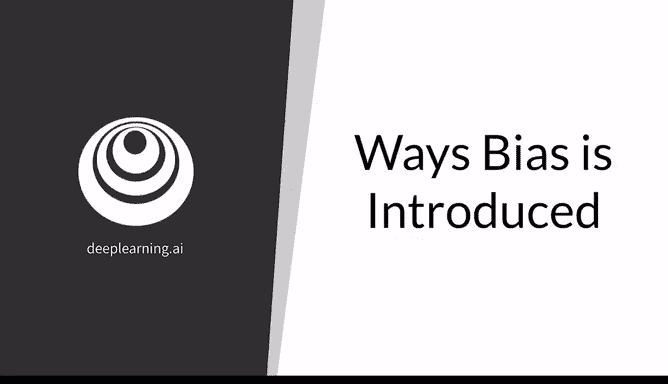
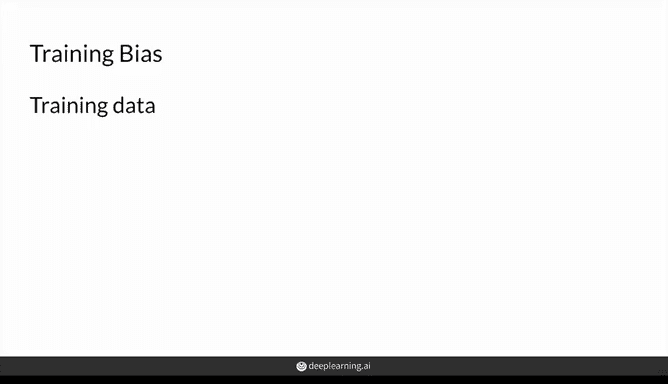
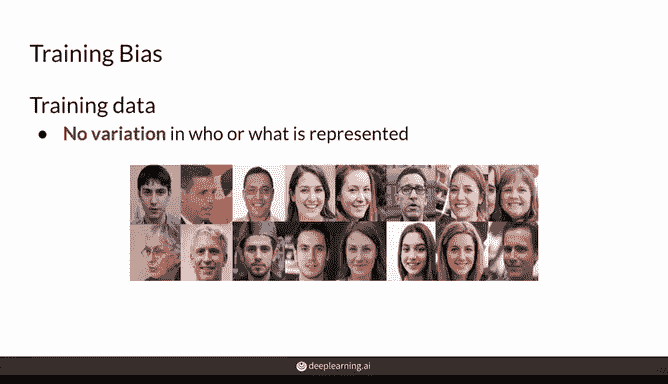
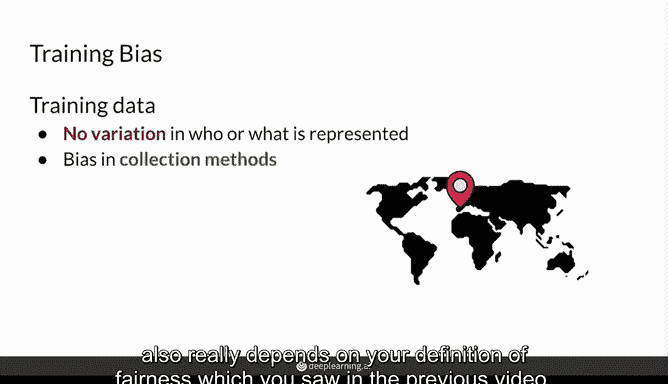
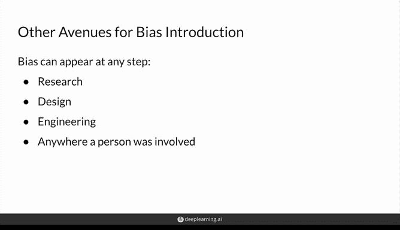
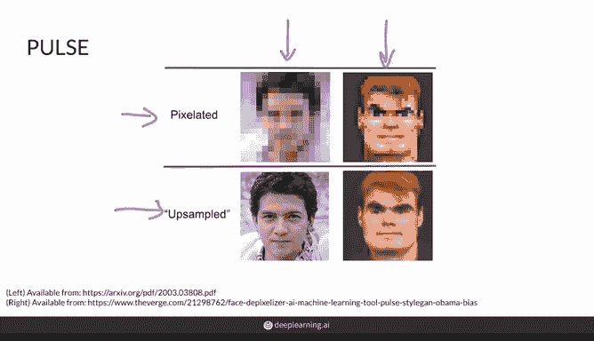
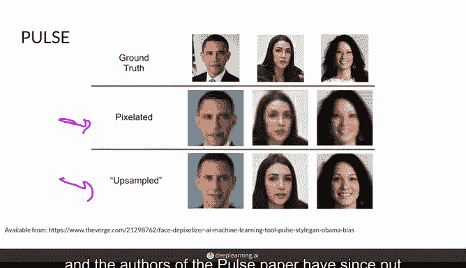
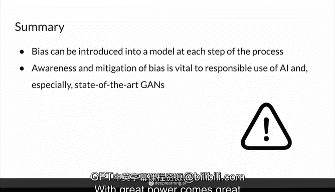

# 50：机器学习中的偏差引入方式 🎯

在本节课中，我们将学习机器学习模型中偏差（Bias）可能被引入的各种途径。理解这些途径对于构建公平、可靠的模型至关重要。

上一节我们介绍了机器学习中偏差的基本概念，本节中我们来看看偏差具体是如何进入模型的。我将介绍几种主要方式，但重要的是要知道还存在其他途径，有些甚至尚未被发现。

## 偏差引入的常见阶段

首先，你将了解偏差在模型开发的各个阶段可能进入模型的几种方式，然后更具体地看一个名为“Pulse”的系统中偏差的表现。

### 1. 训练阶段引入的偏差

偏差进入模型的一种方式是在训练阶段。首先，你应该关注你的训练数据。

以下是训练数据可能存在的问题：

*   **数据缺乏多样性**：数据可能没有足够的变体。
*   **数据收集过程存在偏差**：数据可能反映了收集方式带来的偏见。例如，数据集中是否不成比例地缺少有色人种的图像？有时这很难发现，比如当你只是从互联网上抓取名人图像时。
*   **数据来源单一**：你需要考虑数据是如何收集的。数据是否全部来自一个地点、一次网络抓取？是否由单个人或单一人口统计特征的人群收集？请记住，所谓“多样化”的数据也取决于你对“公平”的定义，正如你在上一个视频中所见。
*   **标注者多样性不足**：如果你使用标注数据，那么标注者的多样性也会影响你的数据。这是因为不同人群可能对事物有不同的标注方式，这可能导致数据中产生固有的偏差。例如，如果标注者大多是男性，他们来标注哪些人的简历值得获得软件工程师职位的面试机会。

这些只是你在准备模型训练数据时应考虑的几个方面。

### 2. 评估阶段引入的偏差

广泛社会中存在的偏见也会影响模型的各个部分。另一个可能引入偏差的领域是在评估阶段。

以下是评估阶段可能存在的问题：

*   **评估方法的设计者**：你使用的评估方法是谁创建的？
*   **评估标准的文化偏向**：评估方法可能偏向于在该社会或一种文化中通常被认为是“好”或“正确”的图像，但在另一种文化中则不然。一个简单的例子是汽车是靠左行驶还是靠右行驶。如果通常在某侧行驶，那么评估可能会反映这一点，并对方向盘在“错误”一侧的图像给出较差的评估或分数。这完全取决于当地的驾驶法律。
*   **数据集的代表性不足**：一个更具体的例子涉及ImageNet，这是用于训练Inception V3模型的数据集，FID使用它来评估GAN以及其他评估指标。ImageNet中超过一半的图像来自美国和英国。与世界人口密度相比，这并不能代表大多数人的来源地。这种不平衡导致系统将图像错误地分类到因地理而异的类别中。例如，斗笠会被分类为头发吗？披风会被分类为围巾吗？
*   **评估计算方式强化偏差**：评估计算的方式可能会强化你开发的模型中的偏差，并可能让你认为模型在某个任务上表现优异，而实际上它并不能执行该任务。例如，研究人员实际上从不同收入水平的家庭中选取物品，然后评估了顶级物体识别模型对这些产品的准确性。结果是，来自较高收入家庭的图像在这些模型上具有更高的准确性。这里的问题在于，开发这些模型的人可能得出结论，认为他们拥有了能够以人类水平“看”世界的优秀模型，并声称视觉感知问题已经解决，而实际上它只对特定社会经济地位的对象达到了高精度水平。这并非我所设想的优秀模型应具备的感知能力。

### 3. 架构与设计阶段引入的偏差

现在，偏差也可以通过架构引入。

以下是架构与设计阶段可能存在的问题：

*   **程序员的多样性**：优化代码的程序员的多样性如何？
*   **设计者的观点影响输出**：他们对什么是“对”或“错”，什么看起来“好”或“坏”的看法会影响生成的图像。毕竟，特别是在生成模型中，评估指标并不完善，因此更要以批判的眼光看待该领域如何选择各种问题，因为一旦你选择了重要的问题，人们就会针对那些对错、好坏的定义来优化解决方案，这将会影响某些研究方向以及它们被选择的方式。
*   **损失函数的影响**：例如，所使用的损失函数可能会扭曲模型认为正确的内容。对于生成人脸图像的生成器G来说，这可能是肤色较浅与肤色较深之间的差异。

这些只是一些例子。偏差可能出现在任何个人设计、工程或接触系统的地方，因为每个人都有偏见，无论他们是否意识到。

## 案例分析：Pulse系统中的偏差

这里有一个GAN系统中偏差的例子。一个名为Pulse的系统使用一种先进的GAN模型StyleGAN，从像素化、模糊的图像创建高分辨率图像，这个过程称为“超分辨率”。它在这里从这些像素化图像作为输入，然后这些上采样图像作为输出，执行了相当好的上采样。这在2020年可能是研究界见过的最好的效果。你可以看到一个男孩在这里被很好地上采样，然后你看到一个很酷的应用，一个电子游戏角色在这里被赋予了生命。

然而，并非全部如此。一个像素化的奥巴马（他是混血）照片的例子被上采样成一个明显的白人男性。此外，政治家亚历山德里娅·奥卡西奥-科尔特斯和演员刘玉玲也被转变成了无法辨认的版本，这些版本可以说在种族上更“白”，更接近于StyleGAN生成器在其训练数据中的平均面孔。对一个白人电子游戏角色的处理效果优于这些有色人种，这相当有力地表明模型中存在偏差问题。

但很难说系统是在哪里失败的。是StyleGAN的问题，还是建立在StyleGAN之上的Pulse系统的问题？或者是StyleGAN训练所用的数据集的问题？

已经有研究致力于减轻GAN中的偏差，例如使用对抗性损失来惩罚存在偏差的模型。这很复杂，也是一个重要的工作领域，因此我强烈建议你去了解一下。

目前，这类问题在机器学习社区中开始受到更多关注，Pulse论文的作者此后也发布了关于应用其模型的谨慎声明。

## 总结与责任

本节课中我们一起学习了偏差可以通过多种不同途径引入模型，这是一个非常现实的问题，正如在Pulse以及之前视频中的Compass系统所看到的那样。

我希望这会提醒你在自己的模型中注意偏差，甚至在日常学习、应用和推进机器学习的过程中找到对抗偏差的方法。机器学习和GAN领域需要研究人员和实践者在工作的同时思考这个问题。

现在掌握了这些重要知识，我希望你现在能够负责任地使用先进的GAN等技术，这些技术将渗透到产品中并影响人们的生活。

**能力越大，责任越大**，请善用你的力量。

