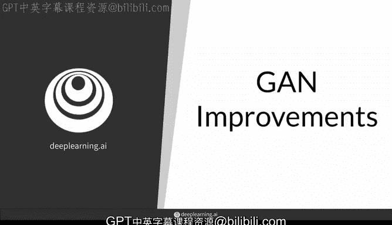
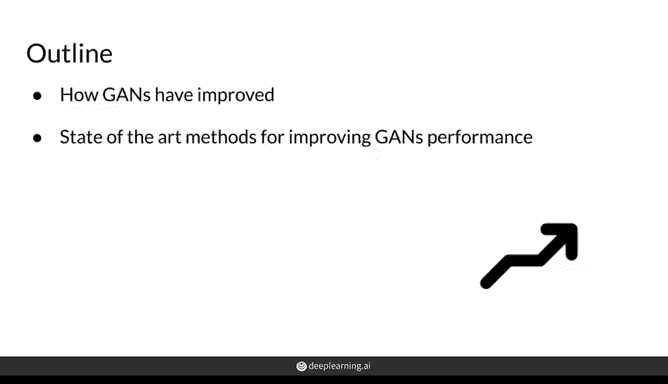
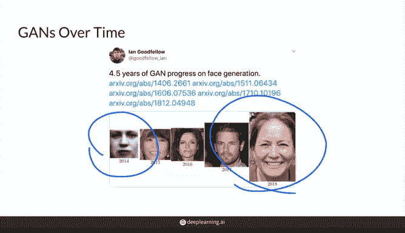
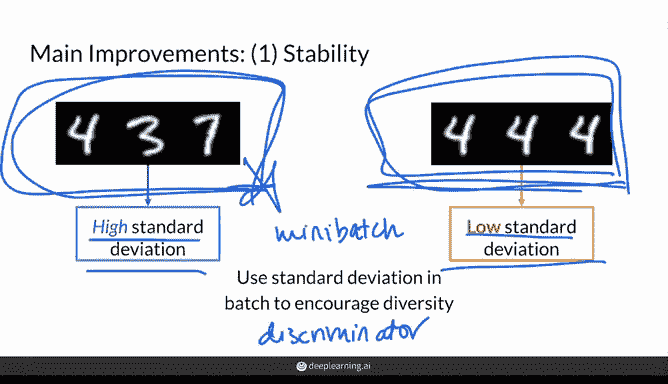
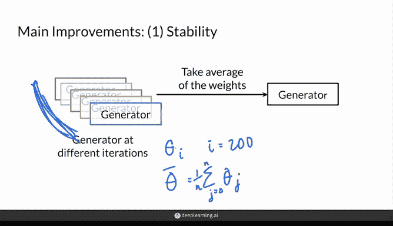
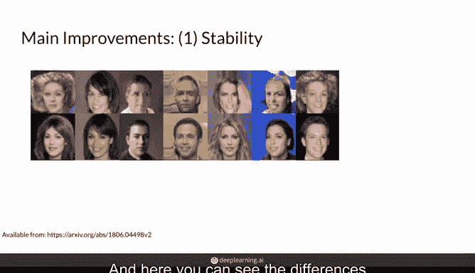
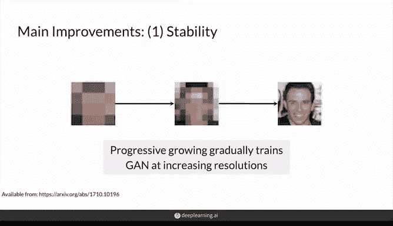
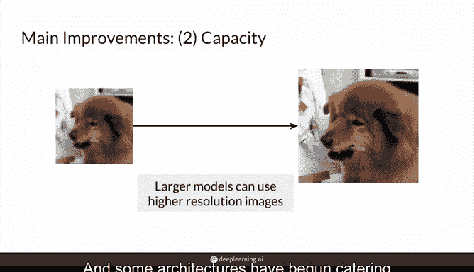
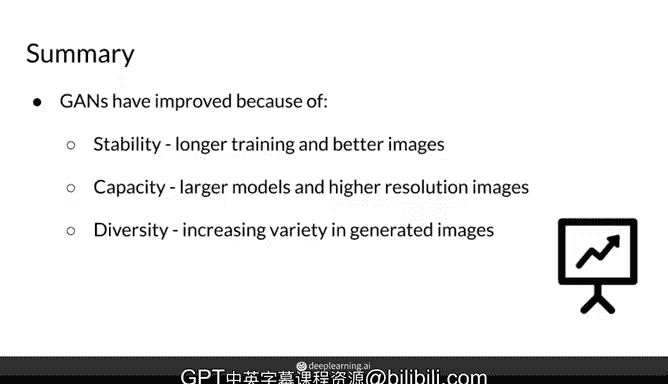

# 52：生成对抗网络（GAN）的改进 🚀

在本节课中，我们将学习生成对抗网络（GAN）自诞生以来的主要改进方向。我们将探讨如何提升GAN的训练稳定性、模型容量以及生成结果的多样性，并了解一些实现这些改进的关键技术。

---

## 训练稳定性的提升

上一节我们回顾了GAN的基本概念，本节中我们来看看研究者们如何解决GAN训练不稳定的问题，特别是模式崩溃（Mode Collapse）。

训练不稳定的GAN通常意味着延长训练时间也无济于事。如下图所示，生成器可能陷入局部最优，只能生成单一类型的样本（例如只生成数字“4”），而无法生成多样化的结果。

### 利用小批量统计信息

一种监测和缓解模式崩溃的方法是分析生成样本的多样性。以下是具体思路：

*   **高多样性样本**：在一个小批量（Mini-batch）中，样本间差异大，标准差高。
*   **低多样性样本**：样本间非常相似，标准差低，这可能是模式崩溃的迹象。

通过将小批量的统计信息（如标准差）传递给判别器，可以帮助判别器识别生成器是否正在发生模式崩溃，从而给出更有效的反馈，促使生成器生成更多样化的样本。

### 实施利普希茨连续性约束

另一种提升稳定性的方法是在使用Wasserstein损失（W Loss）时，强制模型满足1-利普希茨连续性。这可以防止模型学习过快，并保持有效的Wasserstein距离。

以下是两种实现该约束的主流技术：

1.  **WGAN-GP (Wasserstein GAN with Gradient Penalty)**：通过梯度惩罚项来约束判别器函数的梯度范数。
    *   **核心公式**：在损失函数中添加梯度惩罚项，例如 `λ * (||∇D(ˆx)||₂ - 1)²`，其中 `ˆx` 是真实样本和生成样本的随机插值点。

2.  **谱归一化 (Spectral Normalization)**：这是一种权重归一化技术，类似于批归一化（Batch Norm），通常作为一个网络层实现。它通过约束每一层权重矩阵的谱范数来稳定训练，确保函数满足利普希茨连续性。

### 使用移动平均与渐进式增长

在StyleGAN等先进模型中，还采用了以下两种技术来进一步提升稳定性和生成质量：

1.  **权重移动平均**：不是使用单个训练检查点的生成器权重，而是对多个检查点的权重取平均。这能产生更平滑、更稳定的生成结果。
    *   **核心公式**：`θ̄ = (1/n) * Σ(θ_j)`，其中 `θ̄` 是平均权重，`θ_j` 是第j个检查点的权重。

2.  **渐进式增长**：训练时从低分辨率图像开始，逐步增加图像分辨率。这种方法让生成器先学习整体结构，再学习细节，有助于生成高质量的高分辨率图像。

---

## 模型容量的扩大

在提升了训练稳定性之后，研究者们得以构建更大、更深的模型。模型容量的扩大是GAN质量飞跃的另一个关键。

得益于更强大的硬件（如GPU）和更高分辨率的数据集（如用于训练StyleGAN的FFHQ人脸数据集），生成器和判别器网络变得更深、更宽。例如，你在第二周学到的深度卷积生成对抗网络就是早期扩大模型容量的成功范例。一些新的网络架构也开始专门为处理高分辨率数据而设计。

---

## 生成多样性的增强

最后，我们来看看生成多样性的改进。一个优秀的GAN应该能模拟数据分布中的所有变化，而不仅仅是生成同一张脸。

生成多样性的提升主要得益于以下几点：

*   **更大、覆盖更广的数据集**：训练数据本身的多样性直接影响了生成结果的多样性。
*   **避免模式崩溃的技术**：如前所述，利用小批量标准差等方法防止模式崩溃，有助于生成器逼近真实图像的变异程度。
*   **专门的架构改进**：例如StyleGAN等模型在架构上进行了特定设计，以更好地解耦和控制生成图像的不同特征，从而增加多样性。

---

## 总结

本节课中我们一起学习了生成对抗网络（GAN）的三个主要改进方向：

1.  **训练稳定性**：通过监测小批量统计、实施利普希茨连续性约束（如WGAN-GP、谱归一化）以及采用权重移动平均和渐进式增长等技术，使GAN能够进行更长时间、更稳定的训练。
2.  **模型容量**：借助更强大的硬件和高质量数据集，构建更深、更宽的神经网络，以生成更高分辨率和更精细的图像。
3.  **生成多样性**：通过使用多样化的数据集和防止模式崩溃，确保GAN能够生成丰富多样的样本，更好地模拟真实数据分布。

这些改进共同推动了GAN从生成模糊的黑白图像，发展到能生成以假乱真的高质量图像。在接下来的关于StyleGAN的视频中，你将看到这些技术的一些具体应用实例。