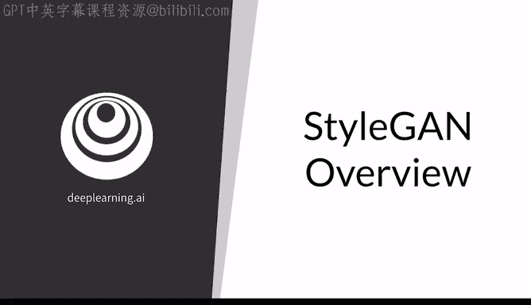
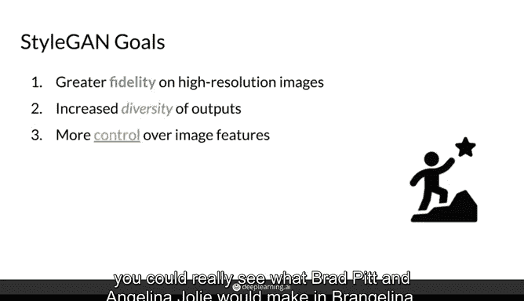
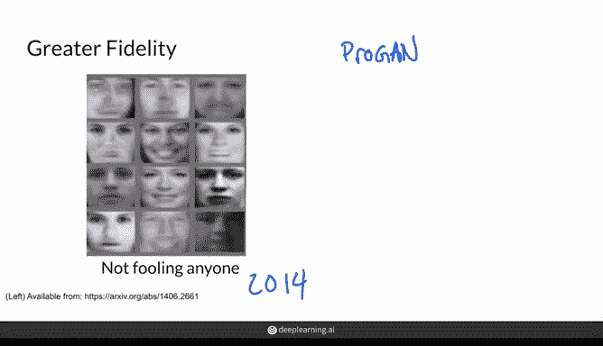
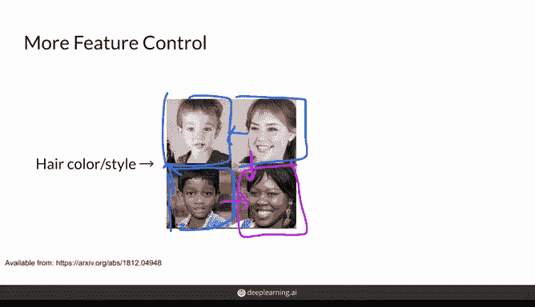
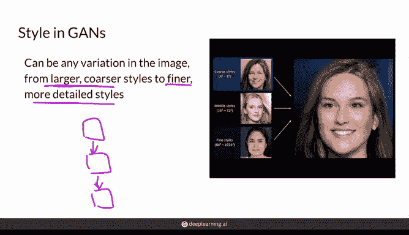
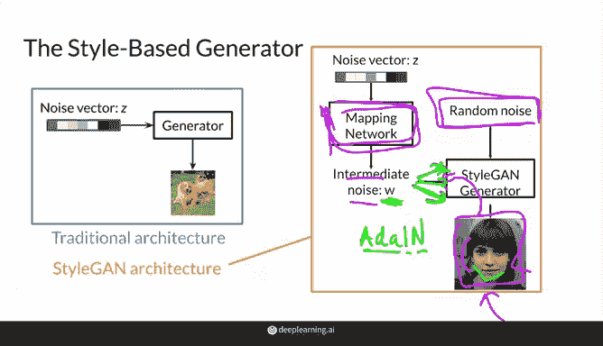
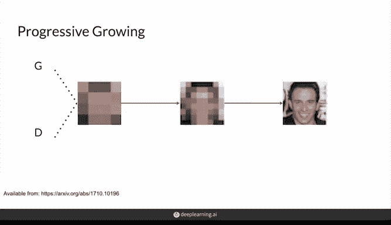
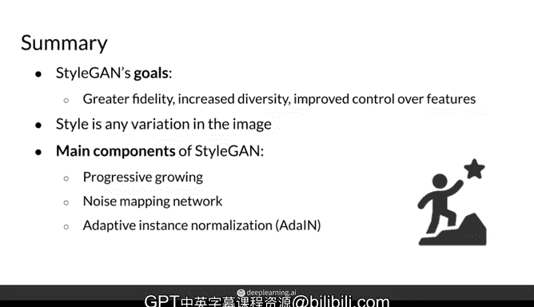

# 53：StyleGAN 概述 🎨

在本节课中，我们将要学习 StyleGAN，这是一种相对较新的生成对抗网络架构。它不仅是当前 GAN 领域的先进代表，更被认为是 GAN 发展的一个转折点，尤其是在生成极其逼真人脸图像方面。

上一节我们回顾了 GAN 近年来的发展历程，本节中我们来看看 StyleGAN 是如何具体实现这些进步的。

## 主要目标

StyleGAN 的首要目标是生成高质量、高分辨率的图像，足以“欺骗”普通观察者。其次，它追求生成图像具有更高的多样性。例如，如果生成小狗图像，输出范围可能涵盖金毛寻回犬、金贵犬和法国贵宾犬，而不仅仅是背景相同、略有差异的金毛寻回犬。

StyleGAN 一个非常酷的特点是增强了对图像特征的控制能力。这包括添加帽子或太阳镜等特征，或者将两张不同生成图像的风格混合在一起。从某种意义上说，你可以看到布拉德·皮特和安吉丽娜·朱莉在“AI 大脑”中结合的样子。

## 高分辨率与逼真度

获得能够“欺骗”未经训练的眼睛的高分辨率逼真图像，是一项巨大的成就，直到最近都难以实现。这主要归因于模型容量较小、数据集分辨率较低，以及高分辨率挑战直到 2018 年 StyleGAN 的前身 ProGAN 出现后才被真正攻克。

以下是 2014 年生成的这些人脸图像，它们看起来大部分像糟糕的素描，颗粒感强，很难让人信服其真实性。

现在，看看这张由 StyleGAN 生成的近期高分辨率人脸图像。如果没有任何上下文，你能猜出她不是一个真实存在的人吗？

显然，StyleGAN 已经实现了更高的逼真度目标。但有趣的是，StyleGAN 尝试了你在第三周学到的 WGAN-GP 损失函数和第一周学到的原始 GAN 损失函数，发现它们在不同的高分辨率人脸数据集上各有优势。因此，结论是关键在于不断实验。

## 特征控制与风格混合

StyleGAN 还旨在增强对图像特征的控制。这可以是混合一张图像的风格到另一张图像中，如下图所示。右下角的这张脸混合了下方和右侧图像的特征，你可以看到发色和发型来自右侧图片，而各种面部特征来自下方的人脸。

同样，在右下角，这位女性的风格混合了上方女性和左侧男孩的风格。

控制也可以意味着添加配饰，如眼镜。StyleGAN 通过**解耦潜在空间**来实现这一点，这个概念稍后会详细学习。如下图所示，这些“家伙”都戴上了太阳镜。

## “风格”的含义

在图像生成的语境中，“风格”一词几乎指图像中的任何变化。你可以将这些变化视为图像不同层次上“外观和感觉”的体现。

这些不同的层次可以意味着更大、更粗糙的风格，例如整体脸型或面部结构；也可以意味着更精细、更详细的风格，例如头发颜色或某些发丝的放置位置。

有趣的是，StyleGAN 生成器由多个模块组成，其中较早的模块大致对应于较粗糙的特征，如面部结构或姿势。

因此，较早的层在这里，靠近输出端，则控制着更精细的风格，如发色或眉毛形状。你可以想象，这里的这位女性可以基于顶部女性的粗糙风格、中间女性的中等风格和底部女性的精细风格，以某种方式进行组合或改变。

## 与传统 GAN 生成器的区别

现在你对“风格”概念更熟悉了，让我们看看 StyleGAN 生成器与你可能更熟悉的传统 GAN 生成器有何不同。

在传统 GAN 生成器中，你将噪声向量输入生成器，然后生成器输出图像。

在 StyleGAN 中，噪声向量的处理方式略有不同。噪声向量不直接馈入生成器，而是通过一个**映射网络**得到一个中间噪声向量 **W**。然后，这个 **W** 向量被多次注入到 StyleGAN 生成器中以产生图像。

此外，还有额外的**随机噪声**被传入，为图像添加各种随机变化，例如以不同方式移动一缕头发。这种随机噪声没有学习成分，主要是无关的随机高斯噪声，用于轻微扰动卷积层等各层的输出值。

然而，这个映射网络非常重要，它包含可学习的参数。因此，反向传播会从判别器一路经过生成器，再回到这个映射网络。

需要注意的是，**W** 并非简单地输入到 StyleGAN 生成器中。相反，风格是从这个中间噪声值 **W** 中提取出来，然后添加到 StyleGAN 生成器的各个点。在生成器的较早阶段，**W** 会影响之前提到的较粗糙风格，如整体脸型；而将 **W** 注入到较后的层，则会控制更精细事物的风格，如头发颜色。

这种将中间噪声注入 StyleGAN 所有层的操作，是通过一种称为 **AdaIN** 的操作完成的。这是一种类似于批量归一化的归一化方法，区别在于它在以某种方式归一化后，会尝试基于传入的 **W** 来应用某种风格。

## 渐进式增长

StyleGAN 第三个也是最后一个重要组成部分是**渐进式增长**。它在训练过程中，逐步增加生成器生成和判别器评估的图像分辨率。

渐进式增长起源于 ProGAN。它并非 StyleGAN 独有，但作为其前身，作者指出它确实有助于更高分辨率图像的训练。

在训练过程中，生成器和判别器都从小的低分辨率图像开始。首要目标是训练生成器能够生成比高分辨率人脸更容易的东西，即一个模糊但大致正确的图像。当模型稳定后，它们可以扩展到双倍的高度和宽度，这是一个稍难的任务，图像需要看起来更像人脸，但仍然比超高分辨率人脸容易。这个过程持续进行，直到达到所需的图像分辨率，这种“加倍”发生在训练过程中的预定时间点。

但棘手的是，这种加倍不能太突然，必须更渐进，以便让生成器逐步适应生成那些更大的图像。如果你感到困惑，完全不用担心，课程后面会更详细地介绍。主要的收获是：如果你想“成长”，就必须慢慢来。

## 总结

本节课中我们一起学习了 StyleGAN 及其一些惊人成就，包括在更高分辨率图像上实现更高的逼真度、输出图像多样性增加，以及对发色、配饰等图像特征更强的控制能力。

我们了解了在图像生成语境中“风格”的含义，即图像不同层次上的一般纹理或外观感觉。这些风格根据其在生成器中的位置而变化，从大的核心风格（如脸型）到精细风格（如发色）。

最后，我们介绍了 StyleGAN 的架构，看到了它的主要组件——噪声映射网络和自适应实例归一化——如何使其区别于更传统的 GAN。渐进式增长虽不限于 StyleGAN，但它确实有助于更高分辨率图像更稳定的训练。

这只是一个高层次的介绍，接下来你将更深入地了解这些组件及其工作原理。