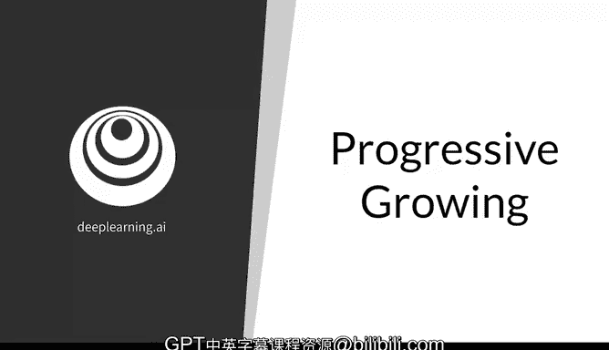
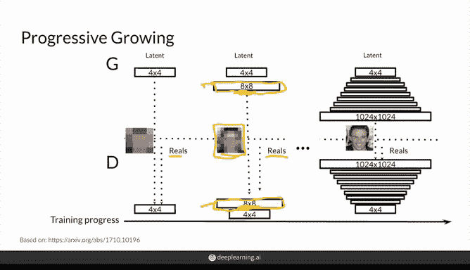
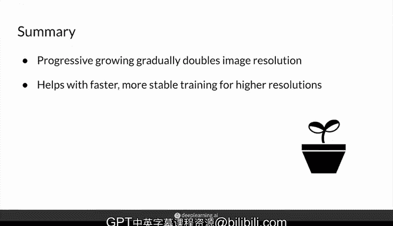

# 54：渐进式增长 🚀



在本节课中，我们将要学习 StyleGAN 中的一个重要组件——**渐进式增长**。我们将了解其背后的直观原理和动机，并深入探讨其实现方式。

---

## 概述

上一节我们介绍了 StyleGAN 的基本概念。本节中，我们来看看 **渐进式增长** 技术。该技术通过让生成器从生成低分辨率图像开始，逐步过渡到生成高分辨率图像，从而简化了生成高分辨率图像的训练过程。

## 渐进式增长的原理与动机

渐进式增长的核心思想是：让生成器从简单的任务（生成低分辨率、模糊的图像）开始学习，然后逐步增加难度，最终生成高分辨率、清晰的图像。这有助于实现更快速、更稳定的训练。



## 渐进式增长的实现步骤

以下是渐进式增长的基本实现流程。

1.  **初始阶段**：生成器 `G` 首先生成一个非常低分辨率的图像（例如 4x4 像素）。判别器 `D` 的任务是判断这个 4x4 图像是真实的还是生成的。为了使任务对判别器也具有挑战性，真实图像也会被下采样到 4x4 分辨率。
    ```
    生成器输出: 4x4 图像
    判别器输入: 4x4 图像（真实或生成）
    ```

2.  **增长阶段**：在预定的训练间隔后，图像分辨率会翻倍。例如，从 4x4 增长到 8x8。此时，生成器需要学习生成 8x8 的图像，而判别器也相应增加一个卷积层来处理这个更高分辨率的输入。真实图像同样会被下采样到 8x8 以匹配。
    ```
    生成器输出: 8x8 图像
    判别器输入: 8x8 图像（真实或生成）
    ```

3.  **最终阶段**：经过多个这样的增长周期，生成器最终能够生成非常高分辨率的图像（例如 1024x1024）。此时，判别器将直接处理全分辨率的真实图像与生成图像，不再需要下采样。

## 平滑过渡：Alpha 参数

分辨率翻倍的过程并非一蹴而就，而是通过一个平滑的过渡实现的。这个过渡由一个关键的 **alpha** 参数控制。

*   **在生成器中**：当需要从低分辨率（如 4x4）过渡到高分辨率（如 8x8）时，我们不会立即用新的卷积层完全生成图像。
    *   初始时，`alpha = 0`。高分辨率图像 100% 由简单的上采样（如最近邻插值）得到，新卷积层的贡献为 0%。
    *   随着训练进行，`alpha` 从 0 逐渐增加到 1。高分辨率图像变为由上采样结果和新卷积层输出的加权和。
        ```
        输出图像 = (1 - alpha) * 上采样图像 + alpha * 卷积层输出图像
        ```
    *   当 `alpha = 1` 时，图像完全由学习到的卷积参数生成，上采样路径被弃用。

*   **在判别器中**：过程类似但方向相反。判别器需要处理逐渐变大的输入图像。
    *   初始时，`alpha = 0`。高分辨率输入图像 100% 被简单下采样，然后送入原有的低分辨率处理层。
    *   随着 `alpha` 增加，判别器逐渐更多地使用新增的卷积层（处理高分辨率输入，然后下采样）的输出来做判断。
    *   最终，`alpha = 1`，判别器完全依赖新增的卷积层路径。

## 网络结构

在 StyleGAN 的生成器中，渐进式增长体现为一系列逐步增大的网络块。每个块通常包含上采样层和卷积层（实践中常为两个卷积层），以学习更复杂的特征。

## 总结



本节课中我们一起学习了 **渐进式增长** 技术。我们了解到，它通过让生成对抗网络从低分辨率图像开始训练，并逐步平滑地过渡到高分辨率，有效降低了模型学习生成高质量图像的难度，从而实现了更快、更稳定的训练。核心的平滑过渡机制由 **alpha** 参数控制，确保了训练过程的连续性。