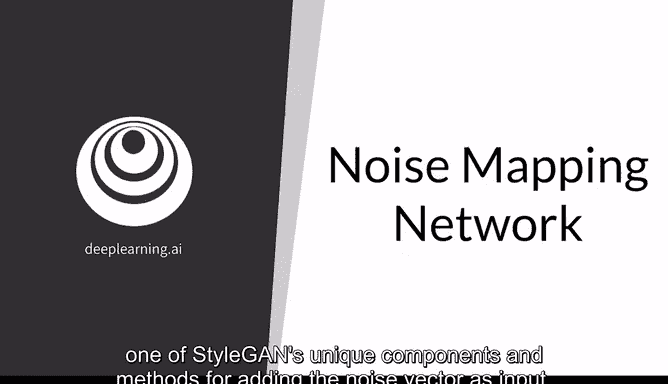
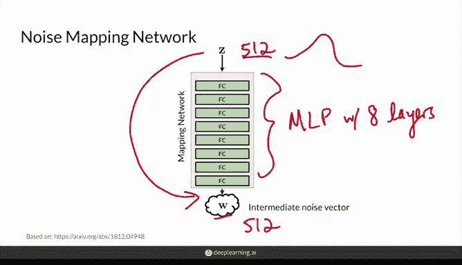
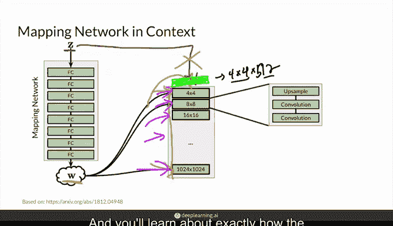
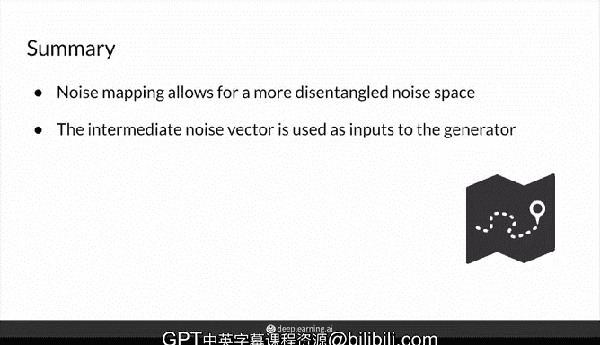

# 55：噪声映射网络 🧠

在本节课中，我们将学习 StyleGAN 的一个独特组件——噪声映射网络。这是一种将噪声向量作为输入的特殊方法，它将在后续帮助我们控制生成图像的风格。

首先，我们将了解噪声映射网络的结构，然后探讨它存在的原因，最后看看它的输出——中间向量 W 的实际去向。

## 噪声映射网络的结构

噪声映射网络接收你的噪声向量 **Z**，并将其映射为一个中间噪声向量 **W**。

这个网络由八个全连接层组成，层与层之间包含激活函数。它也被称为多层感知机（MLP）。这是一个相当简单的神经网络，它接收大小为 512 的 **Z** 向量，并将其映射为同样大小为 512 的 **W** 向量。本质上，它只是改变了向量的值。

你仍然像处理 **Z** 一样，从一个正态分布中采样所有 512 个值来得到 **Z**，但现在你需要将其输入这个网络，以获得中间的 **W** 噪声向量。

## 为何需要噪声映射网络？

上一节我们介绍了网络的结构，本节中我们来看看它存在的原因。其动机在于，映射你的噪声向量实际上能让你获得一个**解耦程度更高**的表示。

简单回顾一下，**Z** 空间中的“耦合”是指噪声向量与输出特征之间并非一一对应的映射关系。当你改变 **Z** 向量中的一个值时，实际上可能会改变输出图像中的许多不同特征。这很糟糕，因为它不允许你对最终图像进行精细的或特征级别的控制。例如，当你试图改变某人的眼睛时，你肯定不希望突然改变他的胡子。

**Z** 空间（噪声向量的来源）之所以经常是耦合的，是因为真实数据具有特定的概率密度。这意味着样本图像具有某些特征（如戴眼镜、有胡子、特定发色、年龄等）存在一定的概率分布。

然而，由于 **Z** 具有正态先验分布（所有值都从正态分布中抽取），让它将这个正态分布映射到所有输出特征的正确密度分布上是困难的。因为你期望随机噪声向量能够建模整个特征空间（戴眼镜、有胡子、各种发色眼睛等所有不同类型的图像及其特征），这对于 **Z** 空间来说极具挑战性。它会试图找到某种方式来扭曲自身以映射到这些期望的特征，而这种扭曲方式对我们来说可能并不合理。

因此，期望 **Z** 空间完全解耦（即完全的一一映射）是不现实的。它很可能（并且非常必要地）会学习一组复杂的、耦合的映射关系来实现目标。

然而，为噪声向量引入这个中间映射（**W** 空间）可以给它一些调整空间，使其能够匹配真实数据的密度分布。这使得学习一个解耦的一一映射变得更容易。本质上，噪声向量不需要严格受限于训练数据的统计特性，而是可以学习这些现在呈线性且更易于生成的变异因子。这将降低不同风格特征过于紧密相关的可能性，并最终有助于控制和映射特征。

需要说明的是，**W** 空间并非如图所示那样完美，这只是一个示意图。研究发现，它只是比 **Z** 空间的耦合程度更低。请注意，图中显示的向量大小是 7，但在实际中它们是 512 维。

## 噪声映射网络在 StyleGAN 中的位置

在了解了噪声映射网络的作用后，我们来看看它如何融入整个 StyleGAN 架构。

你之前已经学习了渐进式增长，即输出尺寸会阶段性地翻倍。生成器的架构大致如下图所示，而噪声映射网络实际上是在这里作为输入，进入所有这些模块中。

你可能会注意到，原本 **Z** 输入的位置现在不再是这样了。相反，**Z** 会经过这个映射网络，而生成的 **W** 实际上会在网络中的多个不同位置被输入。在下一个视频中，你将看到它是如何被精确地添加到所有这些地方的，以及 **W** 在不同输入点的影响有何不同（例如，在早期输入与在后期输入，其影响是不同的）。

要知道，**W** 并不像原始 GAN 设置中 **Z** 那样在网络的最开始输入。这是因为 StyleGAN 的作者发现，在那里添加 **W** 并没有明显的效果差异，加或不加基本上是一样的。

因此，模型实际上是以一个**常量值**开始的，而不是在开头输入 **W**。这个常量值对于你生成的任何图像都是固定不变的。它不仅仅是一个值，其尺寸为 4x4x512（高度、宽度和 512 个通道）。同样，对于生成的每一张图像，这个起始值都是相同的。

任何对生成图像的改变，都将发生在噪声向量被引入的地方，也就是所有这些模块中。实际上，**W** 会在每个中间模块中被多次输入，这非常巧妙。在下一个视频中，你将详细了解噪声向量是如何被添加到这些模块中的。

## 总结

本节课中，我们一起学习了噪声映射网络。它是一个多层感知机（MLP），或者说是一个带有全连接层和激活函数的前馈神经网络，其作用是将你的 **Z** 噪声向量映射为一个中间噪声向量 **W**。这个 **W** 向量被用作生成器中多个位置的输入，从而允许对生成图像的风格进行控制。

