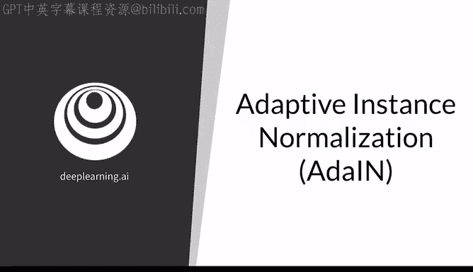
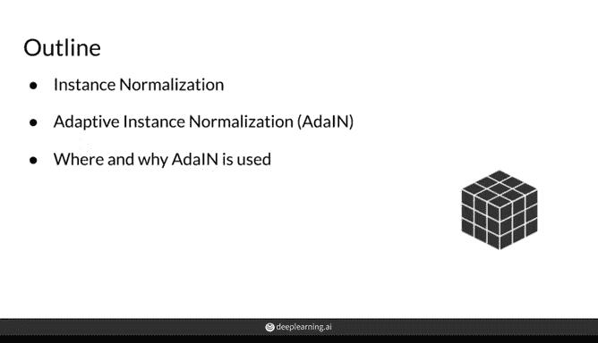
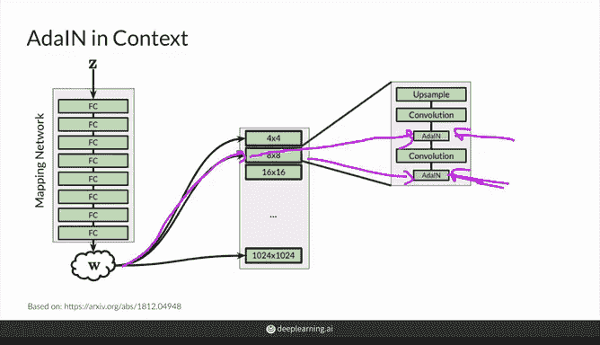
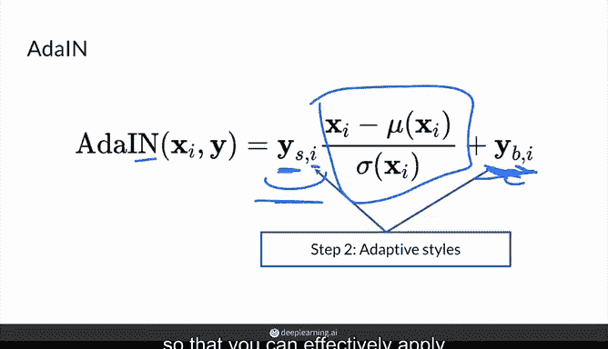
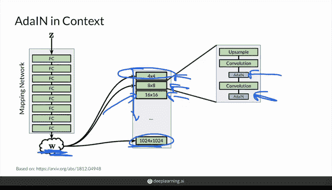
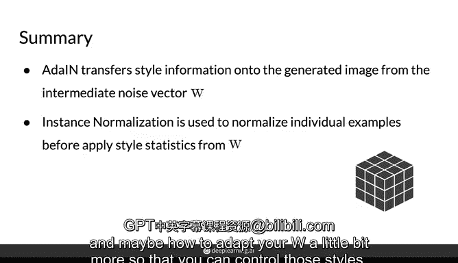

# 56：自适应实例归一化 (AdaIN) 🎨

在本节课中，我们将深入探讨生成对抗网络（GAN）中的一个关键技术：自适应实例归一化（AdaIN）。我们将了解它如何将中间噪声向量 `W` 的“风格”信息整合到生成器的网络中，从而控制生成图像的样式。

---

## 从批归一化到实例归一化

上一节我们介绍了渐进式增长和噪声映射网络。本节中，我们来看看如何将中间噪声向量 `W` 实际集成到网络中，这涉及到自适应实例归一化。

首先，我们来讨论实例归一化，并将其与你更熟悉的批归一化进行比较。

*   **批归一化 (Batch Norm)**：它沿着一个批次（batch）中所有样本的**高度**和**宽度**维度（即图中蓝色高亮区域）计算均值和标准差。具体来说，对于一个通道（例如红色通道R），它会计算该批次内所有样本在该通道上的统计量，然后进行归一化。公式可表示为对批次维度 `B` 的归一化。
*   **实例归一化 (Instance Norm)**：与批归一化不同，实例归一化**只针对单个样本（实例）**。它仅计算一个样本内、单个通道（例如蓝色通道B）的均值和标准差，并基于此进行归一化。它不跨批次或其他样本进行统计。其公式可表示为：
    `IN(x_i) = (x_i - μ_i) / σ_i`
    其中，`x_i` 代表第 `i` 个实例的特征，`μ_i` 和 `σ_i` 是该实例自身的均值和标准差。

在风格化生成任务中，实例归一化通常比批归一化更合理，因为它专注于处理正在生成的每一个独立样本，而不是依赖于整个批次的统计信息。

---

## 自适应部分：注入风格信息

实例归一化是第一步，它将卷积层的输出 `x` 归一化为均值为0、标准差为1的分布。接下来是“自适应”部分，它将风格信息应用到这些归一化后的值上。

这些风格信息来源于你的中间噪声向量 `W`。`W` 由初始噪声向量 `Z` 通过一个多层感知机（映射网络）得到。`W` 本身并不直接输入到 AdaIN 层，而是会先通过两个全连接层，学习生成两个参数：

*   `YS`：代表缩放参数 (Scale)
*   `YB`：代表偏置参数 (Bias) 或平移参数 (Shift)

这两个参数随后被输入到 AdaIN 层中。

以下是自适应实例归一化的完整过程：

1.  **实例归一化**：对输入特征图 `x` 进行实例归一化，去除其原有的风格信息，得到内容表示。
    `x_norm = (x - μ) / σ`
2.  **自适应风格变换**：利用从 `W` 中学习到的 `YS` 和 `YB`，对归一化后的特征进行缩放和平移，从而施加新的风格。
    `AdaIN(x, YS, YB) = YS * x_norm + YB`

你可以这样理解：实例归一化步骤试图“抹去”图像中已有的风格，只保留内容结构。然后，`YS` 和 `YB` 根据 `W` 所编码的风格信息，将这些内容“重新绘制”成特定的风格（如毕加索风格或莫奈风格）。改变 `YS` 和 `YB` 的值，就相当于改变了生成图像的风格。

---

## AdaIN 在生成器中的位置与作用

现在让我们放大视野，看看 AdaIN 在生成器整体架构中处于什么位置。

生成器由多个块组成，其中较早的块大致对应图像的**粗糙特征**（如轮廓、姿态），较晚的块对应**精细细节**（如纹理、发丝）。AdaIN 被用在**每一个生成块**中，具体位置是在每个卷积层之后。

这意味着，中间噪声向量 `W` 的风格信息被注入到了网络的每一个层级。其影响是：

*   在**早期块**中，`W` 主要影响图像的**整体、粗糙风格**。
*   在**晚期块**中，`W` 主要影响图像的**局部、精细风格**。

由于每个 AdaIN 层都会将其输入重新归一化（均值为0，标准差为1），因此**每个块都能独立地控制该层级所表达的样式**。下一个块的 AdaIN 会覆盖前一个块的输出统计量，甚至在同一个块内的不同卷积层之间也是如此。这种设计允许对生成模型进行非常精细的风格控制，例如，可以在不同块注入不同的风格，以实现对图像从整体到细节的多层次调控。

---

## 总结

本节课中我们一起学习了自适应实例归一化 (AdaIN)：

*   **核心功能**：AdaIN 是将中间噪声向量 `W` 所包含的风格信息传递到生成图像上的关键机制。
*   **两个步骤**：
    1.  **实例归一化**：对每个样本（实例）独立进行归一化，剥离其原有风格，提取内容。
    2.  **自适应变换**：利用从 `W` 学习到的缩放(`YS`)和偏置(`YB`)参数，对归一化后的内容施加新的风格。其核心公式为：`AdaIN(x) = YS * ((x - μ)/σ) + YB`。
*   **网络作用**：在生成器中，AdaIN 被应用于多个层级，使得 `W` 能够同时控制图像从粗糙到精细的不同层次的风格表现，为实现多样化和可控的图像生成奠定了基础。

在接下来的视频中，你将看到风格信息具体是如何引入的，以及如何进一步调整 `W` 来精确控制这些风格。