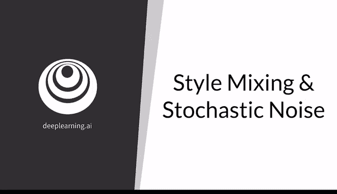
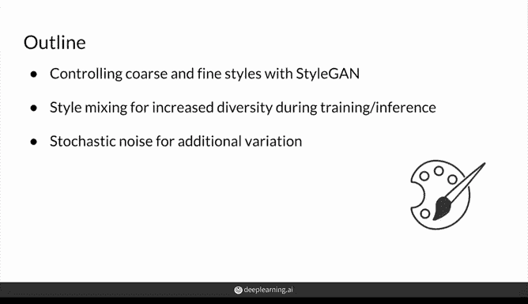
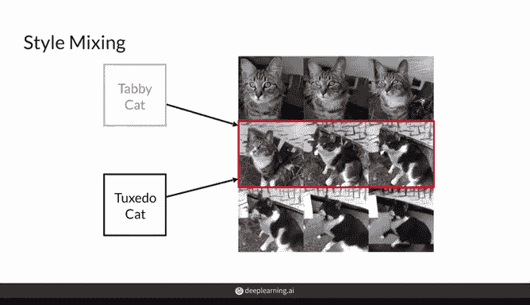
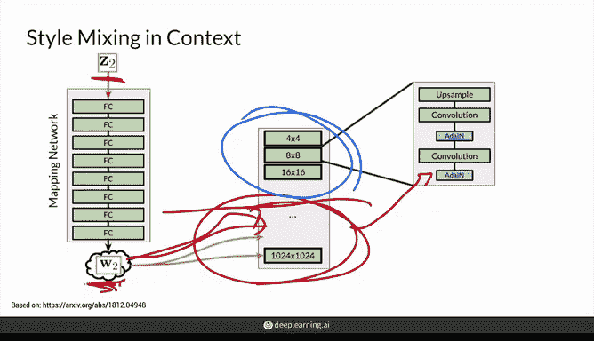
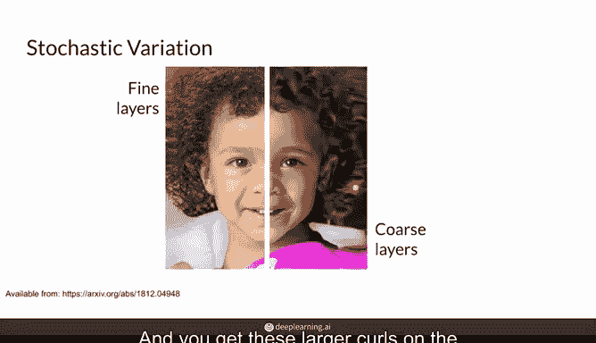
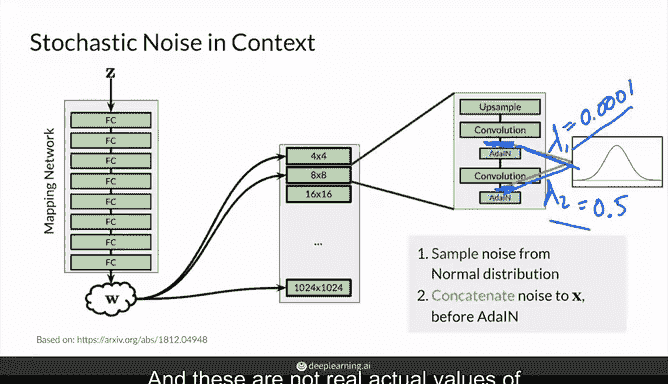
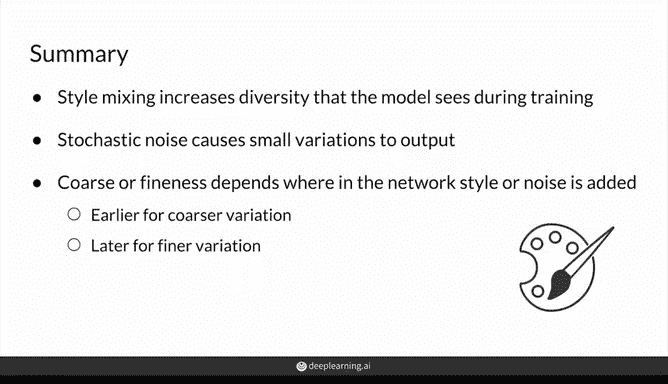

# 57：🎨 风格混合与随机变化

在本节课中，我们将学习 StyleGAN 中用于控制图像风格的两个关键技术：**风格混合** 与 **随机噪声注入**。前者通过混合不同的中间噪声向量来增加生成图像的多样性，后者则通过向模型添加额外噪声来为图像增添细微的变化。

---

## 🧩 风格混合简介

上一节我们介绍了 StyleGAN 的基本架构，本节中我们来看看如何通过混合不同的风格来创造新的图像。风格混合的核心思想是，将两个不同来源的中间噪声向量 **W** 分别注入到生成器网络的不同部分，从而融合两种图像的风格特征。

例如，假设我们有一张虎斑猫的图像和一张燕尾服猫的图像。通过风格混合技术，我们可以生成一张兼具两者特征的“混合猫”图像。这证明了模型能够学习并组合不同的视觉风格。

---

## 🔀 风格混合的工作原理

在之前的课程中，我们了解到中间噪声向量 **W** 会被多次注入到生成器网络的各个模块中。关键在于，这些被注入的 **W** 不必每次都相同。

以下是实现风格混合的步骤：

1.  首先，从潜在空间采样一个噪声向量 **Z1**，通过映射网络得到其对应的中间向量 **W1**。
2.  接着，采样另一个噪声向量 **Z2**，得到其对应的中间向量 **W2**。
3.  在生成图像时，我们可以决定在网络的哪个部分切换使用的中间向量。例如，将 **W1** 注入到网络的前半部分（控制**粗粒度**特征，如脸型、姿态），将 **W2** 注入到网络的后半部分（控制**细粒度**特征，如发丝纹理、肤色细节）。
4.  切换点可以是网络中的任意位置。切换得越晚，**W2** 所控制的特征就越精细。

这种在训练和推理阶段混合不同风格的方式，能有效提升生成图像的多样性。

---

## 👥 风格混合效果示例

让我们通过一个生成人脸的 StyleGAN 示例来直观理解风格混合的效果。

在上图中：
*   **第一列**（A, B, C）是由不同的 **W1** 向量生成的源图像。
*   **第一行**（A, B, C, D, E）是由不同的 **W2** 向量生成的源图像。
*   中间的网格图像则是 **W1** 与 **W2** 混合的结果。

具体分析如下：
*   **第一行混合图像**：它们从 **W2**（顶部行）获取了**粗粒度**风格（如脸型、性别特征），而从 **W1**（左侧第一列的单张图像）获取了中、细粒度风格。
*   **最后一行混合图像**：它们仅从 **W2** 获取了**细粒度**风格（如发丝、皮肤细节），而粗、中粒度风格完全来自 **W1**（左侧列的单张图像），因此看起来与源图像 **W1** 非常相似。
*   **中间行混合图像**：风格混合的程度介于两者之间，展示了不同程度的融合效果。

通过这种方式，我们可以精确控制希望从每个源图像中继承何种类型（粗、中、细）的风格特征。

---

## 🌪️ 引入随机噪声

除了混合不同的风格向量，另一种为图像增加变化的方法是注入**随机噪声**。这可以为生成的图像添加更细微、更随机的细节，例如一缕头发的精确位置或皮肤上微小的纹理。

随机噪声的注入与 **Z** 或 **W** 向量无关，它是一个独立的过程。

如上图所示，在网络的**早期层**（控制粗粒度特征）注入噪声，会产生较大的变化，如头发的整体卷曲度。而在**后期层**（控制细粒度特征）注入噪声，则会产生更精细的变化，如发梢的细微卷曲或眉毛的纹理。

---

## ⚙️ 随机噪声注入机制

随机噪声的注入发生在每个生成器模块的自适应实例归一化层之前。其具体流程如下：

1.  **采样噪声**：从一个标准正态分布中采样一组随机噪声值。
2.  **缩放噪声**：这些噪声值会与一个可学习的缩放因子 **λ** 相乘。**λ** 决定了噪声对最终输出的影响程度。
    *   公式表示为：`调整后特征 = 原始特征 + λ * 采样噪声`
3.  **添加到特征图**：缩放后的噪声被添加到卷积层输出的特征图 **x** 上。
4.  **后续处理**：添加了噪声的特征图再被送入自适应实例归一化层进行后续处理。

通过让模型学习每个 **λ** 的值，StyleGAN 能够自动决定在网络的每一层需要多少随机性来生成逼真的细节。

这种技术可以产生极其微妙的变化，例如上图中人物发梢的细微差异，展示了模型对细节的强大建模能力。

---

## 📝 课程总结

本节课中我们一起学习了 StyleGAN 中控制图像风格变化的两种重要方法：

1.  **🎨 风格混合**：通过混合两个不同的中间噪声向量 **W1** 和 **W2**，并将其分别注入生成器网络的不同部分，可以融合图像的风格，并控制所继承特征是粗粒度还是细粒度。这增加了模型的输出多样性。
2.  **🌪️ 随机噪声注入**：通过向网络的特征图添加经过缩放的随机噪声，可以为生成的图像引入细微的、随机的变化。噪声注入的层位决定了变化的性质：**早期层对应粗粒度变化**，**后期层对应细粒度变化**。

这两种技术共同使 StyleGAN 能够生成高度多样且细节丰富的图像。