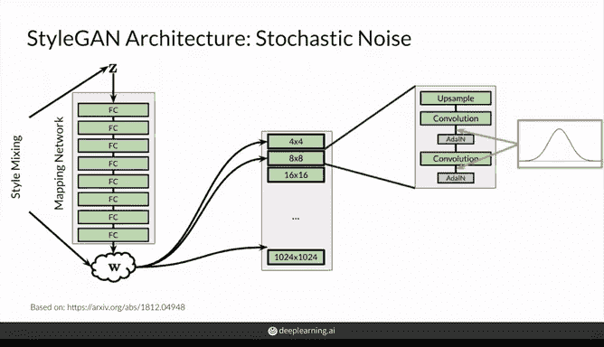
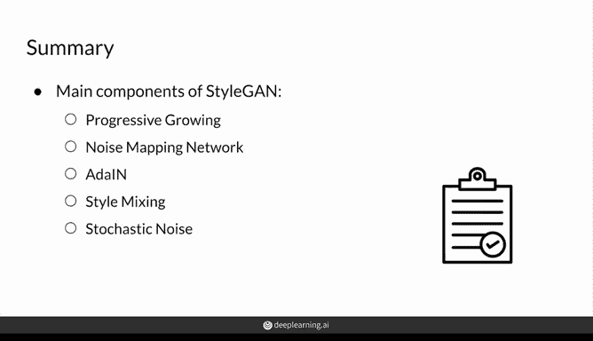

# 58：StyleGAN 核心组件整合教程 🧩

在本节课中，我们将系统性地整合 StyleGAN 的所有核心组件。我们将回顾渐进式增长、噪声映射网络、自适应实例归一化、风格混合以及随机噪声注入等关键概念，并理解它们如何协同工作以生成高质量的图像。

---

上一节我们介绍了 StyleGAN 的各个独立模块，本节中我们来看看如何将这些组件整合成一个完整的生成器架构。

首先，我们学习了**渐进式增长**。该技术让生成器从生成低分辨率图像开始，随着训练进行，逐步添加新的层来生成更高分辨率的图像。这构成了生成器的基本构建块。

接下来是**噪声映射网络**。它接收从标准正态分布中采样的潜在向量 `Z`，并通过一个多层感知机（通常包含8个全连接层，层间使用激活函数如Sigmoid）进行变换，输出一个中间的噪声向量 `W`。这个 `W` 向量随后被注入到生成器的多个层级中（通常从某个阶段开始），为不同层提供风格信息。

然后，我们探讨了**自适应实例归一化**。AdaIN 利用 `W` 向量提供的统计量（缩放和偏移参数），在网络的各个关键点对特征图进行归一化和风格化。较早的层使用 `W` 的统计量来控制更宏观的风格，而较后的层则用于影响更精细的细节。

以下是风格混合的实现思路：
*   采样两个不同的潜在向量 `Z1` 和 `Z2`。
*   分别通过映射网络得到 `W1` 和 `W2`。
*   在生成网络的前半部分使用 `W1`，在后半部分切换为使用 `W2`。
*   最终生成的图像将融合 `W1` 和 `W2` 所代表的两种风格。

最后，我们引入了**随机噪声**。这些额外的、每个像素独立的噪声被添加到生成器的特定层，用于引入细微的、随机的变化，例如发丝的具体位置、卷曲的形态等。网络还会学习一个缩放参数，以控制噪声在每一层的重要性。

---

所有这些组件都至关重要。StyleGAN 的作者通过消融实验验证了这一点，他们发现移除任何一个组件都会对模型性能产生负面影响。当然，正如我们在学习GANs的整个过程中所见，存在其他方法可以替换某些组件以达到相似效果。

现在，让我们将 StyleGAN 的所有部分整合起来。生成器首先通过渐进式增长的结构搭建主干。输入的 `Z` 经过映射网络转换为 `W`。`W` 通过 AdaIN 机制将风格信息注入到生成器的各个层级。同时，可学习的随机噪声被添加到特定层以增加细节的多样性。此外，通过风格混合技术，我们可以创造性地融合不同 `W` 向量所代表的风格。

---

本节课中我们一起学习了 StyleGAN 的五大核心组件：**渐进式增长**、**噪声映射网络**、**自适应实例归一化**、**风格混合**以及**随机噪声**。理解这些组件如何相互作用，是掌握现代高质量图像生成技术的关键一步。