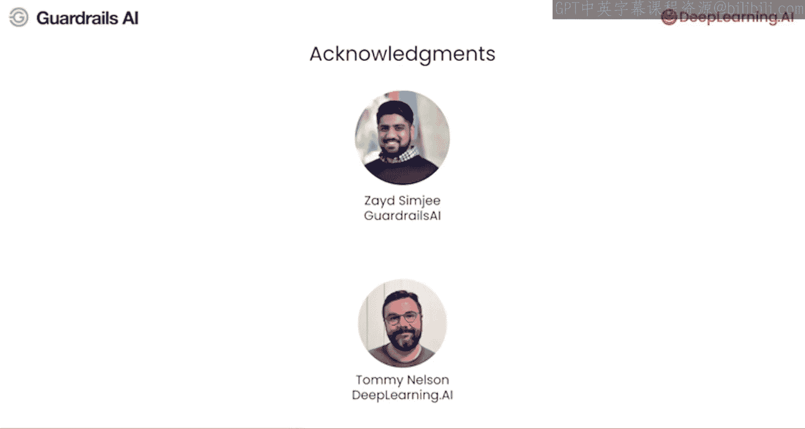

# 001：课程介绍 🛡️

在本节课中，我们将要学习什么是Guardrails（护栏），以及它们如何帮助开发者构建安全、可靠的大型语言模型应用。我们将了解其核心概念、解决的问题以及本课程的学习目标。

欢迎来到《通过Guardrails实现安全可靠的人工智能》课程，本课程是与Guardrails AI合作开发的。

Guardrails是内置于人工智能应用中的安全机制和验证工具，尤其适用于那些使用大型语言模型的应用。其核心作用是在运行时确保应用遵循特定规则，并在预定义的边界内运行。Guardrails作为一个保护性框架，可以防止LLM产生意外的输出，使其行为与开发者的期望保持一致。

它们为你的应用提供了一个关键的控制和监督层，支持构建安全且负责任的人工智能。

本课程将展示如何从零开始构建强大的Guardrails，以减轻LLM驱动应用的常见故障模式，例如幻觉或无意中泄露个人身份信息。

我很高兴向大家介绍Saurabh Rajpal，他是Guardrails AI的首席运营官兼联合创始人，也是本课程的讲师。Saurabh在其职业生涯的大部分时间里都在研究AI可靠性问题，包括自动驾驶系统，在这些系统中，可靠的行为对行人和骑手的安全至关重要。这也是我多年前第一次见到他的时候。他还在Prebase担任过创始工程师，因此对构建LLM系统非常熟悉。

欢迎你，Saurabh。谢谢Andrew，很高兴来到这里。我非常兴奋地向大家展示Guardrails如何帮助你创建可靠的聊天机器人应用，并帮助你实现LLM的全部潜力，为你的项目提供动力。

我看到许多团队正在努力使用LLM构建创新应用。能够访问GPT-4、Claude、Gemni等强大模型的API，使得开发者能够快速构建原型，这对早期开发阶段非常有利。

但是，当你想要超越概念验证阶段时，团队常常会遇到其应用核心——LLM的可靠性问题。

核心挑战在于LLM的输出难以预测。尽管已有一些技术显著改善了这种情况，例如提示工程、微调、RLHF或RAG等对齐方法，但这些技术仍然无法完全消除输出的可变性和不可预测性。

这可能导致重大挑战，尤其是在为有严格监管要求的行业或要求高度一致性的客户开发应用时。开发者常常发现，仅靠RLHF和RAG等技术，不足以满足许多现实世界应用所要求的严格可靠性和合规标准。

在Guardrails AI，我们与医疗保健、政府和金融等领域的许多客户合作。他们对LLM为其业务带来的可能性感到非常兴奋，但由于LLM本身不够可靠，他们无法在产品中使用它们。

这就是Guardrails的用武之地。这些AI应用的附加组件用于检查LLM的输入或输出是否符合一组规则或准则，这可以用来防止不正确、不相关或敏感的信息泄露给用户。

在你的应用中实施Guardrails，确实可以帮助你超越概念验证阶段，使你的应用为生产环境做好准备。

在本课程学习的Guardrails实现中，核心是一个名为**验证器**的组件。这是一个函数，它接收用户提示和/或LLM的响应作为输入，并检查其是否符合预定义的规则。

验证器可以非常简单。例如，如果你想构建一个检查文本是否包含任何个人身份信息（PII）的验证器，你可以使用简单的正则表达式来检查电话号码或电子邮件等类型的PII数据。如果存在任何PII，则让应用程序抛出异常，以防止信息泄露给用户。

你也可以创建更高级的验证器，使用机器学习模型（如Transformer）甚至其他LLM来执行更复杂的文本分析。这将帮助你构建这样的系统：例如，通过对照允许的讨论主题列表进行检查，帮助聊天机器人保持话题；或者防止特定词语出现在LLM的响应中，这对于避免商标术语或提及竞争对手名称非常有用。

你甚至可以使用Guardrails来帮助减少LLM的幻觉。在本课程的一节课中，你将使用自然语言推理模型来构建一个幻觉验证器，用于检查RAG系统中对某个问题的答案是否确实基于检索到的文本。这意味着源文本实际上证实了LLM生成内容的真实性。

Guardrails非常灵活，你可以利用许多较小的机器学习模型来执行验证任务。这有助于保持应用程序的性能，并且实际上比单独使用LLM处理某些故障模式时具有更高的可靠性。

本课程将引导你了解我们在公司中用于构建Guardrails的编码模式。你将针对多种故障模式实现独立的Guardrails。你还将学习如何访问Guardrails Hub上提供的许多预构建Guardrails。

完成课程后，你将能够修改此模式，并构建针对你的特定产品或用例定制的Guardrails。

我要感谢来自Guardrails AI的Zed Simji和来自DeepLearning.AI的Tommy Nelson，他们为创建这门课程付出了努力。许多公司都担心基于LLM的系统的安全性和可靠性，这减缓了构建此类系统的投资。

幸运的是，在你的系统上设置Guardrails，对于创建安全可靠的应用会产生巨大的影响。因此，我认为本课程中的工具将为你解锁更多构建和部署LLM驱动应用的机会。

具体来说，下次有人向你表达对基于LLM的系统的安全性、可靠性或幻觉的担忧时，我相信本课程将帮助你以一种能让他们安心的方式回答。

那么，让我们进入下一个视频，在那里你将探索聊天机器人的基本故障模式。

---

**本节课中我们一起学习了**：Guardrails的基本概念，它是一种用于确保LLM应用安全可靠运行的验证框架。我们了解了其核心组件——验证器，以及Guardrails如何解决LLM的不可预测性、幻觉和敏感信息泄露等问题。最后，我们明确了本课程的目标是学习构建和定制Guardrails，以推动AI应用从概念验证走向生产部署。