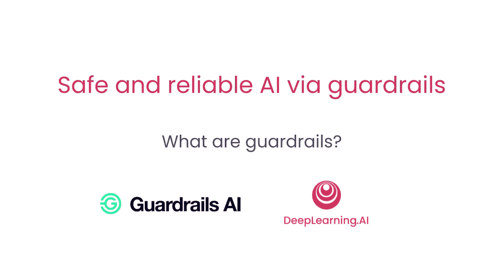
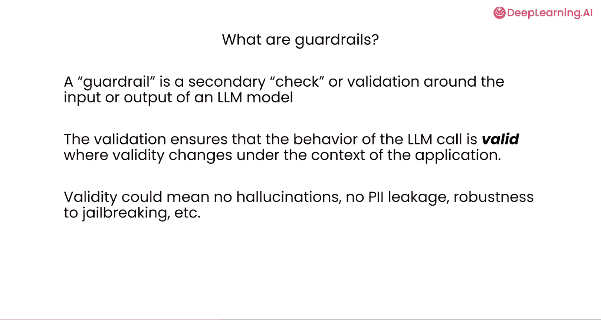
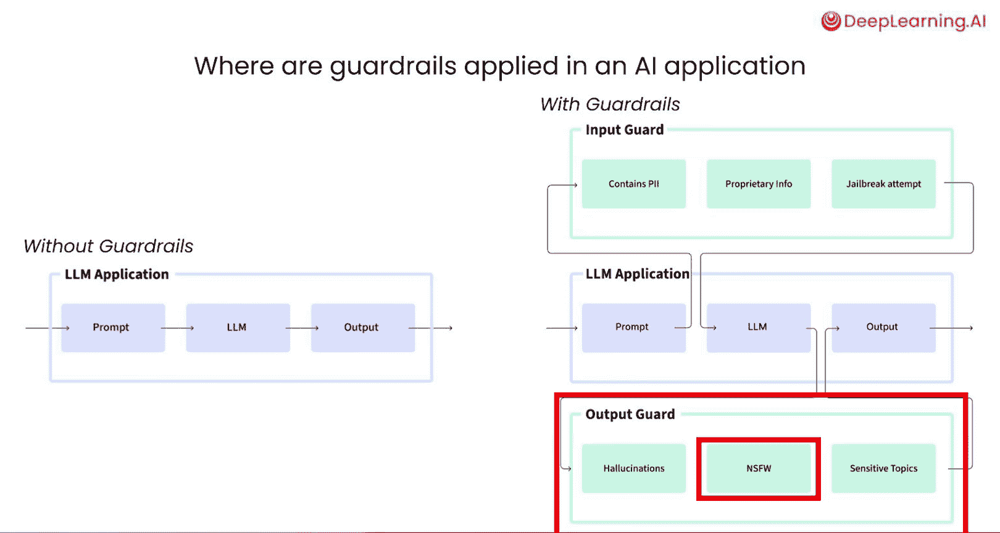
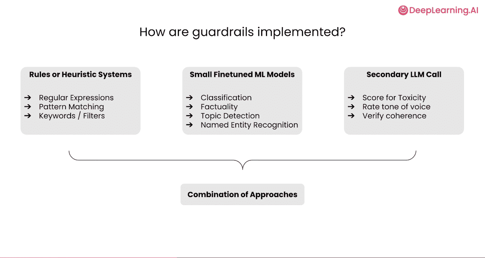
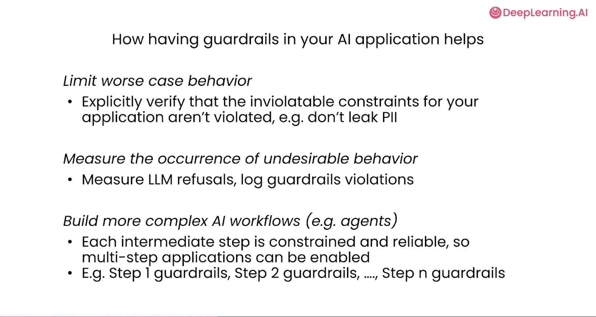
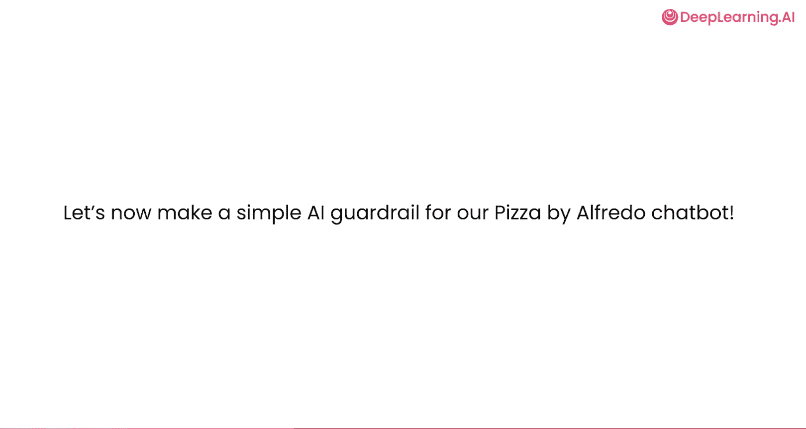

# 003：什么是Guardrails？🛡️

在本节课中，我们将深入探讨AI Guardrails（护栏）如何通过验证和核实应用程序的所有操作，来帮助缓解不可靠的大型语言模型行为。我们将首先明确Guardrails的定义，然后了解其工作原理、应用位置以及它们如何提升AI系统的可靠性。

## 什么是Guardrails？

上一节我们看到了不可靠的LM行为示例。本节中，我们来看看什么是Guardrails。

Guardrails是二级检查或验证机制，用于确保输入或输出（通常是LM调用）符合预期。这里的“预期”可能涵盖多种情况。

以下是Guardrails可能检查的“预期”示例：

*   **检查格式**：验证LM输出格式是否正确。例如，如果预期是简单字符串，检查它是否被正确分割为列表；如果预期是JSON输出，则检查其是否符合预期的模式。
*   **检查内容**：确保AI输出没有产生幻觉（即编造事实），并且没有检测到越狱攻击尝试。

其核心思想是：**不盲目信任LLM会做正确的事，而是明确验证你对LLM输出的任何期望或成功标准。**

## 在何处应用Guardrails？

上一节我们介绍了标准的聊天机器人原型。现在，如果你想将其推向生产就绪阶段，应该在哪里应用AI Guardrails呢？

左边展示的是一个非常标准、直接的LM调用流程：从提示词开始，如果你在进行RAG等复杂操作，检索到的数据库内容和系统提示等都会整合到这个提示框中。然后，你将这个提示发送给LM，LM进行下一个令牌预测并生成输出，最后将该输出发送回你的GenAI应用程序的其他部分。

Guardrails的核心思想非常直接，即**明确验证LM的所有操作**。因此，应用方式如下：

1.  **输入验证**：在将提示发送给LM之前，先将其发送到一个明确的**输入验证套件**或**输入护栏**。这个护栏包含一系列Guardrails，用于明确验证你的预期。
2.  **输出验证**：LM生成输出后，在将其发送回应用程序之前，首先通过一个**输出验证套件**或**输出护栏**。这个护栏同样包含一系列Guardrails，用于检查你可能关心的不同类型标准。

以下是输入和输出护栏可能检查的具体内容：

*   **输入侧检查**：
    *   提示是否包含个人身份信息（PII）？
    *   问题或提示是否偏离主题，不属于聊天机器人服务范围？
    *   是否检测到提示中存在越狱攻击企图？
*   **输出侧检查**：
    *   文本中是否存在幻觉（虚构内容）？
    *   回复是否偏离主题？
    *   输出中是否包含亵渎或不安全的内容？

你可以明确测试上述任何类型标准的违规情况。

## Guardrails如何工作？

那么，Guardrail在底层究竟如何工作呢？其实现技术可以多种多样。

以下是Guardrails可能采用的技术：

*   **规则引擎**：可能简单到包含正则表达式规则。例如，检查LM输出中是否存在特定类型的文本。
*   **微调的机器学习模型**：可能更为复杂，涉及在Guardrail流程中运行小型微调的机器学习模型。例如，检查文本中存在的命名实体、特定主题或有问题的输出等。
*   **二次LM调用**：一些Guardrails也可能是二次LM调用。例如，评估输出在多大程度上回答了用户的问题，或与某些规则的符合程度。
*   **混合技术**：非常常见的是，一个Guardrail最终可能是上述所有技术的组合，你可以混合搭配使用不同的工具，从而非常准确地捕获你期望的LM应用程序行为。

## Guardrails如何提升可靠性？

通过本节课，我们了解了Guardrails是什么以及它们如何工作。现在，让我们回到第一节课的核心问题：Guardrails如何帮助缓解现代生成式AI应用中存在的许多不可靠行为？

以下是Guardrails提升可靠性的三种关键方式：

1.  **验证不可违反的约束**：它们可以明确验证那些系统出错成本极高的、不可违反的约束。例如，“绝不泄露PII”。在不应泄露PII的系统中，这存在实际的财务和风险问题。Guardrails可以确保你不只是依赖AI系统，而是明确验证“不泄露PII”这一不可违反的约束从未被破坏。
2.  **测量不良行为发生率**：即使只有少数Guardrails与你的系统一同运行，它们也能真正测量系统中不良行为的发生情况。例如，我的LLM拒绝回答问题的次数，或收到关于系统中特定主题问题的次数。它将“我的聊天机器人在多大程度上帮助解决了客户问题”这个难以衡量的概念，分解为具体的小检查，从而让你了解系统的整体性能。
3.  **遏制级联错误**：这一技术对于向智能体和多步骤复杂应用发展尤为重要。它可以遏制在许多多步骤应用中发生的级联错误，确保为AI模型的能力划定一个边界框。这样，当你按顺序组合许多LM调用时，它们的错误被控制在范围内，不会产生相同的复合效应。

利用所有这些方法，你最终能够限制GenAI应用程序的最坏情况风险。

## 总结

本节课中，我们一起学习了Guardrails的核心概念。我们明确了Guardrails是用于验证LM输入和输出的二级检查机制，了解了它们可以应用在提示发送前和输出返回前的关键位置，并探讨了其从简单规则到复杂模型混合的多种实现方式。最重要的是，我们看到了Guardrails通过验证关键约束、测量系统行为和遏制级联错误，如何显著提升AI应用的可靠性。

现在你已经理解了Guardrails是什么以及它们如何提高应用程序的可靠性，让我们进入下一课，实现你的第一个Guardrail。这将是一个非常简单的例子，我们将限制我们一直在构建的聊天机器人，不让它透露Peria公司一直在进行的那个激动人心的秘密项目。