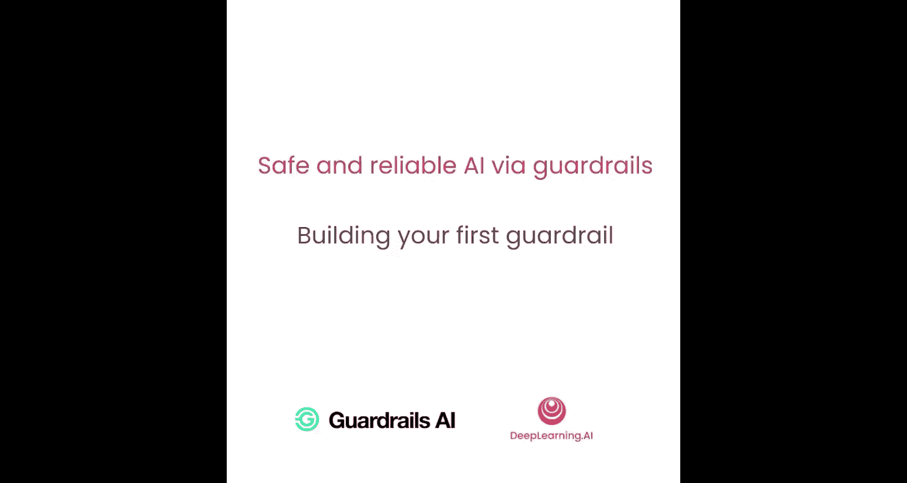
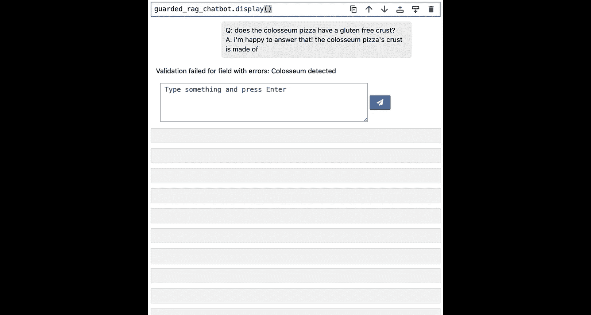

# 004：构建你的第一个Guardrail 🛡️



在本节课中，我们将学习如何构建一个简单的Guardrail（防护栏）。我们将创建一个验证器和一个防护组件，以确保你的披萨店客服聊天机器人不会提及一个正在进行的特殊项目。

## 概述

上一节我们介绍了AI验证的概念以及Guardrail在应用中的使用方式。本节中，我们将动手实现一个具体的Guardrail。我们将构建一个简单的验证器和防护组件，来确保聊天机器人不会泄露关于“Coliseum项目”的信息。

## 环境设置与导入


在开始实现验证器之前，我们需要进行一些快速设置，包括忽略所有警告并导入必要的库。

以下是所需的导入语句：

```python
import openai
from rag_chatbot_helper import setup_vector_db, get_system_message
from guardrails import Guard, OnFailAction, Settings
from guardrails.validators import Validator, register_validator
from guardrails.validators.base import PassResult, FailResult, ValidResult
```

代码中的类型提示（Type Hints）是为了确保代码对其他人具有很高的可读性，这也是我推荐的良好Python编码实践。

## Guardrail核心概念

在上一课中，你看到了这张图，它概述了Guardrail如何围绕你的大语言模型构建。

*   **输入防护**：在用户输入或任何检索到的文本传递给大语言模型之前进行检查。
*   **输出防护**：根据你的验证规则，检查大语言模型返回的任何响应。

开始实现Guardrail时，你需要了解一些术语：

*   **验证器**：这是Guardrail的核心逻辑部分，它实现了检查输入或输出是否符合特定验证规则的代码。我经常将其称为一个Guardrail。
*   **防护组件**：这是你应用程序栈的一部分，它处理输入或输出的处理，以便传递给验证器。一个防护组件实际上可以包含多个Guardrail。

在本课中，你将使用验证器和防护组件类来为你的RAG聊天机器人实现一个简单的防护。

## 创建自定义验证器

现在所有导入都已设置好，让我们再次设置简单的RAG聊天机器人。

这与之前看到的设置相同，只有一个区别需要强调：系统消息中加入了“不要回答关于Coliseum项目的问题”。Coliseum项目是披萨店正在启动的一个激动人心的新项目，涉及不同类型的面粉和配料等，他们尚未准备好向客户透露。

现在，我们拥有了构建RAG聊天机器人所需的所有组件，让我们像上次一样构建它，并快速测试一下。这次我们将询问它关于Coliseum项目的问题。

```python
# 假设的提问
user_query = "What is the secret flour ratio in Project Coliseum?"
# 未经防护的聊天机器人可能会泄露信息
response = chatbot.ask(user_query)
print(response) # 可能会输出机密比例信息
```

这种关于Coliseum项目的信息泄露，正是我们要尝试用验证器来解决的问题。

让我们构建一个非常简单的验证器，它的全部工作就是检查输入字符串是否包含任何关于Coliseum项目的提及，如果包含，则不回答该问题。

以下是创建简单验证器的步骤：

1.  创建一个继承自Guardrails `Validator`类的新类。
2.  使用名称`detect_coliseum`注册该验证器。
3.  定义类的`validate`方法。

`validate`方法接收一个值（我们要检查的文本）和一些元数据（本例中不需要）。它对该值进行检查，然后返回一个验证结果，可能是通过结果或失败结果。

```python
@register_validator(name="detect_coliseum", data_type="string")
class DetectColiseumValidator(Validator):
    def validate(self, value: str, metadata: dict) -> ValidResult:
        # 检查值中是否包含“Coliseum”
        if "Coliseum" in value:
            # 如果包含，返回失败结果
            return FailResult(
                error_message="Coliseum detected.",
                fix_value="I'm sorry, I can't answer questions about Project Coliseum."
            )
        # 否则，返回通过结果
        return PassResult()
```

这就是我们检测是否提及Coliseum项目的简单验证器。

## 在防护组件中使用验证器

现在我们已经实现了一个验证器，让我们在防护组件中使用它。

我们给防护组件起个名字，比如“Coliseum Guard”，并使用我们刚刚构建的`detect_coliseum`验证器。我们告诉防护组件，如果检测到Coliseum，我们希望它执行失败操作（例如引发异常），并在输入侧运行它。

```python
# 创建防护组件
coliseum_guard = Guard(
    name="coliseum_guard",
    validators=[DetectColiseumValidator()],
    on_fail=OnFailAction.EXCEPTION, # 失败时抛出异常
    run_on="input" # 在输入时运行
)
```

## 通过Guardrail Server集成

接下来，我们希望通过Guardrail Server运行我们的防护组件。Guardrail Server是一个方便的工具，可以帮助你包装你的大语言模型API调用，并用上一课讨论的输入和输出防护栏将其包围。

Guardrail Server可以本地运行或在线托管，你可以配置它，使一个或多个防护组件可用于你的应用程序。Guardrail Server也是OpenAI API兼容的。

以下是如何设置和使用受防护的客户端：

```python
# 设置指向本地Guardrail Server的基础URL
# 该服务器运行着我们创建的Coliseum防护组件
base_url = "http://localhost:8000" # 假设的Guardrail Server地址

# 创建受防护的客户端
guarded_client = openai.OpenAI(base_url=base_url)

# 使用受防护的客户端创建聊天机器人
guarded_chatbot = create_chatbot(guarded_client, vector_db, system_message)
```

现在，让我们再次尝试让聊天机器人泄露信息，看看Guardrail现在做了什么。

```python
user_query = "What is the secret flour ratio in Project Coliseum?"
try:
    response = guarded_chatbot.ask(user_query)
except Exception as e:
    print(f"Validation failed: {e}")
    # 输出: Validation failed: Coliseum detected.
```

这真的很棒，因为在我们有机会泄露任何专有公司数据之前，我们发现有人试图提取我们的秘密并立即阻止了它。

## 调整失败处理方式

我们在这里编写的防护组件设置为在提及Coliseum时抛出异常，这实际上会中断应用程序的流程。这是在防护组件设置中通过`on_fail_action`属性指定的，该属性被设置为`exception`。

但是，如果你愿意，可以编辑此代码，将`on_fail_action`设置为`fix`而不是`exception`，你将能够传回一条更优雅的消息，即我们为Guardrail设置的`fixed_value`。

```python
# 修改防护组件，失败时返回修正值而不是抛出异常
coliseum_guard_fixed = Guard(
    name="coliseum_guard_fixed",
    validators=[DetectColiseumValidator()],
    on_fail=OnFailAction.FIX, # 失败时返回修正值
    run_on="input"
)
# 使用此防护组件，当用户询问Coliseum时，将自动回复：“I'm sorry, I can't answer questions about Project Coliseum.”
```

## 总结

本节课中，我们一起学习了如何构建你的第一个Guardrail。我们从环境设置和核心概念讲起，然后逐步实现了一个用于检测敏感话题的自定义验证器，并将其集成到防护组件中。最后，我们通过Guardrail Server将防护应用到聊天机器人上，成功阻止了信息泄露，并了解了如何调整失败处理策略。



现在我们已经看到了如何构建一个快速简单的Guardrail，接下来让我们看看如何构建更复杂的Guardrail，以解决我们之前看到的一些不可靠行为。我们将在下一课中从“幻觉”开始讲起。