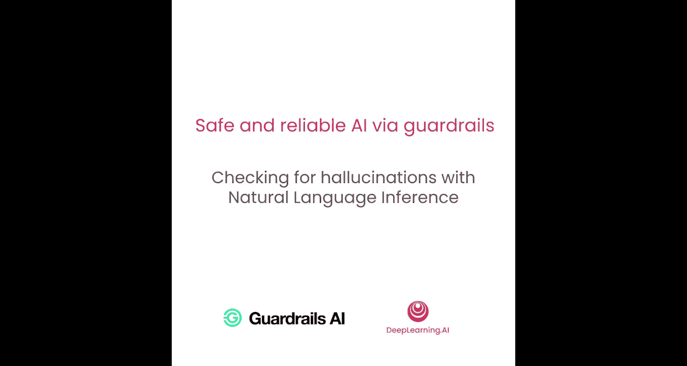
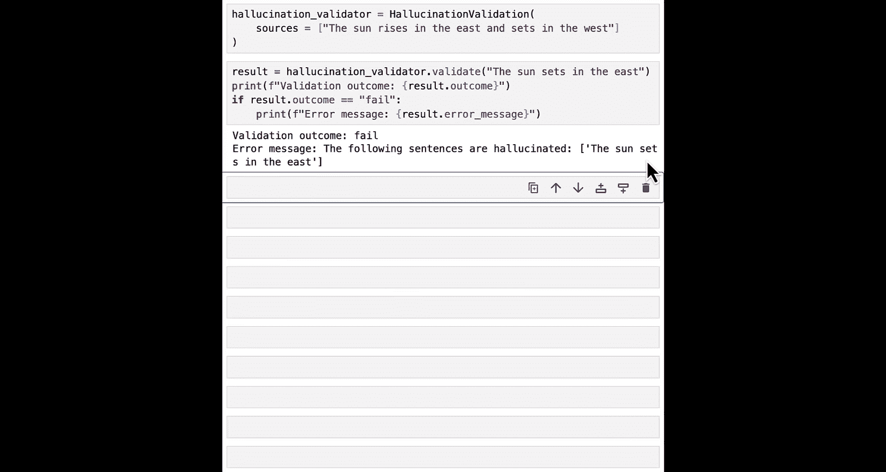

# 005：使用NLI检测幻觉 🧠



在本节课中，我们将学习如何构建一个更复杂的护栏，以解决现代生成式AI系统面临的最大问题之一：幻觉。我们将使用自然语言推理技术来检测聊天机器人回答中的不实信息。

---

上一节我们介绍了如何构建一个简单的护栏来防止提及禁用词。本节中，我们将扩展这一思路，构建一个更复杂的护栏，专门应对生成式AI中的幻觉问题。

## 构建幻觉检测验证器

我们见过许多例子和新闻头条，展示了幻觉如何损害生成式AI的安全性和有效性。例如，聊天机器人提供虚假法律建议或编造不存在的食谱，都可能导致严重后果。


在本节中，我们将回到之前课程中提到的披萨店聊天机器人产生幻觉的例子。我们将构建一个验证器来检测这些幻觉。

### 理解基于NLI的幻觉检测

当我们谈论幻觉及其缓解时，特指在“真实性”背景下的幻觉。真实性是指，当组织或开发者拥有一些可信的来源时，语言模型在回答问题时对这些来源的忠实程度。

自然语言推理模型本质上是在检查，给定一些更高级别的可信上下文（前提），某段文本（假设）的忠实程度如何。

NLI的核心思想是：你有一个可信的“前提”和一个可能与之相关的“假设”。两者作为输入传递给NLI模型。NLI模型本质上是一个分类器，它预测在前提为真的情况下，假设是：
1.  **被蕴含**：假设是真实的，或忠实于前提。
2.  **相矛盾**：假设与前提矛盾。
3.  **中立**：假设与前提无关。

我们将利用这个核心思想，来检测我们的语言模型是否忠实于向量数据库中的来源。

### 设置NLI模型

要进行自然语言推理，首先需要导入一些额外的机器学习库。同时，导入上一课中见过的各种护栏类和函数，以便构建一个使用NLI模型的护栏。

以下是设置NLI模型的代码：

```python
import nltk
from sentence_transformers import SentenceTransformer
from transformers import pipeline
# 导入护栏相关类（假设已定义）
from guardrails import Validator, Guard

# 设置NLI模型管道
model_name = "guardrails/entailment-model"
nli_pipeline = pipeline("text-classification", model=model_name, tokenizer=model_name)
```

我们使用的是由Guardrails AI团队在Hugging Face上提供的微调NLI模型。创建一个Hugging Face管道可以方便地使用这个模型。运行此代码需要几秒钟来下载和设置模型权重。

### 测试NLI模型

现在，我们的本地NLI模型管道已设置好，可以测试一下它的性能。

让我们尝试一个应该被“蕴含”的句子对：

```python
premise = "The sun rises in the east and sets in the west."
hypothesis = "The sun rises in the east."
result = nli_pipeline({"text": hypothesis, "text_pair": premise})
print(result)  # 预期输出：{'label': 'ENTAILMENT', 'score': 0.869}
```

现在，让我们看一个“矛盾”的句子对：

```python
hypothesis_contradiction = "The sun rises in the west."
result = nli_pipeline({"text": hypothesis_contradiction, "text_pair": premise})
print(result)  # 预期输出：{'label': 'CONTRADICTION', 'score': 0.864}
```

通过以上测试，我们了解了NLI管道的工作原理。接下来，我们将以此为基础，构建我们的幻觉检测验证器。

### 构建验证器的整体思路

我们需要将这个NLI模型置于一个更广泛的系统中。该系统需要确保我们的LLM输出以及向量数据库中的来源都处于正确的格式，以便NLI模型能够处理。

以下是其工作原理的高层描述：
1.  将LLM的输出和向量数据库中的信息来源进行分块和拆分。
2.  将这些成对的文本块传递给我们的NLI模型。
3.  如果结果是“蕴含”，则LLM输出没有产生幻觉。
4.  如果结果是“矛盾”，则LLM输出否定了来源中的信息，因此产生了幻觉。

### 逐步构建幻觉验证器

这是一个非常复杂的验证器，包含许多部分。我们将一步一步地构建它。

首先，像上一个例子一样，设置验证器类：

```python
class HallucinationValidator(Validator):
    def __init__(self, sources, embedding_model, nli_pipeline, on_fail="fix"):
        super().__init__(on_fail=on_fail)
        # 初始化将在后续步骤中完成
        pass

    def validate(self, text):
        # 主验证逻辑将在这里实现
        pass
```

### 实现句子分块

当我们获得由许多句子（甚至段落）组成的LLM输出时，为了验证其真实性，我们需要在句子级别进行验证。因此，我们需要将LLM输出拆分成单独的句子。

以下是实现句子分割的函数：

```python
import nltk
nltk.download('punkt')  # 下载分词器数据

class HallucinationValidator(Validator):
    # ... __init__ 部分 ...

    def _split_into_sentences(self, text):
        """将文本分割成句子列表。"""
        sentences = nltk.sent_tokenize(text)
        return sentences

    def validate(self, text):
        # 第一步：将文本分割成句子
        sentences = self._split_into_sentences(text)
        # ... 后续步骤 ...
```

### 查找相关来源

接下来，对于每个句子，我们需要查看它是否基于相关的来源。为此，我们首先要找到相关的来源。

我们添加一个函数来查找相关来源。该函数将嵌入我们的来源句子以及LLM生成的句子。关键是使用完全相同的嵌入模型来嵌入文档来源和LLM生成的句子。

```python
from sklearn.metrics.pairwise import cosine_similarity
import numpy as np

class HallucinationValidator(Validator):
    # ... 之前的代码 ...

    def __init__(self, sources, embedding_model, nli_pipeline, on_fail="fix"):
        super().__init__(on_fail=on_fail)
        self.sources = sources  # 来源文本列表
        self.embedding_model = embedding_model  # 句子嵌入模型
        self.nli_pipeline = nli_pipeline  # NLI模型管道
        # 预计算所有来源的嵌入向量，提高效率
        self.source_embeddings = self.embedding_model.encode(self.sources)

    def _find_relevant_sources(self, sentence, top_k=5):
        """为给定句子查找最相关的来源。"""
        # 嵌入句子
        sentence_embedding = self.embedding_model.encode([sentence])
        # 计算与所有来源的余弦相似度
        similarities = cosine_similarity(sentence_embedding, self.source_embeddings)[0]
        # 获取相似度最高的前k个索引
        top_indices = np.argsort(similarities)[-top_k:][::-1]
        # 返回最相关的来源文本
        relevant_sources = [self.sources[i] for i in top_indices]
        return relevant_sources
```

### 检查蕴含关系

构建验证器的最后一步是判断每个句子的前五个最相关来源是否确实“蕴含”或证明了该句子所陈述的内容。

我们将相关来源作为“前提”，将每个句子作为“假设”，然后使用NLI模型来判断其是否真实。

```python
class HallucinationValidator(Validator):
    # ... 之前的代码 ...

    def _check_entailment(self, sentence, relevant_sources):
        """检查句子是否被相关来源所蕴含。"""
        # 我们将所有相关来源合并为一个前提文本（简单处理）
        premise = " ".join(relevant_sources)
        # 使用NLI管道进行判断
        result = self.nli_pipeline({"text": sentence, "text_pair": premise})[0]
        # 如果标签是“蕴含”，则返回True；否则返回False
        return result['label'] == 'ENTAILMENT'
```

### 整合完整的验证逻辑

现在，让我们回到主验证函数，整合所有步骤：

```python
class HallucinationValidator(Validator):
    def __init__(self, sources, embedding_model, nli_pipeline, on_fail="fix"):
        super().__init__(on_fail=on_fail)
        self.sources = sources
        self.embedding_model = embedding_model
        self.nli_pipeline = nli_pipeline
        self.source_embeddings = self.embedding_model.encode(self.sources)

    def _split_into_sentences(self, text):
        return nltk.sent_tokenize(text)

    def _find_relevant_sources(self, sentence, top_k=5):
        sentence_embedding = self.embedding_model.encode([sentence])
        similarities = cosine_similarity(sentence_embedding, self.source_embeddings)[0]
        top_indices = np.argsort(similarities)[-top_k:][::-1]
        return [self.sources[i] for i in top_indices]

    def _check_entailment(self, sentence, relevant_sources):
        premise = " ".join(relevant_sources)
        result = self.nli_pipeline({"text": sentence, "text_pair": premise})[0]
        return result['label'] == 'ENTAILMENT'

    def validate(self, text):
        # 1. 分割句子
        sentences = self._split_into_sentences(text)
        hallucinated_sentences = []
        entailed_sentences = []

        # 2. 对每个句子进行处理
        for sentence in sentences:
            # 查找相关来源
            relevant_sources = self._find_relevant_sources(sentence)
            # 检查蕴含关系
            is_entailed = self._check_entailment(sentence, relevant_sources)
            # 根据结果分类
            if not is_entailed:
                hallucinated_sentences.append(sentence)
            else:
                entailed_sentences.append(sentence)

        # 3. 最终逻辑判断
        if len(hallucinated_sentences) > 0:
            # 如果存在幻觉句子，验证失败
            self.set_fail_result(f"发现幻觉句子: {hallucinated_sentences}")
            return False
        else:
            # 所有句子都被蕴含，验证通过
            return True
```

### 测试验证器

构建好这个强大的验证器后，如何检查它是否真的有效呢？

你可以通过实例化幻觉验证器类并传入一些源文本来尝试：

```python
# 示例来源（假设来自你的知识库）
sample_sources = [
    "我们的披萨店提供玛格丽特披萨。",
    "玛格丽特披萨的成分包括面团、番茄酱、新鲜马苏里拉奶酪和罗勒叶。",
    "我们的营业时间是上午11点到晚上10点。"
]

# 初始化嵌入模型（使用一个小型但功能强大的模型）
embed_model = SentenceTransformer('all-MiniLM-L6-v2')

# 初始化验证器
validator = HallucinationValidator(
    sources=sample_sources,
    embedding_model=embed_model,
    nli_pipeline=nli_pipeline,
    on_fail="fix"
)

# 测试一个真实的句子
true_text = "玛格丽特披萨含有马苏里拉奶酪。"
result = validator.validate(true_text)
print(f"真实文本验证结果: {result}")  # 预期为 True

# 测试一个幻觉句子
false_text = "玛格丽特披萨含有菠萝和火腿。"
result = validator.validate(false_text)
print(f"幻觉文本验证结果: {result}")  # 预期为 False，并输出失败信息
```

验证器将返回失败结果，因为文本没有被来源所蕴含。很好，验证器正在工作。

---

本节课中，我们一起学习了如何利用自然语言推理技术构建一个复杂的幻觉检测验证器。我们了解了NLI的原理，并逐步实现了句子分割、相关来源查找和蕴含关系检查等核心功能。这个验证器能够判断语言模型的输出是否忠实于我们提供的可信来源。



下一节，我们将学习如何将这个验证器包装成一个完整的护栏，并用它来测试聊天机器人中的幻觉问题。