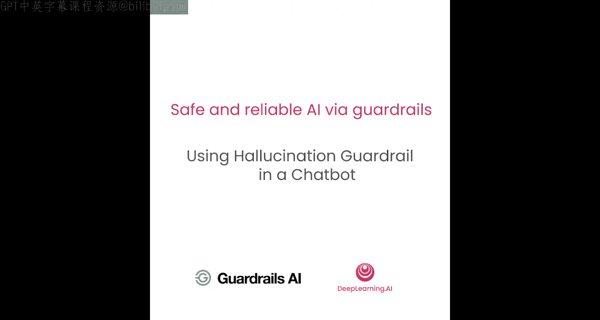
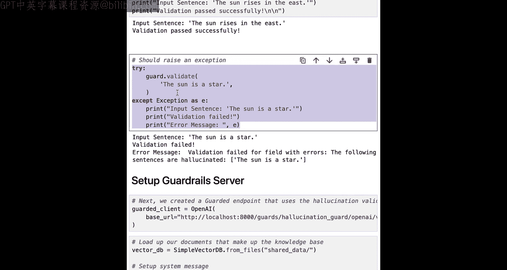

# 006：6.第五课 - 在聊天机器人中使用幻觉护栏




## 概述

在本节课中，我们将学习如何将上节课构建的幻觉检测验证器（Validator）封装成一个护栏（Guard），并将其集成到披萨店聊天机器人中。我们将看到这个护栏如何有效防止幻觉内容被展示给客户。


## 从验证器到护栏

上一节我们介绍了如何构建一个使用自然语言推理模型来检测LLM输出是否基于可信文档的验证器。本节中，我们来看看如何将该验证器包装成一个护栏，并利用它来保护我们的应用。

以下是使用验证器与将其包装成护栏的主要区别：

*   **直接使用验证器**：适用于测试和调试阶段，可以直接访问验证器的原始输出，便于理解其工作原理。
*   **将验证器包装成护栏**：适用于生产环境。护栏提供了更强大的功能，例如支持将多个验证器组合使用、支持LLM输出的实时流式验证、提供与OpenAI兼容的API端点以便于集成，以及内置的日志记录和错误处理功能。

## 构建并测试幻觉护栏

现在，让我们回到代码中，看看如何设置并测试我们的幻觉护栏。

首先，我们需要初始化一个护栏，并将我们上节课编写的幻觉验证器类集成进去。初始化代码如下：

```python
guard = Guard().use(
    HallucinationValidator, # 使用我们编写的验证器类
    embedding_model="all-miniLM-L6-v2", # 嵌入模型
    entailment_model="microsoft/deberta-v3-base" # NLI模型
)
```

我们配置该验证器在检测到幻觉时抛出异常。

接下来，我们使用之前的玩具示例来测试这个护栏。第一个测试句子是“太阳从东方升起”，这个句子与我们在护栏中设置的可信来源（“太阳从东方升起，在西方落下”）一致。

运行测试，验证成功通过，护栏没有抛出错误。

现在，我们测试第二个句子“太阳是一颗恒星”。虽然这是一个事实陈述，但它并不在我们提供的可信来源中。因此，验证迅速失败，并返回错误信息，指出该句子是“幻觉”，因为它缺乏来源支持。

## 在聊天机器人中应用护栏

现在，让我们将刚刚创建的护栏通过Guardrail服务器应用到我们的聊天机器人中，以减轻幻觉问题。

首先，我们需要将客户端切换为使用我们刚刚创建的、受护栏保护的版本。这通过更改API的基础URL来实现，代码如下：

```python
client = OpenAI(base_url="http://localhost:8000/v1", api_key="DUMMY_KEY")
```

这样，所有对LLM的API调用都会先经过我们配置的幻觉护栏进行验证。

接着，我们重复之前的设置步骤：初始化向量数据库和系统提示词。然后，我们使用这个受保护的客户端来运行聊天机器人。

我们使用上节课中那个曾导致幻觉的相同提示词进行测试。这一次，我们收到了一个详细的验证失败错误信息，明确指出关于“如何制作自己的披萨”的说明是幻觉内容。这正是我们所期望的结果。

在实际应用中，你可以捕获这些验证异常，并为其添加更优雅的错误处理逻辑，以控制应用程序的流程。

## 总结

本节课中，我们一起学习了如何将一个幻觉检测验证器封装成护栏，并将其集成到聊天机器人服务中。我们看到了护栏如何成功拦截并报告基于不可信来源的幻觉内容，从而提升了AI应用的可信度与安全性。



你已经掌握了设置验证器、将其包装成护栏并通过服务器提供受保护LLM服务的完整模式。在下一课中，我们将开始探讨如何确保你的聊天机器人不偏离主题。