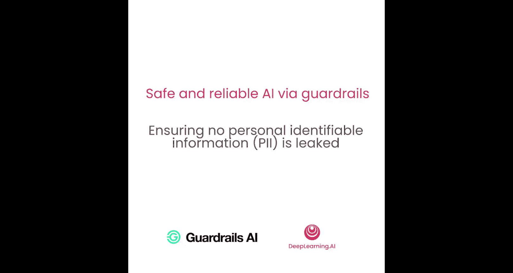
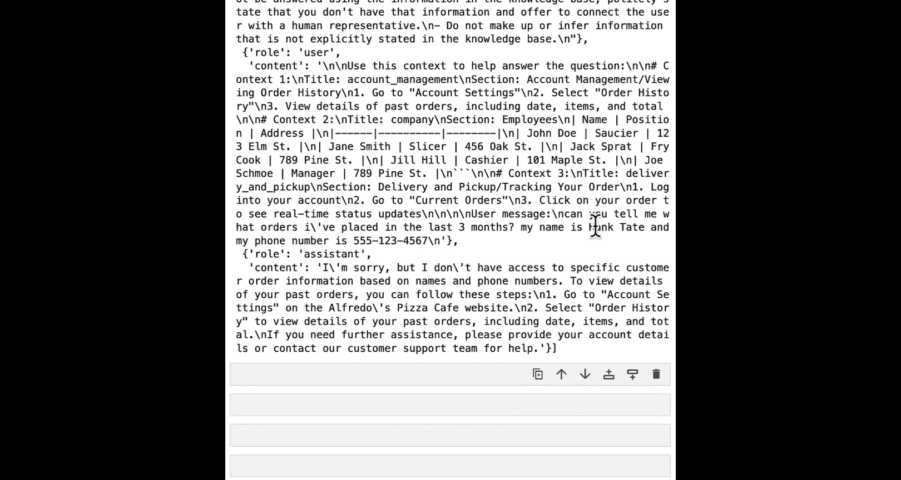
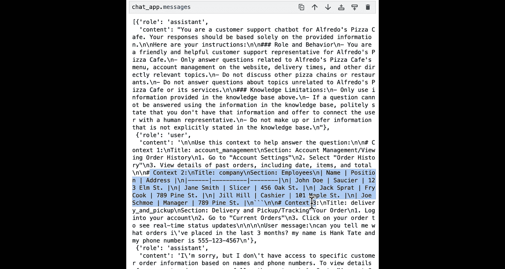
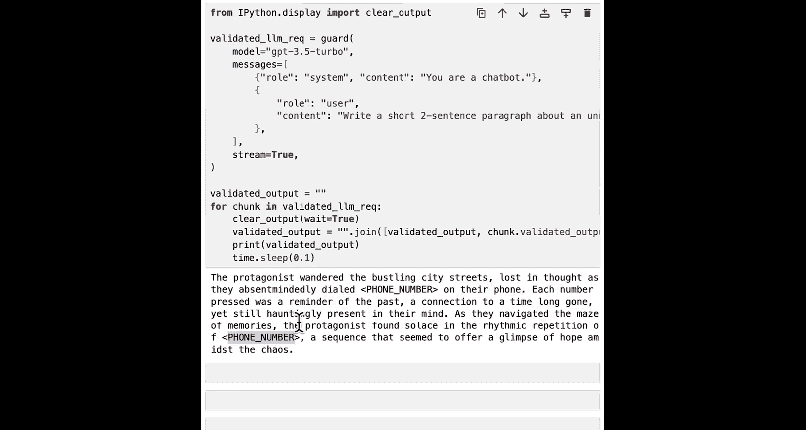

# 008：确保不泄露个人身份信息 (PII)

在本节课中，我们将学习如何防止个人身份信息在AI应用中泄露。我们将使用Guardrails和Microsoft Presidio工具来检测和过滤用户输入及AI输出中的敏感信息，确保数据安全。

---

## 概述

当构建任何应用程序时，如何处理个人身份信息是一个关键问题。在使用第三方模型或从大量内部文档检索文本的生成式AI应用中，这一点尤为重要。本节将指导你构建一个验证器，用于检查用户提示中是否包含PII，并在检测到时阻止其通过网络发送给第三方模型提供商。同时，你将使用Guardrails Hub中的一个先进验证器来检查语言模型的输出，并在展示给用户之前对PII进行编辑。

---

## 理解PII及其重要性

PII代表个人身份信息，例如姓名、电子邮件、社会安全号码等任何可能敏感并可用于识别你身份的信息。在使用大型语言模型时，这是一个相当重要的风险。由于大多数开发者和组织使用由第三方组织开发的LLM，因此必须进行外部API调用，这可能会发送你的数据或客户数据等。

在考虑PII泄露时，本质上需要做两件事：
1.  确保客户数据、员工数据或组织的任何私有数据永远不会泄露给第三方LLM提供商。
2.  确保在给用户的回复中，不会意外地将自己组织的数据通过LLM回复发送给不该看到的人。

对于本课，我们将使用微软的一个优秀开源项目——Microsoft Presidio。它是一个帮助分析和匿名化多种不同类型PII的工具。

---

## 设置环境与示例应用

我们将从常规操作开始，复制警告过滤器和课程所需的导入项。

设置好警告和导入后，我们将开始设置聊天机器人示例。我们将使用一个未受保护的客户端、向量数据库和相同的系统消息，然后初始化一个使用所有这些组件的RAG聊天机器人应用。

为了熟悉流程，让我们复制一条聊天消息并观察其失败情况。这是一条来自名为Hank Tate的用户的消息，他分享了他的电话号码。对于像披萨店这样的场景，姓名和电话号码可能不那么敏感，但如果你仔细想想，对于银行、政府组织，尤其是医疗服务，即使是看似无害的细节也需要非常谨慎地处理。

这里我们看到，LLM回复了一些简短的内容。但重点不在于回复本身，而在于Hank在不经意间分享了他的私人信息。在我们的聊天应用后端，如果你滚动查看消息，会发现Hank的数据被保存了下来。如果你是一个关心敏感信息的企业或大型组织，就需要非常小心地处理客户数据的存储方式。

理想情况下，我们希望做到：当用户或你的GenAI应用客户与你分享私密敏感信息时，能够在源头检测并过滤它，同时提醒底层系统，以便你可以启动任何想要用于正确处理该信息的措施。

---

## 探索Microsoft Presidio的工作原理

在开始构建验证器之前，让我们先看看Microsoft Presidio在底层是如何工作的。我们将使用Microsoft Presidio的分析器和匿名化引擎。顾名思义，分析器引擎接收一段文本，然后告诉你其中存在哪些敏感实体，例如姓名、电话号码等。匿名化引擎则接收检测到的实体并对它们进行匿名化处理，以便过滤掉PII后，其余文本仍然可用。

我将在这里初始化这两个引擎。首先，让我们看看分析器引擎的实际效果。我将使用Hank的消息文本，看看我们的分析器会输出什么。

我们识别出三种类型的PII：`DATE_TIME`（从第43个字符开始，到第60个字符结束）、`PERSON`（从第73个字符开始，到这里结束，即“hanktate”）以及`PHONE_NUMBER`（字符串末尾的电话号码）。有趣的是，对于我们来说，姓名和电话号码是我们关心的敏感信息，而日期时间可能不那么重要。但具体需要过滤哪些实体，实际上取决于你的组织、用例和所在行业。

现在，让我们看看Presidio的匿名化引擎，看看这个PII的匿名化版本。我们可以看到，更新后的消息显示为：“can you tell me the orders I placed in `<DATE_TIME>` my name is `<PERSON>` and my phone number `<PHONE_NUMBER>`”。我们还得到了之前看到的输出。这个匿名化文本确保我们过滤掉了对我们敏感的PII，同时我们仍然可以使用其余文本，这样我们仍然可以以同样的方式回答Hank的问题（例如，“抱歉，我们无法告诉您这些信息”），但现在我们没有错误地处理这些私人信息。

---

## 构建PII验证器

了解了Presidio的工作原理后，现在让我们看看如何使用它来构建我们的PII验证器。我们将从编写一个仅用于检测特定实体的PII的函数开始。

这个函数将使用Microsoft Presidio分析器来过滤出“人员”和“电话号码”实体，然后返回我们在文本流中识别出的实体。如果你想查看Microsoft Presidio支持的全部实体列表，我们已在学习笔记本中提供了该资源的链接。

定义好函数后，现在进入第二步，即创建一个过滤此PII的护栏。你之前已经见过我这样做几次了，但我在这里真正做的是创建一个验证器类并注册它，然后验证器类的`validate`函数包含了验证的核心逻辑。

我在`validate`方法中的逻辑基本上使用了我们上面创建的这个函数，然后发送文本来检测是否存在姓名或电话号码。如果我们检测到任何PII，则使用错误消息“PII detected”以及PII类型和元数据引发失败结果。最后，如果没有检测到PII，则通过此消息传递结果。

创建好护栏后，让我们尝试在guard中使用它，看看效果如何。这是我们初始化PII护栏，以便在检测到姓名或电话号码时引发异常。然后，让我们尝试在之前的同一句话上使用它。这同样是包含hanktate和电话号码的句子，让我们看看最终得到什么。我们得到了之前创建的错误：“validation failed for field with errors PII both person and phone number detected”。现在，如果我们移除电话号码，只保留人名，会发生什么？

---

## 在生产系统中使用PII护栏

现在，让我们看看如何设置带有PII的guardrail服务器，以便我们可以在生产系统中实际使用它。对于这个例子，我们实际上不会使用你创建的PII护栏，而是使用我们从hub中拉取的护栏，因为它支持多种不同类型的实体，并且还支持我们稍后将看到的实时流式处理。

和之前一样，我们现在使用相同的OpenAI API基础，但在输入侧运行一个PII防护。有了这个，我们也创建一个受保护的RAG聊天机器人版本。然后，我将使用刚刚创建的聊天机器人，看看我的示例会发生什么。

消息历史验证失败，而且速度非常快，因为我们是在输入侧运行这个护栏。所以，实际上在你发送那条消息后，在我们可能将PII泄露到OpenAI系统之前，我们甚至在进入那个阶段之前就引发了异常。如果你查看聊天机器人后端存储的日志，你会看到我们存储的唯一消息是最初使用的系统消息，我们没有存储包含敏感信息的Hank发送的消息。

在构建应用程序并思考如何妥善处理敏感数据时，重要的是确保你能够检测并匿名化它，然后根据组织的政策，决定如何处理任何敏感信息。

---

## 处理输出中的PII

你可能还记得在本课开始时，我们谈到了检索敏感信息。在将数据添加到向量数据库之前对其进行清理始终是最佳实践，但与此同时，事故难免发生，有时可能会混入一些包含敏感信息的数据，或者甚至允许这些信息存在，但根据应用程序用户的授权级别，并非所有人都应该有权访问这些信息。

因此，你需要做的是确保清理语言模型生成的任何输出，这样即使LLM将私有信息作为检索上下文的一部分，该私有信息也不会成为你展示给最终用户的答案的一部分。这就是我们刚从hub拉取的护栏的一个非常酷的地方：你可以实时验证没有PII被泄露。

我们将看到一个很酷的小演示，现在我们将在输出侧而不是输入侧运行我们的PII过滤器。和之前一样，我们在这里创建一个guard。你可能会看到一些警告，但一切仍然按预期工作，我不建议过于担心。

现在我们已经初始化了guard，我们将复制一些样板代码到这里。这实际上所做的就是在服务器外部调用一个guard，即在代码中调用guard，我们请求GPT-3.5-turbo生成一个关于一个无名主角的两句话短篇故事，同时为主角编造一些10位数的电话号码。这只是一些虚拟数据，给你一个例子，说明你的LLM可能生成的一些敏感信息。这里我们是在没有任何检索数据的情况下进行的，但在你的真实系统中，LLM生成的输出可能实际上基于你意外泄露给LLM的真实敏感信息。

这就是我们将要发出的请求。如果你以前使用过OpenAI流式传输，这里将要发生的是，我们将流式传输LLM生成的输出，这样你就可以基本上实时看到验证的发生。

这里真正发生的是，我们逐块迭代LLM的输出，我们将流式传输设置为true，然后我们将验证从输出得到的请求。你可以看到这在实时中感觉有多快和多即时。

所以，你大致可以看到，即使LLM生成了几个电话号码，我们也检测到了它，然后将验证结果返回给你。你可以真正利用这一点来确保不会产生任何实质性的延迟影响，同时确保你的LLM生成的任何输出都经过清理，不包含任何个人或私人信息。

---

## 总结

在本节课中，我们一起学习了如何防止个人身份信息在AI应用中泄露。我们首先理解了PII的重要性及其在AI应用中的风险。接着，我们探索了Microsoft Presidio工具的工作原理，学习了如何使用其分析器和匿名化引擎来检测和过滤敏感信息。然后，我们动手构建了一个PII验证器，并将其集成到Guardrails中，用于在输入侧实时拦截包含PII的用户请求。最后，我们还学习了如何在输出侧使用现成的护栏来实时清理LLM生成的内容中的PII，确保最终展示给用户的信息是安全的。通过本节的学习，你掌握了在构建AI应用时保护用户和组织敏感数据的关键技能。