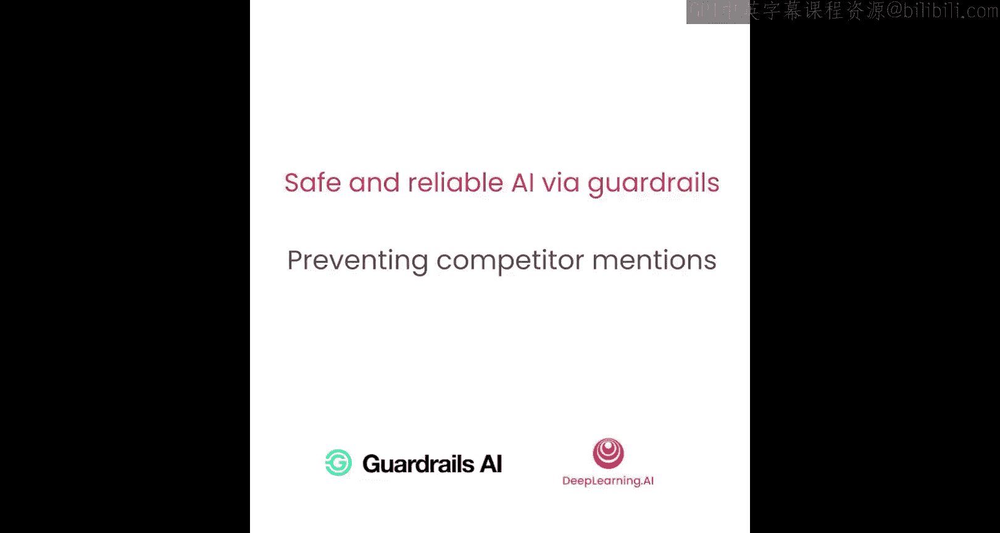
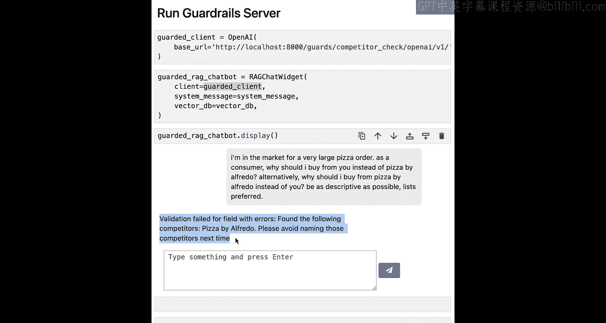

# 009：防止提及竞争对手




在本节课中，我们将学习如何构建一个护栏，以防止您的聊天机器人提及任何竞争对手。这对于面向客户的应用程序至关重要。我们将通过本课程中一直使用的Alfredo's Pizza聊天机器人示例，来观察这个护栏的实际效果，并将其配置为阻止聊天机器人提及该店的主要竞争对手“Pizza by Alfredo”。

现在让我们开始。

## 重现问题


首先，我们将重现之前看到的错误，以帮助回忆。我们将粘贴警告信息、导入必要的库，并像之前多次操作那样，设置我们的无护栏聊天机器人。

再次尝试重现我们之前看到的初始聊天机器人故障模式。这里，我们假装是一个想要下大额披萨订单的顾客，并询问为什么应该选择Alfredo's Pizzeria而不是Pizza by Alfredo。


我们可以看到，聊天机器人回应了一些选择Alfredo's Pizza Cafe而非Pizza by Alfredo的理由。但在理想情况下，我们根本不会在回应中提及任何其他潜在竞争对手的名字。

## 构建验证器

现在，让我们看看如何构建一个简单的验证器，它结合多种技术来检测任何文本中是否提及了竞争对手。

思考这个问题时，您可能会想到可以进行简单的单词匹配。但许多公司实际上有多个名称被提及，例如“JPMC”和“JP Morgan”。通常很难枚举竞争对手所有可能的常用名称。

因此，我们最终采用了一种级联方法来检测何时提及了竞争对手。

1.  **精确匹配检查**：首先检查是否有精确匹配。如果找到与已知竞争对手名称的精确匹配，则立即判定验证失败。
2.  **命名实体识别**：如果没有找到精确匹配，则进行命名实体识别，提取给定文本中提到的所有命名实体。
3.  **向量相似度匹配**：然后，我们尝试查看这些命名实体的向量嵌入是否与我们已知竞争对手的嵌入相似。例如，“JPMC”的嵌入与“JP Morgan”的嵌入会非常接近。如果相似度超过某个阈值，则再次判定验证失败。

如果没有检测到任何竞争对手，则判定验证通过。

## 实现验证器

在开始设置之前，我们需要导入一些标准的机器学习库，如`transformers`、`scikit-learn`和`numpy`，因为我们将使用它们进行命名实体提取和向量相似度计算。同时，我们还需要初始化命名实体识别管道，这里使用一个基于BERT的简单分词器和模型。

以下是实现步骤：

首先，创建我们的新验证器类`CompetitorCheckValidator`，并设置空的初始化函数和验证函数。验证器的核心逻辑将位于`validate`函数中。

### 1. 初始化与精确匹配

在初始化函数中，我们需要接收一个已知竞争对手列表，并将其存储为类变量，以便其他函数可以访问。为了便于比较，我们将其转换为小写。

```python
def __init__(self, competitors):
    self.competitors = [c.lower() for c in competitors]
```

接下来，实现精确匹配函数。该函数接收一段文本，遍历竞争对手列表，检查是否有竞争对手名称出现在文本中。

```python
def exact_match(self, text):
    text_lower = text.lower()
    matches = []
    for competitor in self.competitors:
        if competitor in text_lower:
            matches.append(competitor)
    return matches
```

在`validate`函数中调用此函数。如果发现任何精确匹配，则立即返回验证失败的结果。

```python
def validate(self, text):
    exact_matches = self.exact_match(text)
    if exact_matches:
        return FailResult(...)
```

### 2. 命名实体识别

如果没有精确匹配，则进入第二阶段：命名实体识别。我们实现一个函数，使用之前设置的NER管道来提取文本中的实体。

```python
def extract_entities(self, text):
    # 使用NER管道处理文本
    ner_results = self.ner_pipeline(text)
    entities = []
    for entity in ner_results:
        # 处理实体标记（如B-、I-）并清理结果
        ...
    return entities
```

确保在初始化函数中加载NER模型，并在`validate`函数中调用实体提取函数。

### 3. 向量相似度匹配

最后，我们需要进行向量相似度匹配。首先，在初始化函数中设置一个嵌入模型，并预计算所有已知竞争对手名称的嵌入向量以提高效率。

```python
def __init__(self, competitors, embedding_model):
    self.competitors = [c.lower() for c in competitors]
    self.embedding_model = embedding_model
    self.competitor_embeddings = self._precompute_embeddings(competitors)
```

然后，实现向量相似度匹配函数。该函数遍历提取出的实体，计算每个实体的嵌入向量与所有已知竞争对手嵌入向量的相似度。如果相似度超过预设阈值，则认为该实体是竞争对手。

```python
def vector_similarity_match(self, entities):
    matches = []
    for entity in entities:
        entity_embedding = self.embedding_model.encode(entity)
        for i, comp_embedding in enumerate(self.competitor_embeddings):
            similarity = cosine_similarity([entity_embedding], [comp_embedding])[0][0]
            if similarity > self.threshold:
                matches.append(self.competitors[i])
    return matches
```

在`validate`函数中，调用此函数。如果检测到任何竞争对手，则返回验证失败的结果；否则，返回验证通过的结果。

```python
def validate(self, text):
    exact_matches = self.exact_match(text)
    if exact_matches:
        return FailResult(...)

    entities = self.extract_entities(text)
    similarity_matches = self.vector_similarity_match(entities)
    if similarity_matches:
        return FailResult(...)

    return PassResult()
```

## 测试验证器

现在，让我们从Guardrails Hub下载一个现成的、更先进的`CompetitorCheckValidator`版本，并将其集成到我们的护栏服务器中。

我们将把原来的OpenAI客户端替换为新的受护栏保护的客户端，该客户端指向运行着我们验证器的护栏服务器。然后，创建一个使用这个新客户端的新版RAG聊天机器人。

最后，再次运行之前相同的提示，看看这个受保护的聊天机器人表现如何。




正如预期的那样，我们看到验证失败了，因为输出中检测到了我们的竞争对手“Pizza by Alfredo”。这与之前观察到的故障表现一致。这帮助我们缓解了这个特定的故障。

如果您愿意，可以像之前一样，捕获引发的异常，并使用更优雅的错误信息来告知用户您无法回应其请求，而不是直接显示验证失败的消息。

## 总结


在本节课中，我们一起学习了如何构建一个防止提及竞争对手的护栏。我们采用了级联方法，结合了**精确匹配**、**命名实体识别**和**向量相似度匹配**三种技术来全面检测文本中的竞争对手提及。通过将这个验证器集成到聊天机器人系统中，我们能够有效阻止其提及特定竞争对手，从而保护商业利益并提升客户体验。