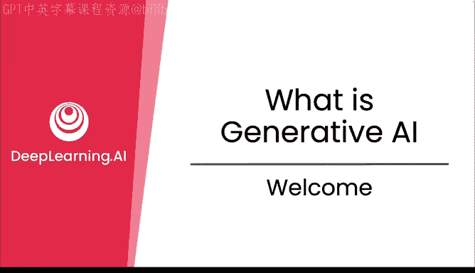
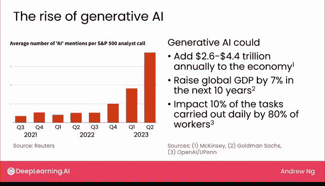
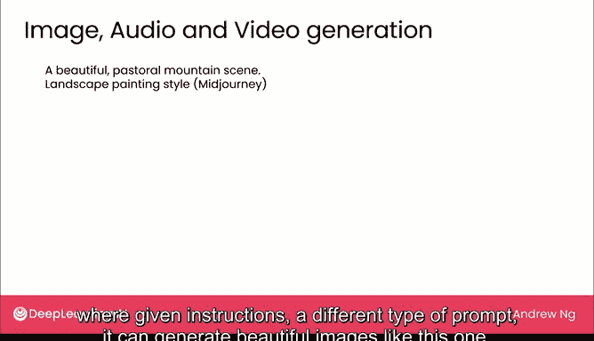
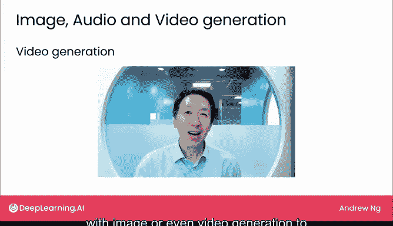
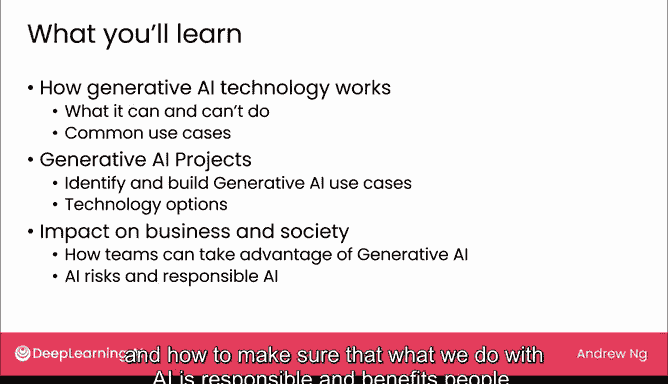

# 01：欢迎与概述 🚀



在本节课中，我们将要学习生成式人工智能（Generative AI）的基本概念、其广泛的社会经济影响，以及本课程的整体结构。生成式AI是一项变革性技术，正改变着人们学习与工作的方式。

自ChatGPT发布以来，生成式AI已吸引了众多个人、企业和政府的关注。许多开发者认为，这项技术将赋能大众，提升生产力，并对全球经济增长做出显著贡献。然而，它也可能带来负面影响，例如工作岗位的流失。本课程旨在帮助你准确理解生成式AI的能与不能，并探讨如何将其应用于你的工作或业务中。

由于生成式AI尚属新兴领域，存在许多误解。本课程将提供一个**非技术性**的准确理解，并引导你思考如何最有效地利用这项技术。本课程不要求任何技术或AI背景，旨在为商业、科学、工程、人文艺术等各领域的从业者提供帮助。

## 生成式AI的影响力 📈

上一节我们介绍了生成式AI的兴起，本节中我们来看看它已产生的具体影响。

生成式AI在2022年11月随着OpenAI发布ChatGPT而进入主流视野，其发展势头持续强劲。多项研究预测了其巨大的经济潜力：
*   根据麦肯锡的估计，它每年可为全球经济增加**2.6万亿至4.4万亿美元**。
*   高盛估计，它可能在未来十年内将全球GDP提升**7%**。
*   一项由OpenAI和宾夕法尼亚大学进行的研究表明，它可能影响美国**超过80%** 的劳动者日常工作中**10%** 的任务。同一研究还估计，**约20%** 的劳动者，其超过**50%** 的工作任务将受到生成式AI的影响。

这些研究既带来了对生产力大幅提升的期望，也引发了关于自动化导致失业的担忧。

## 什么是生成式AI？🤖

生成式AI指的是能够生成高质量内容的人工智能系统，特别是**文本、图像和音频**。最著名的生成式AI系统之一是OpenAI的ChatGPT，它可以遵循指令执行任务。

例如，你可以给出如下**提示（Prompt）**：
```text
为我们的新款机器人太阳镜写三条社交媒体帖子标题。
```
系统则会生成一系列富有创意的输出。



许多用户熟悉能够生成此类文本的网站或直接面向消费者的应用程序。其他例子包括谷歌的Bard和微软的Bing Chat。如今，许多公司都提供了用户界面，让你可以输入一段文本（即提示词）并生成回复。

## 超越消费级应用：作为开发工具 🛠️

除了这些面向消费者的应用，生成式AI还有另一项我认为从长远来看可能更具影响力的应用：**作为开发工具**。

AI已经无处不在。我们许多人每天都会数十次甚至更多地在不经意间使用它。每次你在谷歌或必应上进行网页搜索，那就是AI。每次你使用信用卡，很可能有一个AI在验证是否是本人在使用。每次你访问亚马逊或网飞，它向你推荐产品或电影，那也是AI。

然而，许多AI系统的构建曾经非常复杂且昂贵。生成式AI正在使构建许多AI应用变得容易得多。这意味着AI产品的数量和种类正在激增，因为与以前相比，构建某些AI应用的成本已大幅降低。

因此，本课程中我们将多次探讨的一个主题是：生成式AI如何能让你的企业以低得多的成本构建非常有价值的AI应用。你将学习识别和探索此类应用是否对特定业务有用的最佳实践。

## 生成式AI能生成什么？🎨

如前所述，生成式AI可以生成文本、图像和音频。目前，**文本生成**产生的影响最大。

但它也能生成图像。给定不同类型的提示指令，它可以生成美丽的图像，甚至是逼真的照片。

生成式AI还能生成音频。例如，以下是我的一个语音克隆：
> “嗨，我是安德鲁·吴的AI生成语音克隆。安德鲁·吴说了这些话。这很棒，不是吗？”

你还可以将音频与图像甚至视频生成结合起来，创建我的视频克隆。





## 课程路线图 🗺️

生成式AI领域正在发生许多激动人心的事情，这是一项颠覆性的技术。我确信你将在工作中发现它的用处。

以下是本课程的整体结构：

**第一周**，我们将探讨生成式AI技术的工作原理，特别是它能做什么和不能做什么。你还将看到各种常见的用例，希望能激发你的创造力，思考如何用它为你的生活和工作创造价值。

**第二周**，我们将讨论生成式AI项目，具体包括如何识别有用的生成式AI应用，以及如何构建这些应用的最佳实践。我们将更深入地探讨构建各种有价值项目的技术方案。

**第三周**，我们将把视野从单个项目扩大到更宏观的层面，审视生成式AI将如何影响企业乃至整个社会。我们将探讨团队或公司利用生成式AI的一些最佳实践，同时审视AI风险，并确保我们对AI的应用是负责任且造福于人的。



本节课中我们一起学习了生成式AI的基本定义、其巨大的社会经济潜力、作为开发工具的核心价值、它能生成的内容类型，以及本课程的学习路线图。这项技术既充满机遇也伴随挑战，理解它是利用它的第一步。