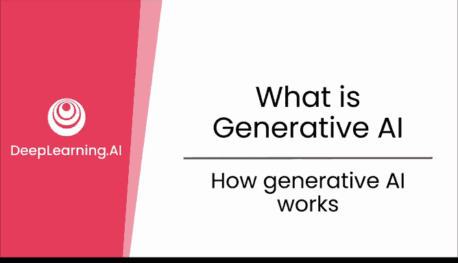
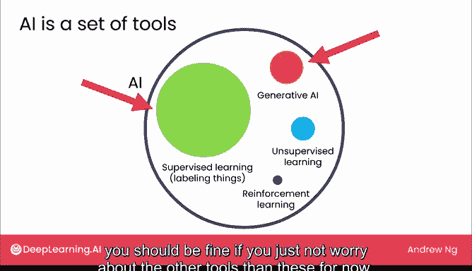
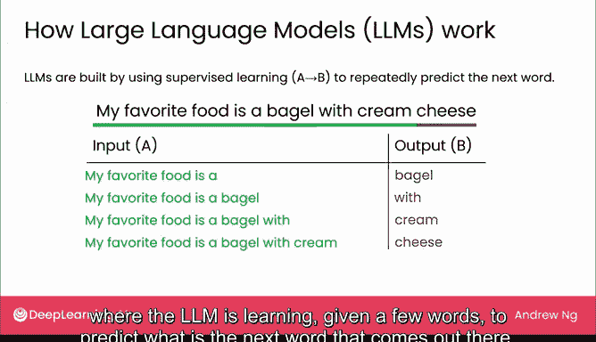

# 02：生成式AI工作原理 🧠

在本节课中，我们将要学习生成式AI（如ChatGPT）背后的核心工作原理。我们将从AI的整体格局入手，重点介绍监督学习的基础概念，并解释大型语言模型如何通过预测下一个词来生成文本。理解这些原理将帮助你更有效地使用这项技术，并认识到其局限性。

## AI格局中的生成式AI 🤖

AI领域充满了各种技术和工具。其中，**监督学习**和**生成式AI**是当今最重要的两项工具。监督学习擅长为输入数据打标签，而生成式AI则能创造新的内容。本课程将简要介绍监督学习，并重点探讨生成式AI，因为后者正是建立在前者的基础之上。

## 监督学习：AI的“贴标签”工具 🏷️

在深入生成式AI之前，让我们先快速了解什么是监督学习。监督学习是一种技术，它能让计算机在给定一个输入A时，生成一个对应的输出B。

以下是监督学习的一些应用实例：

*   **垃圾邮件过滤**：输入是一封电子邮件，输出是0（非垃圾邮件）或1（垃圾邮件）。
*   **在线广告**：输入是广告和用户信息，输出是用户点击该广告的可能性。
*   **自动驾驶**：输入是汽车前方的图像，输出是其他车辆的位置信息。
*   **医疗诊断**：输入是医学X光片，输出是可能的诊断结果。
*   **制造业缺陷检测**：输入是生产线上的产品图片，输出是产品是否存在划痕或缺陷。
*   **语音识别**：输入是一段音频，输出是相应的文字转录。
*   **情感分析**：输入是一段产品评论，输出是正面或负面的情感判断。

大约从2010年到2020年，是**大规模监督学习**蓬勃发展的十年。研究人员发现，当使用更强大的计算机和更大的内存来训练**非常大的AI模型**，并为其提供海量数据时，模型的性能会持续提升，而不会像小模型那样遇到瓶颈。这一发现为后来的生成式AI奠定了重要基础。

## 大型语言模型如何生成文本？ 📝

上一节我们介绍了监督学习的基础，本节中我们来看看生成式AI的核心——大型语言模型是如何工作的。

大型语言模型通过一种基于监督学习的技术来生成文本。其核心思想是：**反复预测下一个词**。

具体过程如下：给定一个输入（称为**提示**，例如“I love eating”），LLM会尝试补全这个句子。它可能会输出“bagels with cream cheese”，再次运行可能输出“my mother‘s meatloaf”。

那么，LLM是如何学会预测下一个词的呢？它是通过海量的文本数据进行监督学习训练而成的。训练时，系统会看到互联网上的句子，例如“My favorite food is a bagel with cream cheese”。这个句子会被拆解成多个训练样本：

*   输入A：`“My favorite food is a”`， 输出B：`“bagel”`
*   输入A：`“My favorite food is a bagel”`， 输出B：`“with”`
*   输入A：`“My favorite food is a bagel with”`， 输出B：`“cream”`
*   ……

通过在海量数据（通常是数千亿甚至上万亿单词）上训练一个非常庞大的模型，系统就学会了根据给定的前文，高概率地预测出下一个词是什么。这就是像ChatGPT这样的模型能够根据你的提示生成连贯文本的根本原因。

> **核心概念**：LLM的训练目标可以简化为一个函数：`下一个词 = 模型(前文词序列)`。通过在海量文本上优化这个预测任务，模型学会了语言的统计规律。

目前，我们省略了一些技术细节（例如如何让模型遵循指令并确保输出安全，这将在后续课程中讨论），但LLM的核心正是这种从数据中学习并预测下一个词的能力。

## 总结 📚

本节课中我们一起学习了生成式AI的工作原理。我们首先将生成式AI置于更广阔的AI工具背景中，了解到它和**监督学习**是当前最重要的两项技术。接着，我们回顾了**监督学习**如何通过输入-输出对来“贴标签”，并指出大规模监督学习的成功为生成式AI铺平了道路。最后，我们深入探讨了**大型语言模型**的核心机制：它们通过在海量文本数据上进行监督学习，掌握了**反复预测下一个词**的能力，从而能够根据用户的提示生成连贯的文本。理解这一基本原理，是有效且负责任地使用生成式AI的关键第一步。