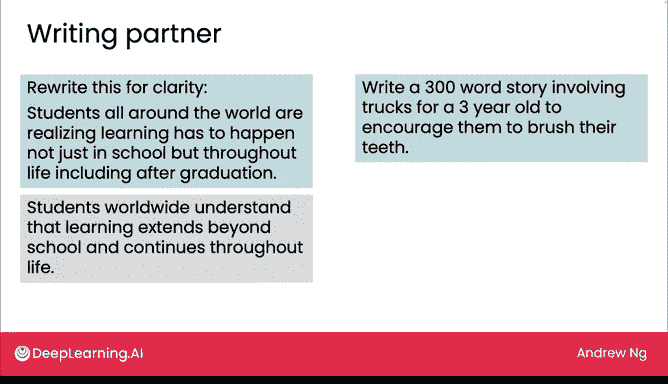
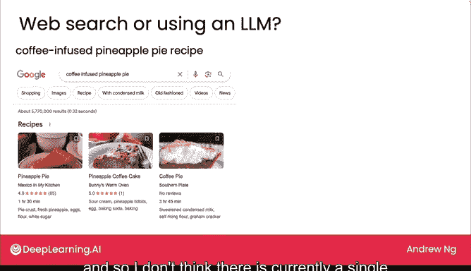

# 03：大语言模型作为思考伙伴

在本节课中，我们将学习大语言模型（LLM）如何作为思考伙伴，辅助我们完成信息查找、文本润色和创意构思等任务。我们将探讨其应用场景、潜在局限，以及如何根据具体需求选择使用LLM还是传统网络搜索。

目前有许多网络界面可以访问大语言模型。ChatGPT是最知名的，谷歌的Bard、微软的Bing以及其他许多模型也表现良好。让我们看看人们如何使用这些LLM应用。无论你是否已经在经常使用它们，希望这能给你带来一些关于何时以及如何有效利用它们的新思路。

## 信息查找与验证

LLM提供了一种查找信息的新方式。例如，如果你问它“南非的首都是哪里？”，它可能会给出一个包含三个首都的正确答案。然而，正如我们稍后将看到的，LLM有时会编造事实，我们称之为“幻觉”。因此，如果你真的依赖它来获取问题的正确答案，在采纳前最好通过权威来源进行双重核查。

有时，与LLM进行来回对话会更有帮助。例如，如果你问“LM代表什么？”，它可能会回答“LM代表拉丁语中的‘Laume Magister’，这是一个法律术语”。这实际上是互联网上LM这个缩写的常见用法。但如果你接着说“那在AI的语境下呢？”，那么它就有望回答“在AI语境下，LM指的是大语言模型”。所以，有时来回对话可以帮助你为LLM提供正确的上下文，从而获得你想要的信息。

## 作为思考伙伴

LLM有时也可以作为思考伙伴，帮助你理清思路。例如，我经常使用LLM来帮助我润色我的写作。如果你告诉它“为了清晰度重写这句话：‘世界各地的学生都意识到学习必须发生在领先的ELM上’”，LLM实际上非常擅长为你重写文本。

或者这里有一个有趣的例子：如果你告诉它“写一个30个词的故事，要包含卡车，并且鼓励孩子刷牙”，LLM实际上可以创作出相当有趣的故事。虽然我认为这远不及伟大小说家写的故事，但对于一个快速、有趣的小创作来说，我认为这还不错。

## LLM与网络搜索的选择

有时，当你寻找信息时，可能会犹豫是使用网络搜索还是LLM。例如，如果你在运动时不幸扭伤了脚踝，想知道该怎么办，网络搜索可以引导你找到非常权威且可信的来源，比如梅奥诊所或哈佛健康网站的页面，它们能就如何处理医疗问题提供建议。

你也可以问LLM如何处理扭伤的脚踝，它会生成一些答案。但考虑到LLM有编造内容的倾向，并且有时在编造时听起来非常权威和自信，我可能会在遵循其关于医疗保健或医学的任何建议之前，仔细核查它所说的内容。

再举一个例子：如果你想烘焙菠萝派并寻找食谱，互联网上有很多菠萝派的食谱。选择一个由可信网站或可信厨师创建的食谱可能会让你得到相当好的结果。或者，你可以让LLM为你编造一个。坦率地说，它给出的食谱可能还行，但也有很高的几率是一个有点奇怪的食谱。因此，如果你想烘焙菠萝派，我可能会去网上找一个可靠的食谱，因为有很多网页能提供关于好菠萝派食谱的可靠答案。

但是，如果你在寻找更小众的东西，比如朋友挑战你制作咖啡风味的菠萝派，我找不到任何关于咖啡风味菠萝派的网页。所以，我认为目前没有一个单一的网页能很好地回答这个问题。这就是一个例子，说明LLM可以作为一个思考伙伴，帮助你思考如何着手烘焙一个咖啡风味的菠萝派。

## 总结

本节课中，我们一起学习了LLM作为思考伙伴的多种应用方式，包括信息查找、文本润色和创意构思。我们了解到，LLM虽然强大，但存在“幻觉”风险，因此在关键领域（如医疗）需要谨慎核查。我们还探讨了根据任务的具体性（常见任务 vs. 小众创意）来选择使用网络搜索还是LLM。这些只是你可能会发现LLM网络用户界面有用的一些任务。本周晚些时候，我们将探索更多例子，讨论LLM的优势和弱点，并介绍一些最佳实践。正如你从这个视频中看到的，生成式AI能够完成许多不同的事情。在下一个视频中，我们将更系统地讨论生成式AI作为一种通用技术，并找出一种方法来组织它们所能做的所有事情，包括写作、阅读和聊天任务。让我们在下一个视频中看看。