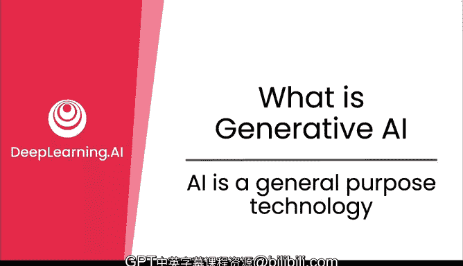
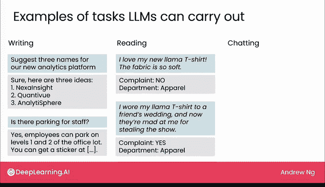
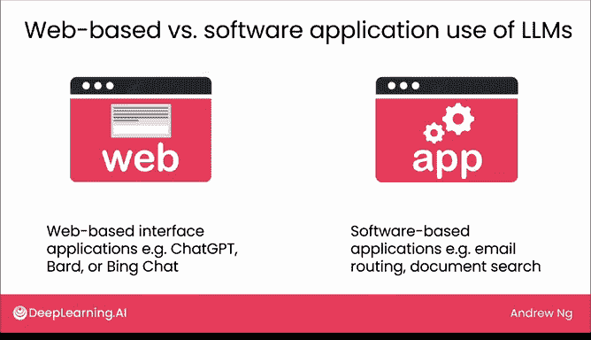

# 04：AI是通用技术

在本节课中，我们将探讨生成式AI的适用领域，并理解AI作为一种通用技术的含义。我们将介绍一个框架，用于分类大型语言模型能够执行的任务类型。

## 什么是通用技术？

生成式AI有什么用？这个问题有点难以回答，原因之一是AI是一种通用技术。这与许多技术不同，例如汽车主要用于交通，微波炉主要用于加热食物。AI不只对一件事有用，它对许多事情都有用。这几乎使得讨论它变得更困难。让我们看看通用技术的真正含义。

与电力类似，AI对许多任务都有用。如果问你电力有什么用，或者互联网有什么用，这些都是其他通用技术。思考电力有什么用几乎很困难，因为它如此普遍，在我们周围用于许多不同的事情。

事实上，正如你之前看到的，监督学习对许多任务都有用，比如垃圾邮件过滤、广告投放、语音识别等许多其他任务。生成式AI也是如此。在上一个视频中，你看到了语言模型可以执行的一些任务，例如回答特定问题和协助写作。

## 生成式AI的任务框架

让我们更广泛地讨论一个框架，用于理解语言模型可以执行哪些类型的任务。

以下是语言模型主要擅长的三类任务：写作、阅读和聊天。

### 写作任务

生成式AI生成文本，因此它对写作有用或许并不奇怪。我经常使用生成式AI工具作为头脑风暴伙伴。例如，如果你试图为产品命名，你可以要求它进行头脑风暴，它会提出一些创造性的建议。语言模型也擅长回答问题。如果你让它们访问你公司的特定信息，它们可以帮助你的团队成员找到他们需要的信息，例如关于办公室停车位的信息。

### 阅读任务

除了写作，生成式AI也擅长我称之为“阅读”的任务。在这类任务中，你会给它一段相对较长的信息，让它生成一个简短的输出。

例如，如果你经营一家在线购物电子商务公司，并且收到许多不同的客户电子邮件，生成式AI可以阅读这些客户电子邮件，并帮助你快速判断这封邮件是否是投诉。这可以用于将投诉路由到适当的部门以便快速处理。

假设一封邮件说：“我爱我的新羊驼T恤，面料太柔软了。”这不是投诉。但如果有人发邮件说：“我穿着我的羊驼T恤去参加朋友的婚礼，现在他们因为我抢了风头而生我的气。”嗯，这可能是一个投诉。生成式AI可以帮助你将电子邮件路由到正确的部门。

这被称为阅读任务，因为它查看一段相对较长的文本（即客户电子邮件），然后生成一个相对较短的输出，仅仅是“是”或“否”，判断是否是投诉。虽然监督学习也可以用于这个特定任务，但我们稍后会看到，生成式AI使得这类阅读任务以及本周稍后我们将看到的其他例子能够更快、更经济地构建。

### 聊天任务

最后，生成式AI也用于许多聊天机器人类型的任务。虽然ChatGPT和Bing Chat是通用聊天机器人，但生成式AI技术，即大型语言模型，也使得许多专用聊天机器人的构建成为可能。

在这个例子中，这是一个用于在线下单的聊天机器人可能的样子，用户可以说“要一个芝士汉堡，外送”，聊天机器人会确认并为用户下单。

## 两种应用类型

在讨论这些任务时，我发现有时区分两种不同类型的基于语言模型的应用是有用的。

第一种是像头脑风暴这样的例子，你自然会将这样的提示输入到ChatGPT、Bard或Bing Chat等互联网上的免费或付费大型语言模型中，并得到结果。我将这种应用称为**基于Web界面的应用**。

相比之下，在识别电子邮件是否为客户投诉的例子中，这更符合公司的电子邮件路由工作流程。让任何人将客户电子邮件逐一复制粘贴到Web界面中以获取哪些是投诉邮件的答案，这并不合理。因此，这是一个语言模型的例子，当它被构建到更大的软件自动化中时才有意义，在这个案例中是公司的自动电子邮件路由系统。我将这称为**基于软件的语言模型应用**。

第二个写作例子，即回答人力资源问题，结果证明这也更适合作为基于软件的语言模型应用，因为它需要访问关于你公司特定员工停车政策的信息，而互联网上的通用大型语言模型可能没有这些信息。我们将在后面的课程中更多地讨论这项技术是如何构建的。大多数专用聊天机器人也将是基于软件的应用。

在本课程的其余部分，我将使用这两个符号来区分基于Web界面的用例和基于软件的语言模型应用。对许多人来说，从一些基于Web界面的用例开始可能更容易，因为你可以直接访问像ChatGPT、Bard或Bing这样的网站，输入提示并得到结果。但我认为基于Web界面的应用和基于软件的语言模型应用都很重要，对个人和公司都非常有用。

## 总结

本节课中，我们一起学习了AI作为一种通用技术的概念，它像电力和互联网一样，具有广泛的适用性。我们介绍了一个将大型语言模型任务分为**写作**、**阅读**和**聊天**的框架。我们还区分了**基于Web界面的应用**和**基于软件的语言模型应用**这两种主要的实现方式。理解这个框架有助于我们系统地思考生成式AI的潜力。

在接下来的三个视频中，我们将更深入地探讨写作、阅读和聊天任务的许多不同例子。希望你能发现其中一些对你自己的工作有潜在用处。期待在下一个视频中见到你。

我们将更多地讨论写作。在那之前，我期待享用我的汉堡。😊