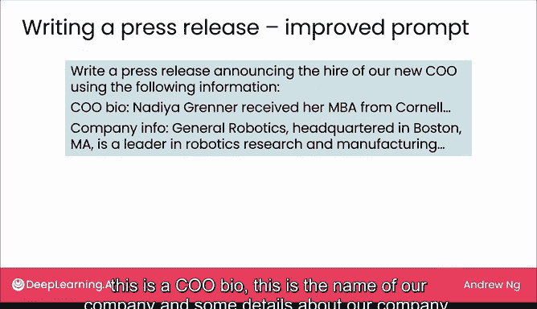
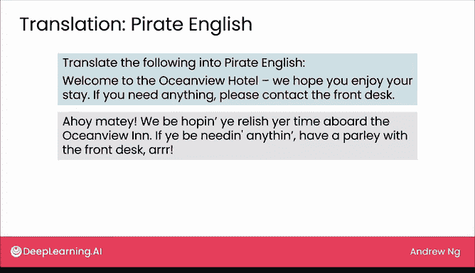

# 05：写作应用


在本节课中，我们将要学习大型语言模型在写作任务上的应用。我们将探讨如何通过提示词让模型生成文本，并了解一些具体的写作场景，如头脑风暴、撰写新闻稿和翻译。

上一节我们介绍了写作、阅读和聊天是大型语言模型可以执行的三大类任务。鉴于大型语言模型是通过反复预测下一个词来训练的，它们擅长生成文本也就不足为奇了。事实证明，许多写作任务可以通过网页用户界面完成。本节中，我们将更深入地探讨写作任务。

对于写作任务，我们的基本操作是输入一个相对简短的提示词，让模型生成一段更长的文本。让我们来看一些写作应用。

## 头脑风暴

我经常使用大型语言模型的网页界面作为头脑风暴伙伴。如果你让它为花生酱饼干想出有创意的名字，它确实能提出一些相当有创意的点子。例如，你可以输入提示词：

```
为花生酱饼干想出5个有创意的名字。
```

或者，如果你让它为增加饼干销量出谋划策，它会提供一些想法。你可以看看其中是否有任何有用的点子。


## 撰写文案

你也可以使用大型语言模型（可能是网页界面版本）为你撰写一些文案。让我们从一个例子开始。如果你要求它写一份新闻稿，宣布你的公司聘请了一位新的首席运营官，它可能会生成像下面这样的文本：

```
[公司名称] 欢迎新任首席运营官 [姓名]...
```

这是一份相当通用的新闻稿。在编写提示词时，你会发现，如果你能为大型语言模型提供更多上下文或背景信息，那么它将为你写出更具体、更好的文案。




如果大型语言模型看到的只是“写一份新闻稿”，那么它对你的公司、新任首席执行官的姓名或资历一无所知，因此最终会写出非常通用的内容。

如果你最终像这样提示大型语言模型，这没有问题。你可能会意识到你得到了一份非常通用的新闻稿，并决定更新提示词以提供更多信息。你可以这样提示它：

```
使用以下信息撰写新闻稿：
- 首席运营官简介：[简介内容]
- 公司名称：[公司名]
- 公司详情：[公司详情]
```

然后，它会写出一份针对这位首席执行官加入公司的、更详细、更有见地的新闻稿。


我发现，在提示语言模型时，通常第一次无法得到完全正确的提示词，就像我们刚才看到的，在没有提供任何上下文的情况下提示“写一份宣布新任首席运营官的新闻稿”。这完全没问题。如果你看到结果不是你想要的，只需修改提示词并重试。本周晚些时候，当我们讨论编写有效提示词的技巧时，我会详细说明这一点。

## 翻译任务

让我们再看一个例子。我有时使用语言模型的另一个写作任务是翻译。事实上，你可以通过网页用户界面访问的一些大型语言模型，其翻译能力已经可以与专门的机器翻译引擎竞争，有时甚至更好，特别是对于那些互联网上有大量文本的语言。因此，对于大型语言模型有大量数据学习如何生成特定语言文本的语言，它往往表现更好。对于互联网上文本较少的语言（也称为低资源语言），它的表现则稍差。

但如果你经营一家酒店，并希望将欢迎信息翻译成正式的印地语来欢迎客人，那么大型语言模型可能会为你输出这样的文本。不幸的是，我不会说印地语。但事实证明，这个特定的翻译只是一般。“前台”这个词被翻译成了“前面的桌子”，而不是我们所说的酒店“接待处”。

因此，如果你与一位印地语使用者合作（就像我准备幻灯片时那样），他们可能会给你一些提示，说“这不太是最好的正式印地语”。但如果你告诉它将其翻译成正式的口语印地语，那么它会更新文本，使“前台”翻译成印地语的“接待处”，这是一个好得多的翻译。

最近我在AI社区看到一件有趣的事情，那就是我们许多从事翻译工作的人经常需要将文本翻译成我们自己不会说的语言。那么，我们如何判断大型语言模型是否在做合理的事情呢？事实上，即使你的团队中有一位印地语使用者，如果团队的其他成员不会说印地语，他们如何了解情况呢？

因此，我看到AI社区的多个团队为了测试目的，将文本翻译成海盗英语。所以，如果你提示一个语言模型将其翻译成海盗英语，你会得到：

```
哦嗬，伙计！我们希望你享受你在海景房的时光。
```

这对我来说听起来是相当不错的海盗英语。

本节课中我们一起学习了大型语言模型在写作任务上的应用，包括如何通过提供上下文来改进提示词，以及如何将其用于头脑风暴、文案撰写和翻译等具体场景。下一节，我们将探讨阅读任务。



