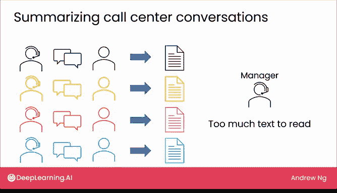
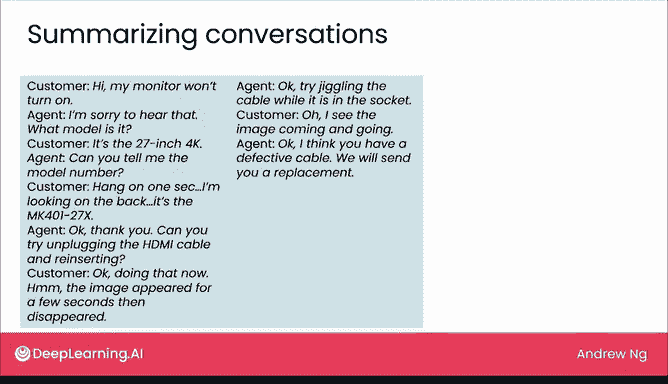
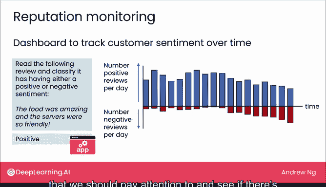

# 06：阅读任务应用


在本节课中，我们将要学习大型语言模型在“阅读”任务上的应用。与上一节介绍的“写作”任务不同，阅读任务通常要求模型分析输入的文本，并生成一个与输入长度相近或更短的输出，例如校对、总结或分类。

## 校对文本 ✍️

上一节我们介绍了写作任务，本节中我们来看看阅读任务。校对是我自己经常使用的一项功能。很多时候，当我写完一段文字后，即使自己仔细检查三四遍，也仍然可能遗漏一些拼写或语法错误。

以下是你可以尝试的一个提示词示例：
```
校对以下文本。该文本计划用于一个销售儿童玩具的网站。请检查拼写、语法错误以及不通顺的句子，并用修正后的版本重写。
```
然后附上包含一些错误的文本。

大型语言模型的输出会修正拼写错误（例如“suger”）和此处的语法问题。当我希望确保自己写的文字没有拼写、语法错误或拗口的句子时，我实际上会使用这个功能来校对。

## 总结长文 📄

大型语言模型另一个常用的阅读任务是总结长篇文章。我的合作者埃里克·布林约尔松教授曾发给我一篇他写的题为《图灵陷阱》的文章链接。我知道这是篇好文章，但它很长，而我在回复邮件前没有时间通读全文。

于是我使用了以下提示词，并将整篇文章复制粘贴到大型语言模型的网页界面中，让它快速为我生成摘要：
```
总结以下文章。
```
这篇文章的核心观点是，与其让AI自动化或取代人类工作，我们更应该努力让AI补充或增强人类工作。通过模型总结这篇长文，我能比亲自阅读全文更快地回复邮件。当然，我后来还是读完了全文，并且非常喜欢它。如今，我有时确实会用语言模型来总结那些我没有时间通读的内容。这是一个你可以快速在大型语言模型的网页界面上尝试的用例。

## 构建软件应用 🛠️

现在，这类功能也有以软件应用的形式在企业中兴起。让我用一个例子来说明。

假设你是一个客服呼叫中心的经理，那里有许多客服专员在与客户通话。如果你有权限录制这些通话，就可以通过语音识别系统获得对话的文字记录。当你有许多客服专员在进行对话时，最终会得到大量的文字记录。如果你想回顾呼叫中心的情况，可能会面临文本过多无法阅读的问题。

以下是此类应用的一种构建方式：
1.  将通话录音通过语音识别转为文字记录。
2.  使用大型语言模型总结整个对话，生成简短摘要（例如“M4127k设备损坏”）。
3.  经理可以快速浏览所有摘要，轻松发现任何问题或需要关注的趋势。

像这样的系统会作为一个使用大型语言模型的软件应用来实现，因为将对话记录一条条复制粘贴到模型提供商的网站上是没有意义的。





## 电子邮件分析与路由 📧

在客户服务互动方面，大型语言模型也用于客户电子邮件分析。在之前的视频中，你看到了一个例子：分析客户邮件，判断它是否是投诉（本例中不是），以及应该将邮件路由到哪个部门。

让我们更深入地看看如何构建这个应用，重点关注决定将邮件路由到哪个部门的部分。你可以写一个提示词，告诉语言模型阅读邮件并决定路由到哪个部门。你可以指定任务并提供邮件。

但事实证明，使用这样的提示词，你可能会发现算法将其路由到了“投诉部门”，而这个部门在你的组织中可能并不存在。

所以，这是一个例子，说明语言模型被给予的上下文信息不足，无法知道应该从你公司的实际部门名称中选择哪一个。

相比之下，如果你将提示词更新如下：
```
阅读以下邮件，选择最合适的部门进行路由。部门只能从以下列表中选择：[列出实际部门，如：服装部、投诉部、技术支持部]。
```
那么，在给定的选择集合中，模型这次会正确地将其路由到“服装部”。

使用大型语言模型构建应用的过程，通常不是第一次就能写出完美工作的提示词。当你发现它路由到一个不存在的投诉部门时，只需更新提示词就能解决问题。

## 声誉监控 📊

最后一个我想提到的应用是声誉监控。你可以使用语言模型构建一个仪表板，来跟踪客户对你的业务或产品随时间变化的情绪（正面或负面）。

例如，如果你经营一家餐厅，偶尔有顾客撰写在线评论或发送电子邮件描述他们的体验，你可以使用这样的提示词：
```
阅读以下评论，并将其分类为具有正面或负面情绪。
```
让它自动判断每条评论是正面还是负面。例如，如果评论说“食物很棒，服务员很友好”，则会被归类为具有正面情绪。

然后，通过软件统计每天正面评论和负面评论的数量，你可以构建一个仪表板，跟踪每天或随时间变化的情绪趋势。如果情绪开始像这样向负面趋势发展，出现更多负面评论，那么这个仪表板可以提醒你，可能发生了需要关注的事情，看看餐厅是否有需要修复的问题。

## 总结

本节课中我们一起学习了大型语言模型在多项阅读任务中的应用，包括**文本校对**、**内容总结**、**电子邮件路由**和**餐厅评论情绪分析**。如果你能想到一些任务，希望有人能阅读一段文字并给出一些简要的说明或指示，那么这很可能是一个适合让语言模型为你完成的阅读任务。



接下来，让我们进入下一个视频，看看聊天任务。