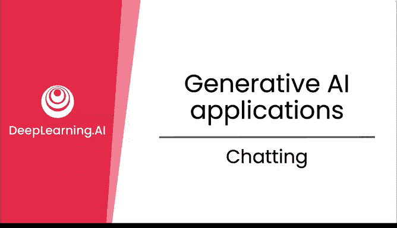
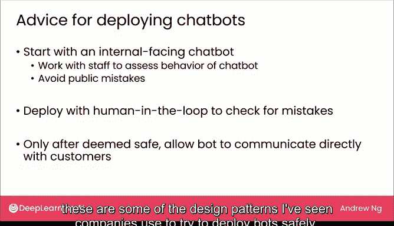

# 07：对话应用

## 概述
在本节课中，我们将学习生成式AI在对话应用中的具体实现。我们将探讨从通用聊天机器人到专业领域对话助手的设计与部署，并了解企业如何安全、有效地将聊天机器人整合到客户服务等业务流程中。

---

在之前的课程中，我们探讨了写作和阅读应用。本节中，我们来看看对话应用。

除了像ChatGPT和Bing Chat这样的通用聊天机器人，许多公司正在探索能否构建专业化的聊天应用。如果你所在的公司有大量员工需要与客户互动，或进行大量性质相似的对话，那么可以考虑是否需要一个专业聊天机器人来辅助这类对话。

## 专业化聊天机器人示例

以下是专业化聊天机器人的一些常见应用场景：

*   **客户服务机器人**：例如，一个专门处理芝士汉堡订单的机器人。
*   **旅行规划机器人**：一个拥有专业旅行知识，能帮你规划“如何在巴黎进行经济实惠的旅行”的机器人。
*   **咨询建议机器人**：目前，许多公司正在探索各种建议机器人，例如提供职业规划建议或烹饪指导的机器人。

如今，不同公司正在开发多种专注于回答某一领域问题的专业化机器人。其中一些机器人仅能进行对话和提供建议；另一些则可以与公司其他软件系统对接并执行操作，例如下达配送芝士汉堡的订单。

## 能执行操作的机器人

一个能执行操作的机器人示例是客户服务聊天机器人。许多IT部门会收到大量的密码重置请求。如果一个机器人能处理此事，就能减轻IT部门的工作负担。这类机器人需要被授权在现实世界中执行操作，例如发送短信验证身份并实际重置密码。

下周我们将详细讨论如何构建这类不仅能生成文本，还能实际采取行动的聊天机器人。

## 客户服务聊天机器人的设计谱系

鉴于众多客户服务组织都在探索聊天机器人的使用，我想与大家分享不同企业常用的一系列设计模式。本部分将专注于基于文本的聊天，而非语音或电话聊天。

在这个谱系的一端，是**纯人工**的客服中心，由人工客服来回打字回复消息。

谱系的另一端，是**纯机器人**客服，完全由软件直接响应客户。

在这两个极端之间，存在几种常见的设计模式：

**1. 机器人辅助人工模式**
在这种模式下，机器人会为人工客服生成或建议回复消息。人工客服会阅读此消息，如果看起来合适则批准发送，或者在发送给客户前有机会进行编辑。这种设计通常也被称为“**人在回路**”，因为人类在消息最终发送给客户之前参与了流程。这是一种降低聊天机器人可能说错话风险的方法，因为人类可以在发送前进行检查。

**2. 机器人分流模式**
在自动化程度上更进一步的是让机器人为人工作业进行消息分流。机器人可能回答简单的问题，但对于尚未准备好处理的复杂问题，则升级转交给人工处理。例如，一个团队曾构建了一个能自动检测客户是否在申请退款的机器人。这部分请求约占来电总量的10%。通过自动检测并提供处理指引，分流了约10%的流量，为人工客服节省了大量时间，让他们能专注于处理更复杂的请求。因此，机器人分流是另一种帮助人工客服节省时间、专注于处理其更擅长解决的复杂案例的常见设计。

在许多客服中心，一个客服人员可能同时与4到8位，甚至在某些极端情况下与16位客户进行聊天对话。有了机器人的辅助，人类管理更多并行对话会变得更容易。

## 安全部署聊天机器人的路径

鉴于机器人有时会说错话，我想分享一下希望安全行事的企业在构建和部署机器人时的常见做法。

企业通常会从**内部面向的聊天机器人**开始。先构建一个机器人，但只允许自己的团队使用，例如用它来回答旅行相关问题。假设你的内部团队对机器人的小错误会更宽容、更理解。这让你有时间评估机器人的行为，同时避免可能令公司尴尬的公开错误。

在确认足够安全后，常见的下一步是采用“**人在回路**”模式进行部署，让人类在消息实际发送给客户前检查尽可能多的回复。

这样运行一段时间后，如果机器人的消息通常可以安全地发送给客户，那么你可能会允许机器人直接与客户沟通。

当然，具体细节因业务而异。对于某些应用，由于流量巨大，可能无法让人工检查每一条消息。根据机器人说错话的风险、流量大小以及“人在回路”是否可行，这些是我看到公司尝试安全部署机器人时采用的一些设计模式。

## 总结

本节课中，我们一起学习了生成式AI模型在写作、阅读和对话这三个方面的应用。这三个类别并非AI模型能做的全部，只是你可能实际使用它们的一些广泛领域。AI模型能做很多事，但并非无所不能。在下一节视频中，让我们来看看AI模型能做什么、不能做什么，以便更好地理解其局限性。让我们进入下一个视频。