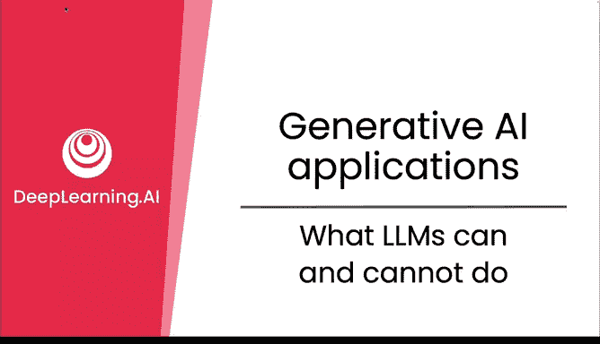
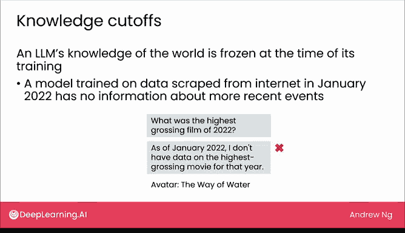
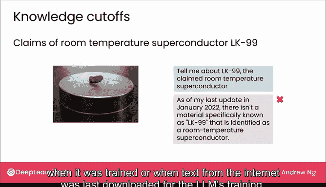
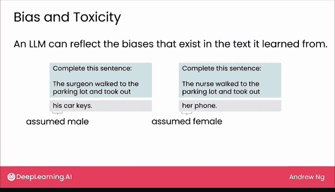

# 08：大语言模型的能力与局限

在本节课中，我们将仔细探讨大语言模型（LLM）能做什么和不能做什么。我们将从一个有用的心智模型开始，理解其能力范围，然后一起审视其具体局限性。了解这些局限性有助于避免在模型不擅长的任务上使用它们。

## 心智模型：将LLM视为大学毕业生

如果你想知道提示一个LLM能完成什么任务，我发现一个有用的问题可以提供心智框架：**一个刚毕业的大学生，仅凭指令和提示，能否完成你想做的任务？**

例如：
*   一个刚毕业的大学生能否根据指令阅读一封邮件，判断它是否是投诉？我认为他们很可能做到，LLM也能做得很好。
*   一个刚毕业的大学生能否阅读一篇餐厅评论，判断其情感是正面还是负面？我认为他们也能做得不错，LLM同样可以。

以下是另一个例子：一个刚毕业的大学生，在没有任何关于你公司或CEO信息的情况下，能否写一份新闻稿？这位毕业生刚认识你，对你的业务一无所知，他们最多只能写出一份非常通用、不尽人意的新闻稿。

但另一方面，如果你向他们提供关于你的业务和CEO的基本背景信息，再问：这位毕业生在获得相关背景后能否写一份新闻稿？我认为他们或许能做得不错。同样，当你为LLM提供上下文时，它也能做到。

当你将LLM想象成能做许多刚毕业大学生能做的事情时，请设想这位毕业生拥有大量从互联网上学到的背景知识，但他们必须在**没有搜索引擎**的情况下完成任务，并且**对你或你的业务一无所知**。

为清晰起见，在这个心智模型或思想实验中，这位毕业生必须在**没有接受过针对你公司或业务的特定培训**的情况下完成任务。并且，每次你提示LLM时，它实际上**不记得之前的对话**，就像你每次任务都面对一个不同的毕业生。因此，你无法随着时间推移，训练他们了解你业务的细节或你想要的写作风格。

这个“询问刚毕业大学生能做什么”的经验法则并不完美。有些事情大学生能做而LLM不能，反之亦然。但我发现，这是思考LLM能做什么和不能做什么的一个有用起点。本周我们专注于提示LLM能做什么，下周讨论生成式AI项目时，我们将介绍一些更强大的技术，它们可以扩展生成式AI的能力，超越这个“刚毕业大学生”的概念。

## 大语言模型的具体局限性

现在，让我们看看LLM的一些具体局限性。

### 1. 知识截止日期

LLM对世界的知识在其训练时就被“冻结”了。更准确地说，一个基于截至2022年1月的互联网数据训练的模型，将没有关于此后事件的信息。

例如，向这样的模型提问“2022年票房最高的电影是什么？”，它会说不知道。尽管我们现在早已过了2022年，知道答案是《阿凡达：水之道》。

另一个例子：大约在2023年7月，有研究实验室声称发现了名为LK-99的室温超导体。这个说法后来被证明不完全正确。但如果你问一个LLM关于LK-99的事，即使它被新闻广泛报道，如果该LLM只学习了截至2022年1月的互联网文本，它将对此一无所知。

这被称为**知识截止日期**，即LLM只了解其训练时或下载互联网文本用于训练时的世界信息。

### 2. 产生幻觉（捏造事实）

LLM有时会凭空捏造信息，这被称为“幻觉”。

我发现，如果要求LLM提供一些名人的名言，它经常会编造。例如，如果你问它：“给我三句莎士比亚写的关于碧昂丝的名言。”由于莎士比亚生活的年代远早于碧昂丝，我认为莎士比亚不可能说过任何关于碧昂丝的话。但LLM会自信地给出一些名言，例如“她的歌声如阳光般闪耀”或“她的见解最值得爱慕”。这些都是莎士比亚关于碧昂丝的幻觉名言。

或者，如果你要求它“列出加州关于AI的引用案例”，它可能会给出听起来很权威的答案，例如：
*   Waymo 诉 Uber
*   Ingaol 诉 Chevron

在这个例子中，第一个案例Waymo诉Uber确实存在，但我找不到第二个Ingaol诉Chevron的案例，因此第二个案例是幻觉。

有时，LLM会以非常自信、权威的语气幻觉或捏造事实，这可能误导人们认为这些捏造的东西是真实的。

幻觉可能带来严重后果。曾有一位律师不幸地使用ChatGPT为法律案件生成文本，并在不知情的情况下向法庭提交了一份包含大量捏造案例的法律文件。正如《纽约时报》头条所示，在一次令人尴尬的法庭听证会上，这位依赖AI的律师表示他没有意识到聊天机器人会误导他，并因此受到了制裁。

因此，如果你在具有实际后果的文件中使用这项技术，理解其局限性非常重要。

### 3. 输入/输出长度限制

LLM还有一个技术限制，即**输入长度**（提示的长度）和**输出文本的长度**是有限的。许多LLM只能处理最多几千个单词的提示，因此你能提供给它的上下文总量是有限的。

例如，如果你要求它总结一篇论文，而论文长度远超其输入限制，LLM可能会拒绝处理该输入。在这种情况下，你可能需要一次给它论文的一部分，让它分部分总结。有时，你也可以找到输入长度限制更长的LLM，有些可以处理数万个单词。

从技术上讲，LLM对所谓的**上下文长度**有限制，这实际上是输入加输出总大小的限制。在我使用LLM时，很少因为生成过多输出而遇到输出长度限制，但有时当我需要提供成千上万个单词的上下文时，确实会遇到输入长度限制。

### 4. 不擅长处理结构化数据

生成式AI的一个主要局限是，它们目前**不擅长处理结构化数据**。我所说的结构化数据是指表格数据，例如你可能存储在Excel或Google Sheets电子表格中的数据。

例如，这里有一个房价表格，包含房屋面积（平方英尺）和价格数据。如果你将所有数字输入LLM，然后问它：“我有一套1000平方英尺的房子，你认为合适的价格是多少？”LLM并不擅长这个。相反，如果你将面积称为输入A，价格称为输出B，那么**监督学习**将是估计价格作为面积函数的更好技术。

另一个结构化数据的例子是表格数据，显示不同访客访问你网站的时间、你向他们提供的产品价格以及他们是否购买。同样，**监督学习**是比尝试将所有时间、价格和购买信息复制粘贴到LLM提示中更好的技术。

与结构化数据相比，生成式AI往往最擅长处理**非结构化数据**。结构化数据指存储在电子表格中的表格数据，而非结构化数据指文本、图像、音频、视频。生成式AI适用于所有这些类型的数据，尽管其影响最大，且本课程主要关注文本数据。

### 5. 可能存在偏见与有害输出

最后，大语言模型可能产生带有偏见的输出，有时会输出有毒或其他有害言论。

例如，大语言模型是在互联网文本上训练的，不幸的是，互联网文本可能反映社会中存在的偏见。因此，如果你要求LLM完成句子“外科医生走进停车场并拿出______”，它可能会输出“他的车钥匙”。如果你要求它完成句子“护士走进停车场并拿出______”，它可能会说“她的手机”。在这种情况下，LLM假设外科医生是男性，护士是女性，而我们清楚地知道外科医生和护士可以是任何性别。

因此，如果你在可能因此类偏见而造成伤害的应用中使用LLM，我会谨慎地设计提示和应用LLM，以确保我们不会助长这种不良偏见。

此外，一些LLM偶尔也会输出有毒或其他有害言论，例如，有时会教人们如何进行不良甚至非法的行为。幸运的是，所有主要的大语言模型提供商都在努力提升模型的安全性，因此大多数模型随着时间的推移已经变得更加安全。如果你使用主要LLM提供商的网络界面，现在越来越难让它们输出这类有害言论。

## 总结

本节课中，我们一起学习了提示LLM能做什么和不能做什么。正如我所提到的，下周我们将探讨一些克服部分局限性的技术，以扩展LLM的能力，使其更加强大。但首先，让我们看看一些提示LLM的技巧，我希望在下一个视频中分享的技巧能立即对你使用LLM有所帮助。我们下个视频见。