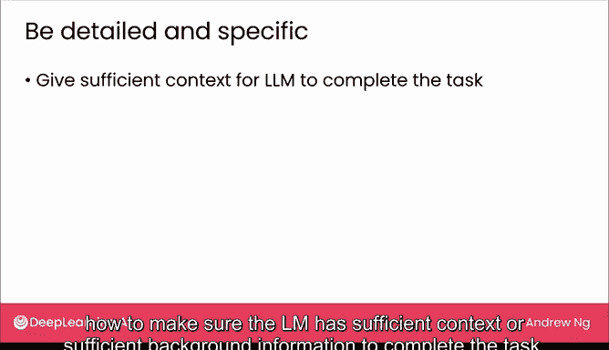
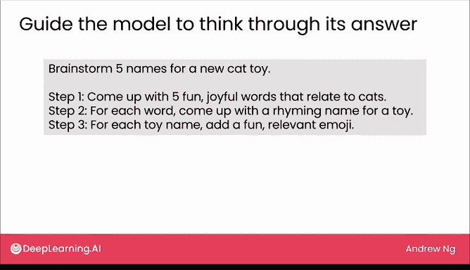
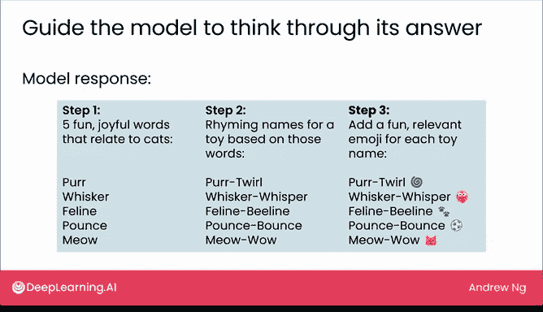
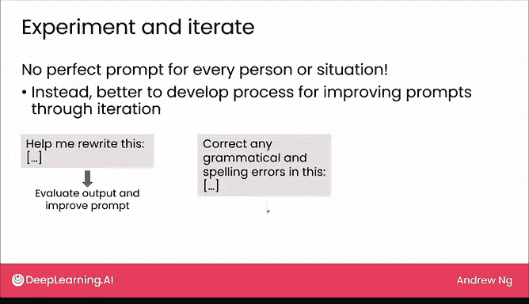
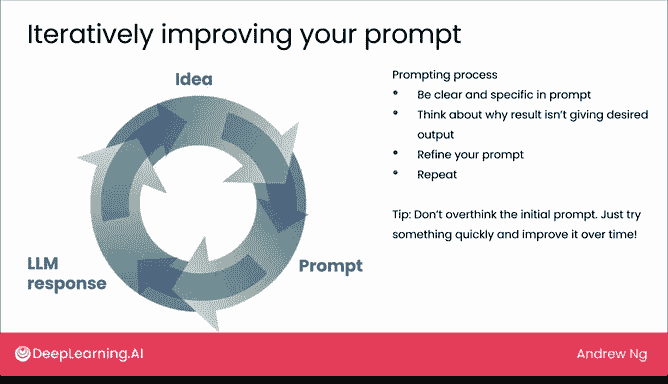

# 09：提示技巧


在本节课中，我们将学习如何有效地向大型语言模型提问，即“提示”技巧。这些技巧不仅适用于直接使用模型的网页界面，对于未来开发基于语言模型的应用程序也很有帮助。我们将重点介绍三个核心技巧：**详细具体**、**引导模型逐步思考**以及**实验与迭代**。



## 详细具体

上一节我们介绍了提示的基本概念，本节中我们来看看第一个核心技巧：提供详细且具体的指令。

使用“应届大学毕业生”的类比，我们需要确保语言模型拥有足够的背景信息来完成任务。例如，如果你只提问“帮我写一封邮件，请求加入法律文件项目”，模型很难写出有说服力的邮件。

但如果你提供更多背景信息，例如“我申请了一份工作，法律文件项目需要检查法律文件，我拥有提示语言模型以获取专业语气准确文本的经验”，这就为模型提供了更相关的上下文来撰写邮件。

进一步地，你可以详细描述期望的任务。与其说“帮我写一封邮件”，不如说“**写一段文字，解释为什么我的背景使我成为这个项目的强有力候选人，并支持我的申请**”。这样的提示不仅提供了充分的背景，也清晰地指明了你的需求，从而更可能获得理想的结果。


## 引导模型逐步思考

在了解了提供详细背景的重要性后，我们来看看第二个技巧：如何通过结构化指令引导模型思考。

如果你直接要求模型“为新的猫玩具想出五个名字”，它可能做得不错。但如果你心中已有明确要求，比如想要一个押韵的猫玩具名并配上相关表情符号，你可以尝试这样引导它。

以下是你可以使用的结构化提示：





```
1. 想出五个与猫相关的、令人愉悦的词语。
2. 为每个词语想出一个押韵的名字。
3. 为每个玩具名字添加一个有趣且相关的表情符号。
```

通过这样的提示，模型会遵循你的指令，先想出诸如“Whisker”（胡须）等词语，然后生成像“Whisker” -> “Whisper”（低语）这样的押韵名，最后为每个名字配上表情符号。如果你已经构思好一个能让模型得出理想答案的流程，那么给出清晰的逐步指令会非常有效。

## 实验与迭代

我们已经学习了如何通过详细指令和引导思考来优化提示。最后，我们来探讨一个至关重要的理念：提示是一个高度迭代的过程。



社交媒体上可能充斥着诸如“每个人都必须知道的提示技巧”或“17个能助你职业发展的提示”之类的文章。我认为并不存在一个对所有人都完美的提示。相反，掌握一个能让你自己写出有效提示或生成理想结果的过程更为有用。

当我为自己编写提示时，我通常会进行实验和迭代。我可能从“帮我重写这个”开始。如果对结果不满意，我可能会澄清为“**纠正此文本中的任何语法和拼写错误**”。如果仍未得到理想结果，我会进一步明确：“**纠正任何语法和拼写错误，并以适合专业简历的语气重写**”。

提示的过程通常不是一开始就找到完美的提示，而是从一个想法开始，观察结果是否满意，并知道如何调整提示以使其更接近你想要的答案。我将提示过程视为一个循环：

1.  你从想要模型做什么的想法开始。
2.  将这个想法表达为一个提示。
3.  模型根据提示给出响应。
4.  如果响应符合预期，则完成。
5.  如果响应不满意，则利用初始响应来完善你的想法并修改提示。
6.  重复此过程，直到获得理想结果。

开始时，我会尽量清晰具体，但为了节省时间，我常常从一个可能不那么具体的简短提示开始，只是为了快速启动。在得到结果后，如果不符合预期，就思考原因，并据此优化你的提示以澄清指令，然后重复这个过程。

一个重要的建议是：我见过一些人对初始提示过度思考。通常更好的做法是快速尝试一些东西，如果没得到想要的结果也没关系，继续改进它。你不会因为一个措辞稍有不妥的提示而“搞坏互联网”。

## 重要注意事项



在结束之前，有两个重要的注意事项需要牢记。

首先，如果你掌握高度机密信息，在将其复制粘贴到语言模型的网页用户界面之前，请务必了解该大型语言模型提供商是否以及如何对这些信息保密。

其次，正如我们在上一节视频中看到的律师案例，他们在提交由语言模型编造事实的法庭文件时遇到了麻烦。因此，在完全相信语言模型的结果之前，值得进行双重检查，并自行决定是否可以信任并依据其输出采取行动。

在这两点注意事项的前提下，我在提示时通常会直接尝试，看到结果不理想，然后利用初始结果来决定如何优化提示以获得更好的结果。这就是为什么我们说提示是一个高度迭代的过程，有时需要尝试多次才能得到想要的结果。

## 总结

本节课中，我们一起学习了有效提示大型语言模型的三个核心技巧：**提供详细具体的背景和指令**、**通过逐步引导来结构化模型的思考过程**，以及将提示视为一个需要**不断实验与迭代**的循环。记住，从简单的提示开始，根据反馈逐步优化，是掌握这项技能的关键。希望你能前往一些大型语言模型提供商的网页界面，亲自尝试这些技巧。