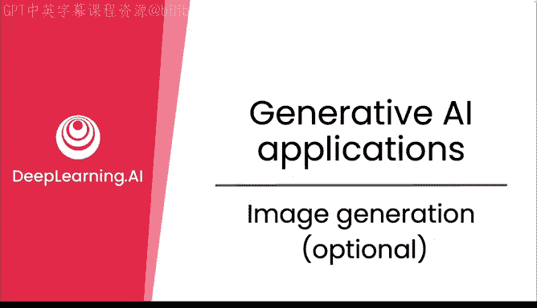
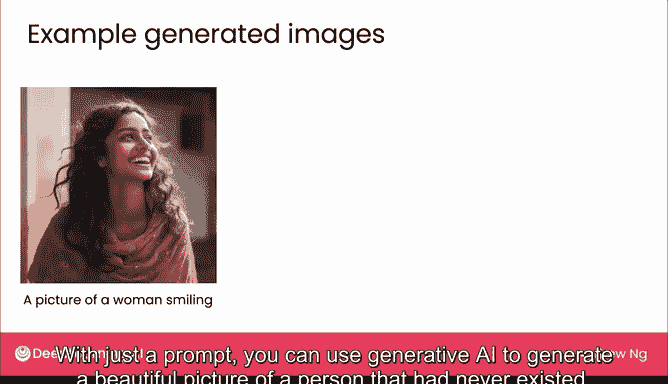
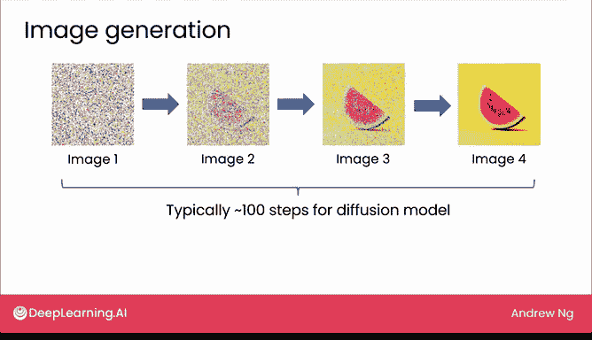
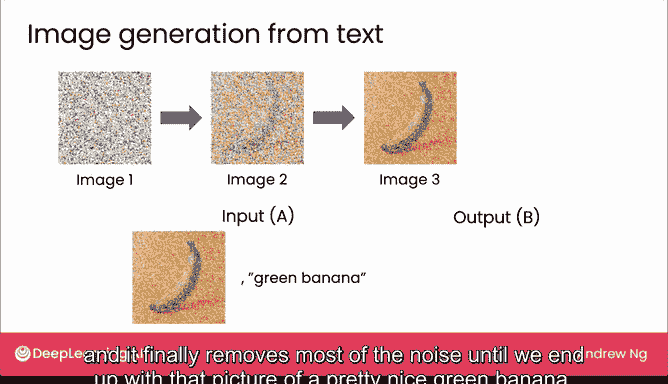

# 10：图像生成（选修）

在本节中，我们将探讨生成式AI中一个令人兴奋的领域：图像生成。我们将了解其背后的核心原理——扩散模型，并学习它是如何通过监督学习从噪声中创造出全新图像的。

## 概述

到目前为止，本周课程的重点是文本生成，因为这是许多用户正在使用且影响最广泛的生成式AI工具。然而，生成式AI的魅力同样体现在图像生成上。一些模型已能同时生成文本和图像，这类模型被称为**多模态模型**。本节视频旨在分享图像生成技术的工作原理。

## 图像生成的工作原理

仅凭一段文字提示，你就可以使用生成式AI生成一张从未存在过的人物肖像、一幅未来主义场景或一个酷炫的机器人图片。这项技术是如何实现的呢？

😊

当今的图像生成主要通过一种名为**扩散模型**的方法实现。

扩散模型从互联网或其他来源的海量图像中学习。其核心在于**监督学习**。以下是它的工作流程：

1.  **添加噪声**：假设算法在网上找到一张苹果图片。它想从这张图片以及数亿张其他图片中学习如何生成图像。第一步是逐渐向这张图片添加越来越多的噪声，使其从一张清晰的苹果图，变成一张有噪点的图，再到噪点更多的图，最终变成一张看起来完全是随机像素的纯噪声图，完全不像苹果。

2.  **监督学习训练**：扩散模型随后使用这些图片作为数据，通过监督学习进行训练。其目标是学习将一张有噪声的图片作为输入，并输出一张噪声较少的图片。具体来说，它会创建这样的训练数据：
    *   给定第二张（有少量噪声的）输入图像，我们希望监督学习算法学会输出一张更清晰的苹果图。
    *   给定第三张（噪声更多的）图像，我们希望算法学会输出一张像这样噪声稍少的图。
    *   最后，给定第四张纯噪声图像，我们希望它学会输出一张能暗示苹果存在的、噪声稍少的图片。

在通过类似过程对可能数亿张图像进行训练后，当你想应用它生成新图像时，流程如下：

1.  **从纯噪声开始**：首先创建一张每个像素都完全随机选择的纯噪声图片。
2.  **迭代去噪**：将这张图片输入到之前训练好的监督学习算法中。当输入纯噪声时，算法学会从图片中去除一点点噪声，你可能会得到一张像这样的图片，中间暗示着某种水果，但还不确定是什么。
3.  **逐步清晰**：将第二张图片再次输入模型，它会去除更多一点噪声，现在看起来像一张有噪点的西瓜图。
4.  **最终生成**：再应用一次这个过程，我们最终得到第四张图像，它看起来像一张相当不错的西瓜图片。

我在上一张幻灯片中用4个步骤说明添加噪声的过程，在本幻灯片中用4个步骤说明去除噪声的过程。但在实践中，扩散模型可能更典型地使用约100个步骤。

## 通过提示词控制图像生成

上述算法可以完全随机地生成图片，但我们希望能够通过指定**提示词**来控制它生成的内容。以下是一种改进算法，允许你添加文本或提示词来告诉模型你想要生成什么。

在训练数据中，我们不仅有像苹果这样的图片，还有可能生成这张图片的描述或提示词。例如，这里有一个文本描述：“这是一个红苹果”。然后，我们会像之前一样，向这张图片添加噪声，直到得到第四张纯噪声图像。

但我们将改变构建学习算法的方式：

*   监督学习算法的输入A，不再是仅有噪声图片，期望它输出干净图片。
*   相反，我们将**噪声图片**以及可能生成此图片的**文本标题或提示词**（即“红苹果”）一起作为监督学习算法的输入A。
*   给定这个输入，我们现在希望算法输出这张干净的苹果图片。

类似地，我们使用其他噪声图像为算法生成额外的数据点。每次给定一张噪声图像和文本提示“红苹果”，我们都希望算法学会生成一张噪声较少的红苹果图片。

在从庞大数据集学习之后，当你想应用此算法生成，比如说，一个“绿香蕉”时，操作如下：

1.  **起始**：和之前一样，我们从一张纯噪声图像开始（每个像素完全随机选择）。
2.  **输入提示**：如果你想生成一个绿香蕉，就将这张纯噪声图片与提示词“绿香蕉”一起输入到训练好的监督学习算法中。
3.  **迭代生成**：现在算法知道你想要绿香蕉，它有望输出一张可能像这样的图片（可能还看不太清香蕉，但中间暗示着某种绿色的根状物）。这是图像生成的第一步。
4.  **逐步优化**：接下来，我们将右边这张输出图片B作为新的输入A，再次与提示词“绿香蕉”一起输入，以生成一张噪声更少的图片。现在可以清楚地看出它像一个绿香蕉，但仍有较多噪点。
5.  **最终输出**：我们再执行一次这个过程，它最终去除了大部分噪声，直到我们得到那张相当不错的绿香蕉图片。

这就是扩散模型生成图像的工作原理。在这个生成精美图像的神奇过程核心，依然是**监督学习**。

## 总结

在本节中，我们一起学习了图像生成的基本原理。我们了解到，**扩散模型**通过一个**监督学习**过程，从添加噪声的图像中学习如何逐步去除噪声，从而从随机噪声中生成全新的图像。此外，通过将**文本提示词**与噪声图像一同作为输入，我们可以精确控制模型生成我们想要的特定内容。这个看似神奇的过程，其核心依然是坚实的学习算法。

感谢你坚持学习这个选修视频。我期待在下周与你相见，届时我们将更深入地探讨使用生成式AI构建的各种应用。下个视频再见。

😊