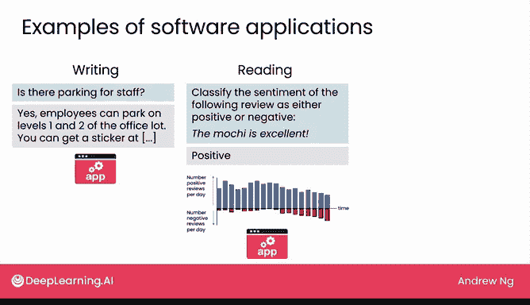
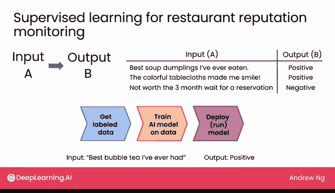
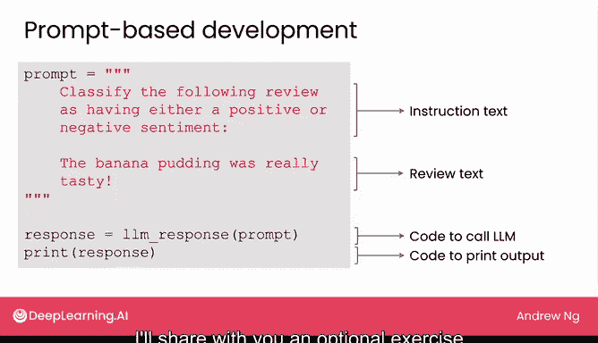
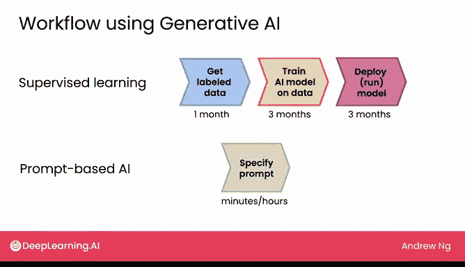

# 11：在软件应用中使用生成式AI

欢迎回来。上周我们讨论了生成式AI可以通过网页用户界面使用，也可以被集成到软件应用中。

在本节课中，我们将了解许多令人惊叹的软件应用是如何利用生成式AI构建的。我们还将探讨一些超越简单提示的技术选项，这些选项能让你用生成式AI做更多事情，例如，让它基于你自己的专有文档进行操作，而不仅仅是基于从互联网公开来源学到的知识。

让我们开始吧。

## 应用示例与对比

上一节我们介绍了生成式AI应用的几个例子。现在，我们来看看构建这些应用的传统方法与基于提示的新方法有何不同。

上周我们看到了一些生成式AI应用的例子，例如，回答可能需要访问公司停车政策信息的问题，或者阅读互联网上的餐厅评论以帮助进行声誉监控，或者构建一个聊天机器人来帮助接收食品订单。

事实证明，虽然这类应用中的一些确实存在，并且在生成式AI兴起之前就已经被构建出来，但生成式AI使得构建这些应用变得容易得多，并且在许多情况下，效果也更好。

让我以阅读餐厅评论进行声誉监控为例来说明。几年前，如果你想构建一个阅读餐厅评论的系统，需要编写大量如下所示的软件代码，需要机器学习工程师编写成页成页的软件。具体来说，构建餐厅声誉监控评论系统的过程会是这样的：你会使用监督学习，这是一种将输入A映射到输出B的技术。如果我构建这个系统，我会首先收集可能几百或几千个数据点，例如这样的例子：我会有一条评论“我吃过的最好吃的饺子，听起来很美味”，并将其标记为正面评价；“彩色的桌子让我感到温暖”，那是正面的；“三个月的等待不值得”，那将是负面评价。

构建系统的过程将涉及：首先获取标注数据，然后找一个AI团队帮助在数据上训练一个AI模型，以学习如何根据不同的输入A输出正面或负面结果，最后你可能需要找到一个像AWS或Google Cloud这样的云服务来部署和运行模型。这样，当你输入“我喝过的最好喝的珍珠奶茶”时，希望它能被识别为具有积极情绪。这个过程通常需要数月时间。

相比之下，如果你使用基于提示的开发，这就是开发一个情绪分类器所需的代码。首先，这是我们在代码中指定提示的方式：`my_prompt`，我将其设置为等于两个正文本，即指令文本“将以下评论分类为具有正面或负面情绪”，然后这里是评论文本。在指定提示后，我只需要一行代码。

调用大语言模型以获取响应，然后我将让它显示或打印响应。这几乎是构建这样一个系统所需的所有代码。事实上，在下一个视频中，我将分享一个可选练习，你可以自己尝试这段代码。

而使用监督学习构建情绪分类器的传统方法，项目的时间线可能是：花一个月获取大约1000个带标签的例子，即1000条带有正面或负面标签的评论。收集数据后，一个团队可能需要大约三个月的时间在数据上训练AI模型，再用另外三个月来部署模型并使其运行良好、稳定和健壮。

我不知道这对你来说是否感觉时间很长，但对于我合作过的许多非常优秀的机器学习团队来说，这个6到12个月的时间线对于构建和部署一个有价值的AI模型来说是相当现实的。这种方法有效，并且对许多应用来说非常有价值，但只是耗时很长。

相比之下，对于基于提示的AI，感觉是这样的：你可以在几分钟或几小时内指定一个提示，然后在几小时或几天内部署模型。

因此，现在有许多应用，以前需要我和非常优秀的机器学习团队可能6到12个月才能构建，而今天，我认为全世界有数百万人现在可以在几天或一周内构建出来。这非常棒，因为构建此类应用的门槛降低，正导致更多AI应用的蓬勃发展。

但有一个重要的注意事项，正如我们上周讨论的，生成式AI在处理非结构化数据（如文本、图像和音频）时往往效果更好。尽管有这个重要的注意事项，但基于生成式AI构建的AI应用数量，正让社区能够做到比以往任何时候都多的事情。

在下一个可选视频中，我想邀请你和我一起尝试一些用于阅读餐厅评论和分类情绪的代码。即使你一生中从未见过或写过一行代码也没关系，但我希望向你传达现在做这件事所需的代码是多么少，并让你自己尝试一下。所以我希望你看一看，当然，如果你愿意，也可以随意跳过。

之后，我们将回来讨论，当我们谈论生成式AI项目的生命周期时，构建一个生成式AI软件项目是怎样的感觉。

## 总结

本节课中，我们一起学习了生成式AI在软件应用中的集成方式。我们通过对比传统监督学习与基于提示的开发，展示了生成式AI如何大幅降低应用开发的门槛和时间。传统方法可能需要数月时间进行数据标注、模型训练和部署，而基于提示的方法只需几行代码和几天时间即可实现类似功能。这极大地促进了AI应用的创新与普及。