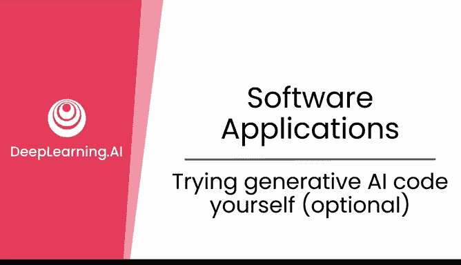
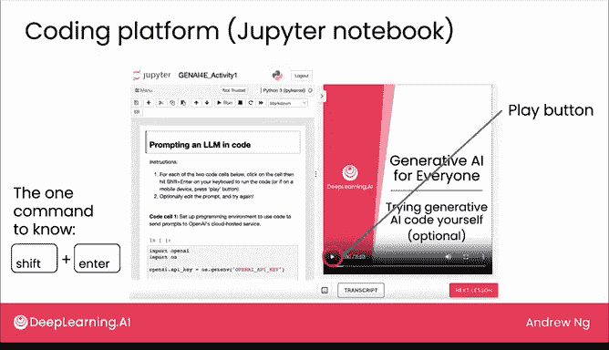
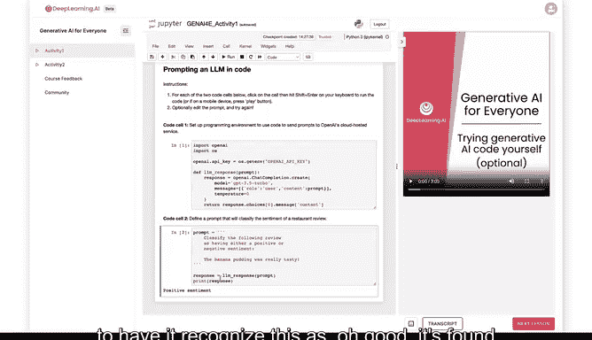

# 12：动手编写生成式AI代码（选修）💻



在本节可选课程中，我们将一起在DeepLearning.AI平台上，动手运行一段生成式AI代码。你无需具备编程经验，我们将逐步引导你完成整个过程。

## 平台与界面介绍

上一节我们介绍了生成式AI的基本概念，本节中我们来看看如何实际操作。

当你访问Coursera网站上的相应链接并进入DeepLearning.AI平台后，你会看到一个用户界面。界面左侧显示了一些代码，右侧是一个视频播放器。

如果你对代码感到陌生，请不要担心。我会通过右侧的视频，带你逐步了解每一行代码。在这个编程环境中，你只需要记住一个命令：**`Shift + Enter`**。这个命令用于运行代码。

## 操作步骤说明

以下是运行代码的具体步骤。

1.  前往Coursera网站上的下一个课程项目。
2.  点击链接进入DeepLearning.AI平台。
3.  在平台界面中，点击右侧视频播放器的播放按钮。
4.  跟随视频指导，在左侧代码区域按 **`Shift + Enter`** 来逐段运行代码。

## 代码示例与功能

当我们一起在平台上操作时，你会看到类似下方的代码。你的任务就是按 **`Shift + Enter`** 运行它。



```python
# 示例：使用模型分析一段文本的情感
prompt = “The banana pudding was very tasty.”
sentiment = analyze_sentiment(prompt)
print(f”Sentiment: {sentiment}”) # 输出：Sentiment: Positive
```

这段代码的功能是让AI模型识别所提供文本的情感。例如，对于提示“香蕉布丁非常美味”，模型会判断其情感为**积极（Positive）**。

## 课程要求与总结



需要强调的是，**即使不完成这个代码练习，你也完全可以学完本门关于生成式AI的课程**。这个练习是完全可选的。

如果你选择尝试，我希望你能享受这个过程。完成练习后，我们将回来继续讨论生成式AI项目的生命周期。

本节课中，我们一起学习了如何在在线平台上运行生成式AI代码，并了解了其基本操作流程。