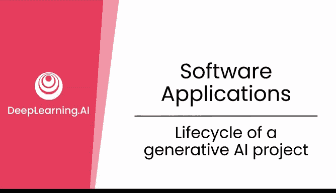
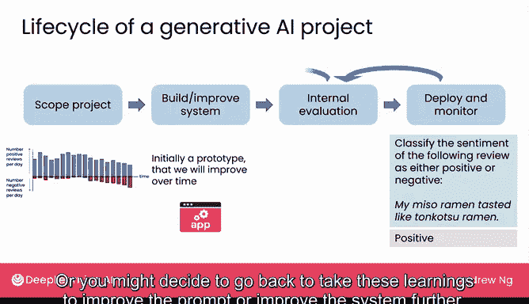
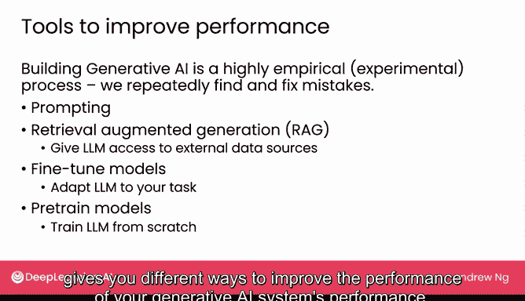
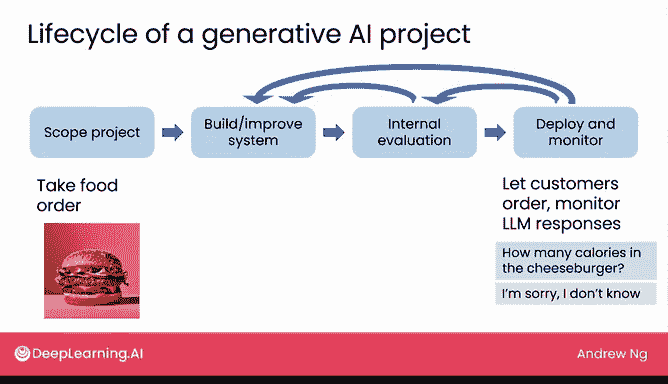

# 13：构建生成式AI软件应用的过程

在本节课中，我们将学习构建生成式AI软件应用的生命周期。我们将通过两个具体例子，了解从项目构思到部署上线的完整流程，并理解这是一个高度迭代和实验性的过程。

## 项目生命周期概述

构建生成式AI软件应用的生命周期通常遵循一个迭代循环。这个过程始于项目范围的确定，随后是快速原型构建、内部评估、部署以及持续的监控与改进。

## 第一步：确定项目范围

首先，我们需要确定软件的目标和功能。例如，假设我们决定构建一个**餐厅声誉监控系统**。这个系统的核心任务是分析餐厅评论，并判断其情感倾向（正面或负面）。

## 第二步：构建初始原型

得益于生成式AI的强大能力，我们通常可以非常快速地构建出一个软件原型。对于许多应用，初始原型可能在一两天内就能完成。

以下是构建原型的关键点：
*   初始原型的功能可能并不完善。
*   快速构建的目的是为了尽快进入评估阶段。

## 第三步：内部评估与迭代

上一节我们介绍了如何快速构建原型，本节中我们来看看如何评估和改进它。我们会让内部团队撰写不同的餐厅评论来测试系统，检查其给出正确响应的频率。

内部评估经常会发现一些问题。例如，系统可能将“我的味噌拉面尝起来像豚骨拉面”这句评论错误地判断为**正面情感**。然而，对于熟悉日式拉面的人来说，这可能是一个负面评价，因为味噌拉面和豚骨拉面的汤底风味截然不同。

基于内部发现的问题，我们会返回去持续改进系统。正如上周所学，**提示词工程**本身就是一个高度迭代的过程：你提出一个想法，尝试提示词，观察输出结果，然后更新想法和提示词，再次尝试。

除了优化提示词，本周我们还将讨论其他提升生成式AI系统性能的工具。以下是几种关键方法：
*   **检索增强生成**：让大语言模型能够访问外部数据源。
*   **微调**：针对特定任务调整预训练的大语言模型。
*   **预训练模型**：从头开始训练一个大语言模型。

## 第二个例子：订餐客服聊天机器人

为了加深理解，让我们看看构建一个**订餐客服聊天机器人**的生命周期是怎样的。

我们首先确定项目范围：构建一个能处理所有订餐请求的聊天机器人。接着，快速搭建一个原型让内部团队试用。他们会尝试下不同的订单，以测试系统的表现。

内部测试中，系统有时能给出良好回应，例如当用户问“你们的芝士汉堡里有酸黄瓜吗？”，它会反问“您需要加酸黄瓜吗？”。但有时也会出现意外的错误回应，比如用户问汉堡里是否有蘑菇，聊天机器人却错误地回答“抱歉，我们没有蘑菇”。

与餐厅声誉监控系统一样，正是通过发现这些错误，我们才能改进系统。在对系统的安全性有足够信心后，便可以将其部署上线，让真实客户下单，并持续监控大语言模型的响应，确保其表现符合预期。

## 部署后的持续学习

在构建了多个生成式AI项目后，我常常对用户尝试用系统做的各种新奇有趣的事情感到惊讶和欣喜。例如，用户可能会问“你们的汉堡有多少卡路里？”。最初，系统可能不知道答案。但一旦发现这个问题，我们就可以使用前面提到的**检索增强生成**等技术来更新系统，使其能够给出正确答案。

## 总结与成本考量

本节课中我们一起学习了构建生成式AI软件应用的生命周期。这个过程是高度经验性和实验性的，意味着我们需要反复尝试、发现并修复错误。

关于成本，一个常见的担忧是使用这些托管在互联网上的大语言模型是否非常昂贵。实际上，使用这些模型的成本可能比许多人想象的要低。在接下来的视频中，我们将分享关于实际使用这些大语言模型成本的一些直观认识。