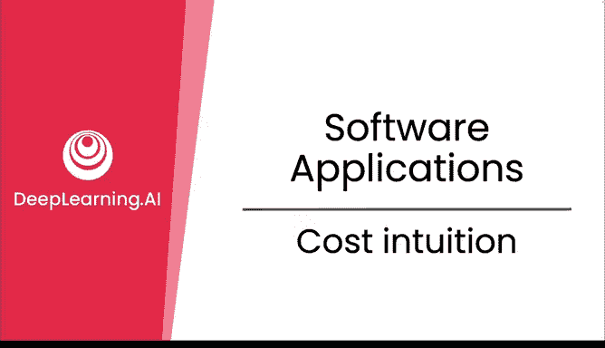
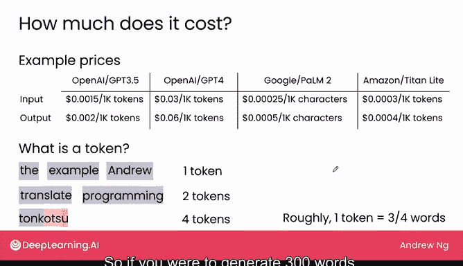
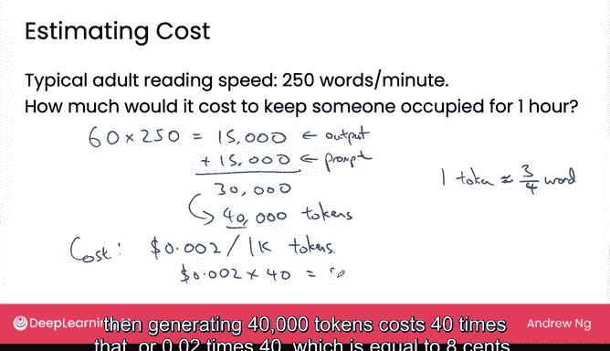

# 14：成本直觉

## 概述
在本节课中，我们将通过几个简单的例子，来建立关于在软件应用中使用大型语言模型（LLM）实际成本的直觉。我们将了解成本是如何计算的，并通过一个具体的场景来估算费用。

---

## 成本计算基础

上一节我们介绍了生成式AI的基本概念，本节中我们来看看使用这些模型的具体成本。以下是开发者调用不同大型语言模型进行提示和获取回复的示例价格。

*   OpenAI GPT-3.5：每1000个令牌（token）收费 **$0.002**（0.2美分）。
*   OpenAI GPT-4：每1000个令牌收费 **$0.06**（6美分）。
*   谷歌 PaLM 2 和亚马逊 Titan Light：价格也相对低廉。

技术上，大型语言模型对提示（输入）的长度也收费，但输入的成本几乎总是低于输出（模型生成的回复）的成本。因此，我们暂时先关注输出的成本。

---

## 理解“令牌”（Token）

你可能会问，什么是“令牌”？令牌大致相当于一个单词或一个单词的一部分，因为大型语言模型就是以这种方式处理文本的。

以下是令牌计数的例子：

*   常见单词如“the”或“example”会被算作**一个令牌**。
*   像“Andrew”这样的常见名字也是一个令牌。
*   不常见的单词如“translate”可能会被拆分为“Tra”和“nslate”**两个令牌**。
*   编程术语如“programming”可能被拆分为“program”和“ming”**两个令牌**。
*   更生僻的词如“tokota”可能被拆分为“to”、“k”、“ots”、“u”**四个令牌**。

平均而言，在大量文本中，**每个令牌大约相当于0.75个单词**。因此，生成300个单词大约需要400个令牌。请记住这个关键直觉：**令牌数大致等于单词数，但会稍微多一些（大约多33%）**。

---

## 成本估算实例

接下来，我们假设使用GPT-3.5（每千令牌0.2美分）来进行一个成本估算。当然，如果你选择不同的模型，成本会相应变化。

假设你正在为团队构建一个AI应用，用于生成文本供成员阅读。让我们估算一下，生成足够让一名团队成员阅读一小时的文本需要多少成本。

以下是计算步骤：

1.  **计算所需单词数**：成年人平均阅读速度约为每分钟250个单词。一小时需要 `60分钟 * 250单词/分钟 = 15,000单词` 的输出。
2.  **考虑输入（提示）成本**：我们还需要向模型发送提示来生成这些内容。假设提示的长度与输出长度相当，这又增加了15,000单词的输入。
3.  **计算总单词数**：因此，总处理量为 `15,000（输出） + 15,000（输入） = 30,000单词`。
4.  **转换为令牌数**：由于每个令牌约等于0.75个单词，30,000单词对应约 `30,000 / 0.75 = 40,000令牌`。
5.  **计算总成本**：每千令牌成本为$0.002，40,000令牌的成本是 `(40,000 / 1,000) * $0.002 = 40 * $0.002 = $0.08`。

所以，使用云端托管的LLM服务（如OpenAI、谷歌或AWS），让一个人忙碌一小时阅读AI生成的内容，成本大约仅为**8美分**。

这个计算做了很多假设，但对于建立成本直觉已经足够。在美国，许多地方的最低时薪约为10到15美元。相比之下，每小时额外增加8美分的阅读材料成本显得非常低廉，尤其是如果它能帮助提高工作效率。

当然，如果你的免费产品拥有百万用户，那么8美分乘以一百万，在没有相应收入的情况下会变得非常昂贵。但对于许多应用场景而言，使用LLM的成本通常比人们想象的要低。

---

## 总结
本节课中，我们一起学习了如何估算使用大型语言模型的成本。我们了解了**令牌**的概念及其与单词的近似关系，并通过一个具体场景，计算出让一名员工阅读一小时AI生成内容的成本可能低至**8美分**。这为我们评估AI项目可行性提供了重要的成本直觉。

在下一个视频中，我们将学习一些更先进的技术，这些技术能让你的大型语言模型变得更强大。